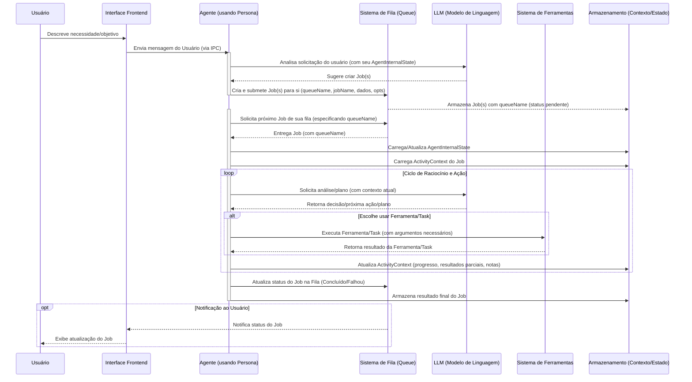

# Diagramas de Fluxo Atuais do Project Wiz ("As Is")

## Introdução

Os diagramas a seguir representam o entendimento atual dos fluxos de processo e da interação entre os componentes chave do Project Wiz. Esta representação é baseada na documentação conceitual existente nas pastas `docs/new_docs/application/`, `docs/new_docs/frontend/`, e `docs/new_docs/backend/`. O objetivo é fornecer uma visualização clara que possa auxiliar na identificação de gargalos, pontos de complexidade ou áreas que necessitem de maior detalhamento no design futuro.

## 1. Diagrama de Sequência: Fluxo de Vida de um Job

Este diagrama ilustra a sequência típica de interações desde a solicitação de uma tarefa pelo usuário até sua conclusão por um Agente (atuando com uma Persona). Baseia-se fortemente no `docs/new_docs/backend/conceptual_flow.md`.



## 2. Diagrama de Blocos: Componentes Conceituais do Backend e suas Interações Principais

Este diagrama de blocos visualiza os principais componentes conceituais do backend, conforme descrito em `docs/new_docs/backend/components.md`, e as suas relações primárias. Note que "Worker" é o loop do Agente.

```mermaid
graph TD
    subgraph "Usuário e Interface"
        UI[Interface Frontend (React)]
    end

    subgraph "Núcleo do Backend (Electron Main Process)"
        Queue["Sistema de Fila de Jobs (Queue - Múltiplas Filas Nomeadas)"]
        WorkerPool["Gerenciador de Agentes (Worker Pool)"]
        AgentLogic["Lógica do Agente (Persona Core Logic)"]
        TaskManager["Sistema de Execução de Tasks (Formula Prompts)"]
        ToolRegistry["Framework/Registro de Ferramentas (Tools)"]
        StateManager["Subsistema de Gerenciamento de Estado (SQLite)"]
        LLMIntegration["Ponto de Integração LLM (AI SDK)"]
    end

    UI -- "1. Interage com (via IPC)" --> AgentLogic
    AgentLogic -- "2. Cria/Gerencia Jobs em Fila específica" --> Queue
    WorkerPool -- "3. Gerencia instâncias de" --> AgentLogic
    AgentLogic -- "4. Solicita Jobs de uma queueName específica da" --> Queue
    AgentLogic -- "5. Carrega/Salva Estado" --> StateManager
    AgentLogic -- "6. Usa para Raciocínio" --> LLMIntegration
    AgentLogic -- "7. Formula Task para" --> TaskManager
    TaskManager -- "Envia Prompt para" --> LLMIntegration
    LLMIntegration -- "Retorna resposta do LLM para" --> AgentLogic
    AgentLogic -- "LLM solicita uso de Tool via" --> ToolRegistry
    ToolRegistry -- "Executa Tool e retorna para" --> AgentLogic
    AgentLogic -- "8. Reporta Status para Atualizar" --> Queue
    Queue -- "Notifica (via IPC)" --> UI


    %% Detalhes de interdependência dentro da PersonaLogic (não são fluxos sequenciais diretos, mas usos)
    subgraph "Detalhes da Lógica do Agente"
        AgentLogic --- StateManager
        AgentLogic --- LLMIntegration
        AgentLogic --- TaskManager
        AgentLogic --- ToolRegistry
    end
```

## 3. Diagrama de Atividade: Tomada de Decisão Simplificada de uma Persona

Este diagrama de atividade ilustra o fluxo de controle interno simplificado de uma Persona ao processar um Job, focando no ciclo de decisão. É inferido da descrição da `Persona Core Logic` e dos conceitos de `LLM`, `Tasks` e `Tools`.

```mermaid
graph LR
    A["Início do Processamento do Job pelo Agente"] --> B{"Carregar Contextos (AgentInternalState + ActivityContext)?"};
    B -- Sucesso --> C["Contextos Carregados"];
    C --> D{"Analisar Objetivo do Job e Planejar Próximos Passos com LLM"};
    D -- "Plano/Ação Definida" --> E{"Selecionar Próxima Ação Concreta"};
    E -- "É uma Task específica?" --> F["Executar Task (Formular Prompt para LLM)"];
    E -- "É uso direto de Tool?" --> G["Executar Tool via Framework"];
    F --> H["Atualizar ActivityContext com Resultado da Task/LLM"];
    G --> I["Atualizar ActivityContext com Resultado da Tool"];
    H --> J{"Job Concluído?"};
    I --> J;
    J -- Sim --> K["Finalizar Job e Notificar Sistema de Fila"];
    J -- Não --> C; %% Volta para carregar/reavaliar contexto ou direto para D

    B -- Falha --> Z["Erro Crítico: Impossível Carregar Contexto"];
    Z --> K;
    D -- "Falha no Planejamento/LLM" --> Y["Registrar Falha de Raciocínio"];
    Y --> K;
    E -- "Nenhuma ação válida" --> X["Registrar Falha na Seleção de Ação"];
    X --> K;
```
