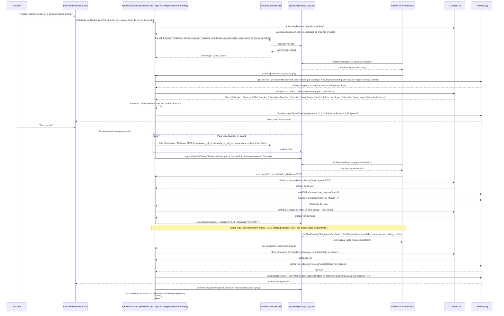
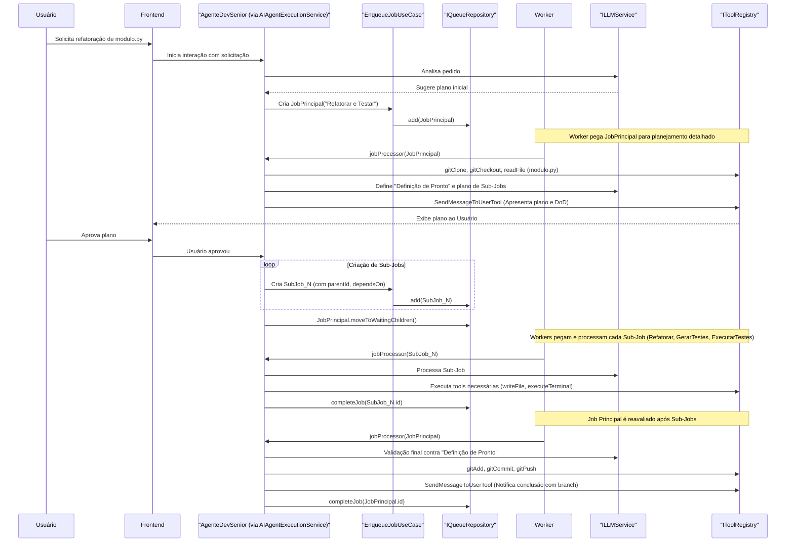

# Caso de Uso: Refatorar Código Legado e Adicionar Testes Unitários

Este documento detalha um cenário de uso para o Project Wiz, onde um usuário solicita a refatoração de um módulo de código legado e a criação de testes unitários correspondentes. O objetivo é explorar as interações entre o usuário, o AgenteIA (configurado por uma Persona e utilizando um LLM), os Casos de Uso, o sistema de Filas e as Tools, conforme a arquitetura alvo.

## Personagens e Componentes Envolvidos

*   **Usuário:** Desenvolvedor.
*   **AgenteDevSenior:** Um `AgenteIA` configurado com uma `Persona` de Desenvolvedor Sênior/Arquiteto.
    *   Possui acesso a: `GitTools`, `FileSystemTools` (readFile, writeFile), `CodeExecutionTools` (terminal), `CommunicationTools` (para interagir com o usuário).
    *   Sua lógica de processamento de Jobs é orquestrada pelo `AIAgentExecutionService`.
*   **`EnqueueJobUseCase`:** Caso de Uso para adicionar Jobs à fila.
*   **`IQueueRepository`:** Interface para persistência de Jobs.
*   **`Worker` (Infraestrutura):** Processo que pega Jobs da fila e executa o `jobProcessor` correspondente.
*   **`AIAgentExecutionService`:** Serviço de domínio que fornece o `jobProcessor` para os Jobs do AgenteDevSenior.
*   **`ILLMService`:** Interface para interação com o LLM.
*   **`IToolRegistry`:** Interface para acesso e execução de Tools.

## Fluxo Detalhado do Caso de Uso

**Etapa 1: Solicitação do Usuário**

*   **Interação:** O Usuário inicia uma conversa com o AgenteDevSenior através da interface de chat do Project Wiz.
    *   **Usuário:** "Olá, AgenteDevSenior! Tenho um módulo de código legado em Python aqui (`caminho/do/modulo.py`) que está bastante confuso e não possui testes unitários. Gostaria que você o refatorasse para melhorar a legibilidade, seguindo os padrões PEP 8, e também criasse testes unitários para as funções principais dele usando a biblioteca `unittest`. O código está no nosso repositório X, branch Y, na `working_directory` do projeto que já configuramos."

**Etapa 2: Análise Inicial, Criação do Job Principal e Planejamento pela Persona**

*   **Ações do AgenteDevSenior (orquestradas pelo `AIAgentExecutionService` atuando como `jobProcessor`):**
    1.  **Entendimento da Solicitação:** O `AIAgentExecutionService` recebe a solicitação (originada do chat do usuário) e usa o `ILLMService` para que o LLM (configurado pela PersonaDevSenior) interprete a necessidade.
    2.  **Criação do Job Principal:**
        *   O `AIAgentExecutionService` invoca o `EnqueueJobUseCase`.
        *   **`EnqueueJobUseCase`:**
            *   Cria uma instância da entidade `Job` rica (ex: `Job.create(jobProps)`).
            *   `jobProps` incluiria:
                *   `queueName`: `fila_AgenteDevSenior` (a fila dedicada deste Agente).
                *   `jobName`: `refatorar_e_testar_modulo` (identifica o tipo de processamento).
                *   `payload`: `{ repo_url: "url_do_repo_x", branch_original: "Y", caminho_arquivo_original: "caminho/do/modulo.py", padrao_estilo: "PEP 8", framework_testes: "unittest", solicitacao_original_usuario: "..." }`.
                *   `opts`: Opções padrão da fila ou específicas (ex: tentativas).
                *   Status inicial: `waiting`.
            *   Persiste o `Job` usando `IQueueRepository.add(job)`.
    3.  **Feedback Inicial ao Usuário (Opcional):**
        *   AgenteDevSenior (via `SendMessageToUserTool`): "Entendido! Recebi sua solicitação para refatorar e testar `modulo.py`. Vou iniciar a análise e o planejamento."

**Etapa 3: Planejamento Detalhado, Definição de Pronto e Ponto de Verificação com Usuário (Execução do Job Principal)**

*   Um `Worker` da infraestrutura pega o `Job` principal "refatorar_e_testar_modulo" da `fila_AgenteDevSenior`.
*   O `Worker` invoca o `jobProcessor` registrado para este `jobName` (que é uma função dentro do `AIAgentExecutionService`, configurada para o AgenteDevSenior).
*   **Dentro do `jobProcessor` (AgenteDevSenior):**
    1.  **Carregar Job e Contextos:** Carrega a entidade `Job` principal do `IQueueRepository` usando o ID do job fornecido pelo Worker. Carrega `AgentInternalState`.
    2.  **Preparar Ambiente:**
        *   Obtém o `caminho_working_directory` do Projeto (do `AgentInternalState` ou `payload` do Job).
        *   Usa `IToolRegistry` para invocar `GitTools`:
            *   `gitCloneTool` (se necessário) ou `gitFetchTool`.
            *   `gitCheckoutBranchTool` para o `branch_original`.
            *   `gitCreateBranchTool` para criar um novo branch de trabalho (ex: `feature/refactor-modulo-123`).
        *   Usa `readFileTool` para carregar `modulo.py` no `Job.data` (ActivityContext).
    3.  **Análise e Definição de "Definição de Pronto":**
        *   Usa `ILLMService` para analisar o código e a solicitação.
        *   Define os `validationCriteria` (Definição de Pronto) para o Job principal, armazenando-os em `Job.data`. Ex: "Código refatorado (PEP8), testes unitários para funções X,Y,Z criados, todos os testes passam, alterações commitadas no novo branch."
    4.  **Planejamento de Sub-Jobs:**
        *   Usa `ILLMService` para decompor o trabalho em `Sub-Jobs` lógicos:
            *   `sub_job_1_refatorar_pep8`
            *   `sub_job_2_identificar_funcoes_para_teste` (depende de sub_job_1)
            *   `sub_job_3_gerar_testes` (depende de sub_job_2)
            *   `sub_job_4_executar_testes` (depende de sub_job_3)
            *   `sub_job_5_commitar_validar_entrega` (depende de sub_job_4)
    5.  **Ponto de Verificação com Usuário:**
        *   Usa `SendMessageToUserTool` para apresentar o plano (lista de Sub-Jobs) e a "Definição de Pronto".
        *   **AgenteDevSenior (Chat):** "Analisei o módulo. Meu plano é: 1. Refatorar para PEP8. 2. Identificar funções. 3. Gerar testes. 4. Executar testes. 5. Commitar. A entrega final será um novo branch com código refatorado e testes passando. Você aprova?"
        *   O `jobProcessor` pode usar `job.moveToDelayed()` e lançar `DelayedError` para pausar o Job principal enquanto aguarda a resposta. A UI notificaria o Agente da resposta do usuário, que então reativaria o Job principal (ou o Worker o pegaria novamente após o delay).
    6.  **Criação dos Sub-Jobs:** Após aprovação do usuário:
        *   Para cada Sub-Job planejado, o `jobProcessor` invoca `EnqueueJobUseCase` para adicionar o `Sub-Job` à `fila_AgenteDevSenior`. Cada `Sub-Job` terá:
            *   `parent_job_id`: ID do Job principal.
            *   `depends_on_job_ids`: IDs dos Sub-Jobs dos quais depende.
            *   `jobName`: Ex: "aplicar_pep8", "gerar_testes_para_funcao_X".
            *   `payload`: Dados específicos para o Sub-Job (ex: código a ser refatorado, nome da função para gerar teste).
    7.  **Aguardar Sub-Jobs:** O `jobProcessor` do Job principal usa `job.moveToWaitingChildren()` (que internamente pode listar os IDs dos Sub-Jobs criados no `Job.data`) e lança `WaitingChildrenError`.

**Etapa 4: Execução dos Sub-Jobs**

*   Os `Workers` (instâncias de `AIAgentExecutionService` para o AgenteDevSenior) pegam os `Sub-Jobs` da `fila_AgenteDevSenior` conforme suas dependências são satisfeitas.
*   **Exemplo: `Sub-Job_aplicar_pep8` (`jobName="aplicar_pep8"`)**
    *   `jobProcessor` carrega o código do `Job.data` (passado do Job principal ou lido do branch na `working_directory`).
    *   Usa `ILLMService`: "Refatore este código para PEP8."
    *   LLM retorna código refatorado.
    *   Usa `writeFileTool` (ou `searchAndReplaceInFileTool`/`applyDiffTool`) para salvar na `working_directory` (no branch do Job).
    *   Usa `executeTerminalCommandTool` (`flake8`) para validar.
    *   Se houver erros, itera com `ILLMService` e `Tools` para corrigir. (Se dificuldades, aplica "regras de ouro": dividir tarefa, reavaliar, ou, como último recurso, criar um Sub-Job para pedir ajuda ao usuário).
    *   Ao concluir, chama `QueueClient.completeJob()` para este Sub-Job.
*   Outros Sub-Jobs seguem fluxos similares, usando as `Tools` e `ILLMService` apropriados.

**Etapa 5: Conclusão do Job Principal**

*   Quando todos os `Sub-Jobs` estão 'completed', o `Job` principal (que estava em 'waiting_children') se torna elegível novamente.
*   O `jobProcessor` do `Job` principal é reativado:
    1.  **Auto-Validação Final:** Compara os resultados dos Sub-Jobs com a "Definição de Pronto" armazenada em seu `Job.data`, usando `ILLMService` se necessário.
    2.  **Entrega:** Se a validação for bem-sucedida:
        *   Usa `GitTools` (`gitAddTool`, `gitCommitTool` com mensagem gerada pelo LLM, `gitPushTool` opcional) para finalizar o trabalho no branch da `working_directory` do projeto.
    3.  **Comunicação Final:** Usa `SendMessageToUserTool`:
        *   **AgenteDevSenior (Chat):** "Concluído! As refatorações e testes para `modulo.py` estão no branch `feature/refactor-modulo-123`. Todos os critérios de pronto foram atendidos. Por favor, revise."
    4.  Chama `QueueClient.completeJob()` para o Job principal.
    5.  **Aprendizado:** Consolida aprendizados sobre o `modulo.py` ou sobre o processo de refatoração no `AgentInternalState` (distinguindo entre conhecimento geral e específico do projeto).

## Diagrama de Sequência Simplificado do Caso de Uso

## Perguntas para Discussão e Refinamento:

(As perguntas originais ainda são válidas e podem ser rediscutidas à luz desta arquitetura mais detalhada.)

1.  **Interação do Usuário:** O ponto de verificação para aprovação do plano é suficiente?
2.  **Sub-Jobs:** A granularidade dos Sub-Jobs está adequada?
3.  **Tools:** Alguma `Tool` crítica faltando para este fluxo?
4.  **Estratégia de Dificuldades:** Como a "regra de ouro" de pedir ajuda ao usuário seria acionada e gerenciada pelo `jobProcessor`?
5.  **"Definição de Pronto":** Este continua sendo um bom mecanismo?
6.  **Entrega via Git:** O fluxo de commit e push está claro?
7.  **`AgentInternalState`:** A forma de aprendizado (geral vs. projeto) é adequada?
