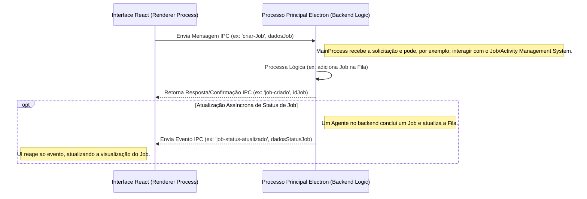
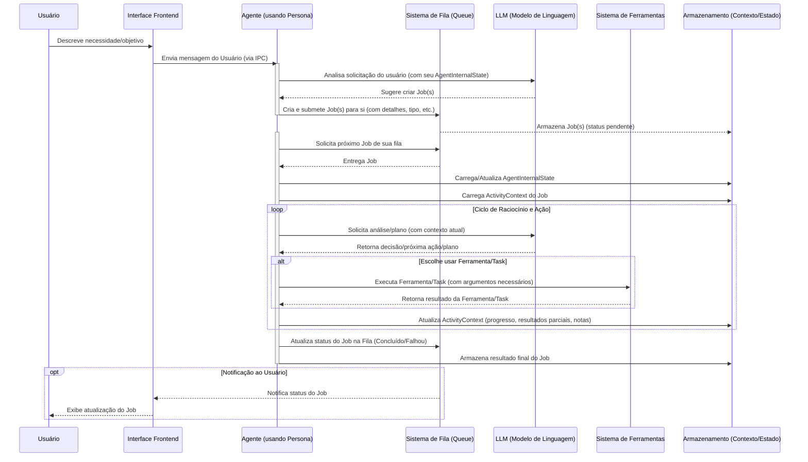

# Project Wiz: Visão Conceitual para Desenvolvedores

Este documento oferece uma visão geral do Project Wiz sob uma perspectiva mais técnica, focando na arquitetura conceitual, componentes chave, fluxos de trabalho e tecnologias envolvidas. O objetivo é fornecer um entendimento de como o sistema opera internamente em um nível conceitual.

## Arquitetura Geral e Filosofia

O Project Wiz é uma aplicação desktop **Electron**, onde o processo principal do Electron (Node.js) gerencia a lógica de backend (Agentes, Fila de Jobs, estado) e o processo de renderização (Chromium) é responsável pela interface do usuário (UI) construída em **React**. A comunicação entre o frontend (processo de renderização) e o backend (processo principal) ocorre via **IPC (Inter-Process Communication)** do Electron. Esta arquitetura permite que o Project Wiz funcione como uma aplicação local robusta, com acesso ao sistema de arquivos e outros recursos nativos quando necessário, ao mesmo tempo que utiliza tecnologias web modernas para a interface do usuário.

Abaixo, um diagrama simplificado ilustra essa comunicação IPC:


Este mecanismo de IPC é fundamental para a interatividade da aplicação, permitindo que a UI dispare ações no backend e receba atualizações em tempo real sobre o progresso dos Jobs e o estado dos Agentes.

A filosofia central do Project Wiz é a de uma "fábrica de software autônoma" operando localmente. Nela, o **Usuário** interage com **Agentes** (lógicas autônomas de processamento) através da UI. Cada Agente é configurado por uma **Persona**, que define como um **LLM (Large Language Model)** subjacente deve se comportar (seu papel, objetivos, tom, conhecimentos específicos). A interação do usuário com a Persona (Agente) geralmente leva o Agente a decidir criar e executar um ou mais **Jobs** (tarefas) para atender à solicitação. Ao lidar com tarefas de modificação de código, o Agente opera dentro da **`working_directory` do Projeto** e é uma boa prática que ele crie/utilize **branches Git específicos** para isolar as alterações de cada Job. Para realizar os Jobs, os Agentes utilizam um conjunto de **Tools** (funcionalidades específicas codificadas no sistema e expostas ao LLM). A maior parte da lógica de "como" um Job é executado é determinada pelo LLM em tempo de execução, que interpreta uma **Task** (um objetivo ou prompt específico derivado do Job, formulado pelo Agente) e orquestra as `Tools` disponíveis para cumpri-la.

## Componentes Chave do Backend (Conceitual)

Os componentes do backend são projetados para serem modulares e interagirem de forma coesa para executar os Jobs. Abaixo, um diagrama de blocos ilustra suas principais interações, seguido de uma descrição mais detalhada de cada um:

```mermaid
graph TD
    subgraph "Usuário e Interface"
        UI[Interface Frontend (React)]
    end

    subgraph "Núcleo do Backend (Electron Main Process)"
        Queue["Sistema de Fila de Jobs (Queue)"]
        WorkerPool["Gerenciador de Agentes (Worker Pool)"]
        AgentLogic["Lógica do Agente (Persona Core Logic)"]
        TaskManager["Sistema de Execução de Tasks (Formula Prompts)"]
        ToolRegistry["Framework/Registro de Ferramentas (Tools)"]
        StateManager["Subsistema de Gerenciamento de Estado (SQLite)"]
        LLMIntegration["Ponto de Integração LLM (AI SDK)"]
    end

    UI -- "1. Interage com (via IPC)" --> AgentLogic
    AgentLogic -- "2. Cria/Gerencia Jobs na" --> Queue
    WorkerPool -- "3. Gerencia instâncias de" --> AgentLogic
    AgentLogic -- "4. Solicita Jobs da" --> Queue
    AgentLogic -- "5. Carrega/Salva Estado" --> StateManager
    AgentLogic -- "6. Usa para Raciocínio" --> LLMIntegration
    AgentLogic -- "7. Formula Task para" --> TaskManager
    TaskManager -- "Envia Prompt para" --> LLMIntegration
    LLMIntegration -- "Retorna resposta do LLM para" --> AgentLogic
    AgentLogic -- "LLM solicita uso de Tool via" --> ToolRegistry
    ToolRegistry -- "Executa Tool e retorna para" --> AgentLogic
    AgentLogic -- "8. Reporta Status para Atualizar" --> Queue
    Queue -- "Notifica (via IPC)" --> UI


    %% Detalhes de interdependência dentro da PersonaLogic (não são fluxos sequenciais diretos, mas usos)
    subgraph "Detalhes da Lógica do Agente"
        AgentLogic --- StateManager
        AgentLogic --- LLMIntegration
        AgentLogic --- TaskManager
        AgentLogic --- ToolRegistry
    end
```

*   **Persona Core Logic (Autonomous Agent):** Este componente é o "cérebro" de cada Agente. Ele não é a Persona em si (que é uma configuração de prompt/comportamento), mas a lógica de software que *utiliza* essa configuração de Persona para instruir um LLM.
    *   **Responsabilidades Críticas:** Gerenciar o ciclo de vida completo de um `Job` que o Agente se atribuiu, desde a interpretação da necessidade do usuário, criação do `Job`, planejamento com o LLM, execução de `Tasks` e `Tools`, até a auto-validação e conclusão. Orquestra a interação complexa entre o `LLM`, as `Tools` disponíveis, e os estados (`AgentInternalState` e `ActivityContext`). É responsável por promover aprendizados do `ActivityContext` para o `AgentInternalState`.
    *   **Interações:**
        *   Com `StateManager`: Carrega/salva `AgentInternalState` e `ActivityContext`.
        *   Com `TaskExecutionSystem` (e indiretamente `LLMIntegrationPoint`): Formula e envia `Tasks` (prompts) para o LLM.
        *   Com `ToolFramework/Registry`: Solicita a execução de `Tools` conforme decidido pelo LLM.
        *   Com `Queue`: Submete `Jobs` que ele mesmo cria e atualiza seus status.
        *   Pode usar `Tools` de comunicação para interagir com outros Agentes ou com o usuário via Frontend (IPC).

*   **Job/Activity Management System (Queue):** Inspirado em sistemas robustos como BullMQ e persistido em SQLite (via Drizzle ORM), este sistema atua como o coordenador central de `Jobs`.
    *   **Responsabilidades Críticas:** Gerenciar de forma confiável a fila de `Jobs` de todo o sistema, assegurando que nenhum `Job` seja perdido e que as dependências sejam respeitadas.
    *   **Interações:**
        *   Recebe novos `Jobs` criados pelos `Agentes`.
        *   Responde às solicitações dos `Agentes` (Workers), entregando o próximo `Job` elegível da fila específica daquele Agente.
        *   Armazena e atualiza o status dos `Jobs`, gerencia dependências (`depends_on_job_ids`, `parent_job_id`), e lida com prioridades. Embora a prioridade base possa ser definida na criação do `Job` pelo Agente, o próprio Agente pode usar `Tools` para influenciar dinamicamente a prioridade de seus `Jobs` ou `Sub-Jobs`.
        *   Suporta retentativas configuráveis e agendamento de `Jobs`. Emite eventos sobre mudanças de status, permitindo que a UI e outros sistemas reajam.

*   **Worker & Worker Pool:** Um "Worker" conceitual representa o loop de processamento assíncrono individual de um Agente autônomo. O "Worker Pool" (ou Gerenciador de Agentes) é o componente que gerencia o ciclo de vida dessas instâncias de Agentes ativos e concorrentes.
    *   **Responsabilidades Críticas:** Garantir que os `Jobs` na `Queue` sejam processados pelos Agentes corretos e gerenciar a concorrência e o ciclo de vida dos Agentes.
    *   **Interações:**
        *   O `WorkerPool` instancia, monitora e finaliza Agentes conforme necessário.
        *   Cada Agente (Worker) solicita ativamente seus `Jobs` à `Queue`.
        *   O Agente (Worker) então executa o `Job` utilizando sua `PersonaCoreLogic`. Após a conclusão (sucesso ou falha), o Agente reporta o novo status à `Queue`. A concorrência do sistema vem de múltiplos Agentes operando em paralelo, cada um em seu loop.

*   **Task Execution System:** Este é o mecanismo pelo qual um Agente, através de sua `PersonaCoreLogic`, formula e envia uma `Task` (um objetivo claro e contextualizado, ou seja, um prompt específico) para o LLM. Não se trata de executar uma sequência de passos pré-definidos no código do Agente, mas sim de preparar a consulta para que o LLM possa realizar o planejamento e a execução da lógica principal da `Task`.
    *   **Responsabilidades Críticas:** Transformar um objetivo de alto nível de um `Job` (ou um passo intermediário planejado pelo Agente) em um prompt eficaz para o LLM, fornecendo todo o contexto necessário.
    *   **Interações:**
        *   Recebe o objetivo/meta do `PersonaCoreLogic`.
        *   Coleta e formata o contexto relevante do `ActivityContext` (histórico de conversa, dados do Job) e do `AgentInternalState` (conhecimento de longo prazo).
        *   Obtém a lista de `Tools` disponíveis e suas descrições do `ToolFramework/Registry`.
        *   Envia o prompt completo para o `LLMIntegrationPoint` e retorna a resposta bruta do LLM para o `PersonaCoreLogic` para interpretação e ação.

*   **Tool Framework/Registry:** Uma coleção de `Tools` (funcionalidades) pré-desenvolvidas, versionadas, e bem definidas no código fonte da aplicação, que são expostas ao LLM através do AI SDK.
    *   **Responsabilidades Críticas:** Fornecer um conjunto de capacidades concretas e seguras que o LLM pode solicitar para interagir com o ambiente do sistema e além (arquivos, terminal, outras APIs, outros Agentes).
    *   **Interações:**
        *   O `PersonaCoreLogic`, após o LLM indicar o desejo de usar uma `Tool` (com base nas descrições fornecidas), solicita a execução dessa `Tool` ao `ToolFramework/Registry`, passando os argumentos especificados pelo LLM.
        *   O Framework localiza e executa o código da `Tool` correspondente.
        *   A `Tool` executa sua lógica (ex: `ReadFileTool`, `WriteToDBTool`, `SendMessageToAgentTool`, `PostToProjectChannelTool`) e retorna um resultado (sucesso, dados, ou erro) ao `PersonaCoreLogic`.
        *   O LLM "aprende" sobre as `Tools` e como usá-las através das descrições que são injetadas no prompt pelo `LLMIntegrationPoint`.

*   **LLM Integration Point:** Abstrai e gerencia a comunicação com diferentes provedores de LLM (ex: OpenAI, DeepSeek), que são configuráveis pelo usuário.
    *   **Responsabilidades Críticas:** Facilitar a interação confiável, contextualizada e configurável com os LLMs, tratando das particularidades de cada API de provedor.
    *   **Interações:**
        *   Recebe prompts (formulados pelo `TaskExecutionSystem`) do `PersonaCoreLogic`.
        *   Gerencia o histórico de conversas (`CoreMessages` ou estrutura similar) para manter o contexto nas interações com o LLM dentro de um `ActivityContext`.
        *   Aplica configurações específicas da Persona e do usuário (modelo de LLM, temperatura, chaves de API seguras, embeddings, etc.) à requisição.
        *   Envia o prompt formatado ao provedor de LLM selecionado e retorna a resposta (texto, código, decisão de usar `Tool`) ao `PersonaCoreLogic`.
        *   Pode lidar com erros comuns de API de LLMs (ex: rate limits, timeouts), implementando lógicas de retentativa ou fallback se apropriado.

*   **State Management Subsystem (SQLite):** Responsável pela persistência robusta dos estados cruciais da aplicação, utilizando Drizzle ORM sobre SQLite.
    *   **Responsabilidades Críticas:** Garantir a durabilidade, consistência e recuperação dos dados de longo prazo dos Agentes e do contexto detalhado das tarefas ativas, mesmo entre sessões da aplicação.
    *   **Interações:**
        *   O `PersonaCoreLogic` lê e escreve no `AgentInternalState` (memória de médio/longo prazo do Agente: sua lista de Jobs, conhecimentos acumulados, anotações promovidas de `ActivityContexts` anteriores, promessas feitas).
        *   Também lê e escreve no `ActivityContext` (contexto da tarefa ativa: histórico completo de mensagens e ações do LLM/Tools, `validationCriteria` definidos pelo Agente, `validationResult`, e outros metadados do Job).
        *   A `Queue` também utiliza este subsistema para persistir os `Jobs` e seus estados.
        *   O acesso é geralmente feito através de repositórios ou serviços que abstraem as queries diretas ao Drizzle/SQLite.

## Fluxo de Trabalho Principal (Job Lifecycle)

O ciclo de vida de um Job no Project Wiz envolve uma série de etapas orquestradas, desde sua criação até a conclusão. O diagrama a seguir, importado de `02_diagramas_fluxo_atual.md`, ilustra este fluxo:



1.  **Início da Interação e Criação do Job pelo Agente:** O usuário, através da UI (Frontend), descreve uma necessidade ou objetivo para uma `Persona` específica, geralmente no contexto de um `Project`. O Agente (utilizando a `Persona`) analisa a solicitação com o LLM e, se apropriado, decide criar um ou mais `Jobs` para si, definindo seus detalhes, incluindo o escopo da tarefa e como ela se encaixa no `Project` (ex: qual arquivo ou módulo na `working_directory` do projeto será afetado). Antes de prosseguir com a execução, o Agente pode apresentar um plano e uma "Definição de Pronto" ao usuário para aprovação. O Agente também criará um novo branch Git na `working_directory` do projeto para isolar as alterações deste `Job` ou conjunto de `Sub-Jobs`.
2.  **Envio para a Fila:** Os `Jobs` criados pelo Agente são então submetidos por ele ao `Job/Activity Management System (Queue)` e persistidos em SQLite. A Fila gerencia o estado inicial (ex: "pendente" ou "aguardando dependências" de outros `Sub-Jobs` do mesmo Agente).
3.  **Obtenção pelo Agente (Seu Próprio Worker Loop):** Cada Agente (atuando como seu próprio Worker) solicita ativamente à `Queue` um `Job` elegível de sua própria lista de responsabilidades. A elegibilidade considera as dependências (que o Agente pode ter definido entre seus próprios `Jobs`) e a prioridade.
4.  **Carregamento de Contexto:** Ao obter um `Job`, o Agente carrega seu `AgentInternalState` (memória de longo prazo e conhecimentos gerais/específicos do projeto) e o `ActivityContext` específico do `Job` (histórico de interações da tarefa atual).
5.  **Formulação da Task (Prompt):** O Agente, através de sua `Persona Core Logic`, formula uma `Task` (um prompt detalhado e contextualizado) para o `LLM`. Este prompt é construído usando o objetivo do `Job`, os dados do `ActivityContext` (incluindo histórico de conversas), informações relevantes do `AgentInternalState`, e é executado no contexto do branch Git previamente criado na `working_directory` do projeto.
6.  **Processamento pelo LLM:** O `LLM` processa a `Task`. Com base na configuração da `Persona` e no prompt, o `LLM` pode planejar uma série de passos, decidir usar uma ou mais `Tools` disponíveis para coletar informações ou realizar ações, ou gerar uma resposta direta (ex: um trecho de código, um texto).
7.  **Execução de Tools:** Se o `LLM` decide usar uma `Tool`, o Agente interage com o `Tool Framework/Registry` para executar a `Tool` com os parâmetros fornecidos pelo `LLM`. O resultado da `Tool` é retornado ao Agente.
8.  **Atualização do ActivityContext:** O Agente atualiza o `ActivityContext` do `Job` com os resultados da ação da `Tool`, a resposta do `LLM`, quaisquer erros ocorridos, e o histórico da interação. Este contexto enriquecido é crucial para os próximos ciclos de raciocínio.
9.  **Auto-Validação:** O Agente, como parte de seu planejamento ou ao final de uma sequência de ações, pode definir `validationCriteria` (a "Definição de Pronto" para o `Job` ou um passo importante). Antes de considerar o `Job` concluído, ele realiza uma auto-validação (que pode ser uma sub-Task enviada ao `LLM` para avaliar o resultado contra os critérios). Se a validação falhar, o Agente retorna ao passo 5 para replanejar e corrigir o trabalho.
10. **Comunicação Inter-Agente (Opcional):** Durante sua execução, um Agente pode usar `Tools` de comunicação para interagir com outros Agentes, por exemplo, para solicitar uma informação específica, pedir a execução de um Sub-Job por um Agente mais especializado, ou notificar sobre um evento. Isso pode levar o Agente receptor a criar novos `Jobs` para si em sua própria fila.
11. **Conclusão e Notificação:** Ao concluir o `Job` (seja com sucesso após passar na auto-validação, ou com falha após esgotar retentativas ou encontrar um erro crítico), o Agente atualiza o status final do `Job` na `Queue`. A `Queue` então persiste essa mudança e notifica o frontend (via IPC) para que o usuário seja informado.

## Tecnologias Principais (Stack)

*   **Desktop:** Electron
*   **UI:** React, Tailwind CSS, shadcn/ui (ou inspiração similar com Radix UI para componentes base)
*   **Build/Dev:** Vite
*   **Linguagem:** TypeScript (para frontend, backend e build scripts)
*   **ORM & Banco de Dados:** Drizzle ORM com SQLite (para persistência de estado e fila de Jobs)
*   **Internacionalização (i18n):** LinguiJS
*   **Roteamento (Frontend):** TanStack Router
*   **Validação de Schema:** Zod (para validação de dados de Jobs, configurações, etc.)
*   **Testes:** Vitest (para testes unitários e de integração)
*   **IA:** AI SDK (como Vercel AI SDK ou similar) para interagir com provedores de LLM (OpenAI, DeepSeek, etc.)

## Extensibilidade

O Project Wiz é projetado com extensibilidade em mente:

*   **Novas Tools:** Desenvolvedores podem expandir as capacidades dos Agentes criando novas `Tools`. Para isso, seria necessário:
    *   Definir uma interface clara para a `Tool`: quais argumentos ela aceita (com seus tipos, usando Zod para validação, por exemplo) e o que ela retorna.
    *   Implementar a lógica da `Tool` em TypeScript. Essa lógica pode interagir com o sistema de arquivos, APIs externas, executar comandos, etc., sempre respeitando as permissões do ambiente Electron.
    *   Registrar a `Tool` no `Tool Framework/Registry`, fornecendo uma descrição funcional detalhada. Essa descrição é crucial, pois é como o LLM "aprende" sobre a existência da `Tool` e entende sua utilidade e como invocá-la.

*   **Novas Personas:** A configuração de novas `Personas` é uma forma primária de especializar o comportamento dos Agentes. Isso envolve mais do que apenas definir um nome e um papel. É crucial detalhar seu `goal` (objetivo principal que a Persona deve buscar em suas tarefas) e `backstory` (contexto, conhecimentos prévios, e estilo de atuação) no prompt de sistema que será usado para o LLM. A seleção cuidadosa das `Tools` que são habilitadas para uma determinada Persona também é fundamental, pois define seu escopo de atuação e as capacidades que o LLM pode orquestrar para ela.

*   **Novas Tasks (Prompts):** A verdadeira flexibilidade e poder do sistema residem na capacidade de definir `Tasks` complexas e novas através de prompts bem elaborados, geralmente encapsulados na descrição de um `Job`. Um desenvolvedor ou usuário avançado pode criar novos tipos de `Jobs` que, por sua vez, formulam `Tasks` que instruem o LLM (configurado pela Persona) a utilizar as `Tools` existentes de maneiras inovadoras e criativas para resolver novos tipos de problemas, muitas vezes sem a necessidade de codificar novas `Tools` para cada variação de tarefa.

Esta visão geral deve ajudar a entender a estrutura e o funcionamento conceitual do Project Wiz. O sistema é projetado para ser flexível, com grande parte da orquestração de tarefas delegada à inteligência do LLM, que é cuidadosamente configurado pela Persona e capacitado pelas Tools disponíveis, operando de forma segura dentro da `working_directory` do projeto e utilizando branches Git para gerenciamento de alterações.
