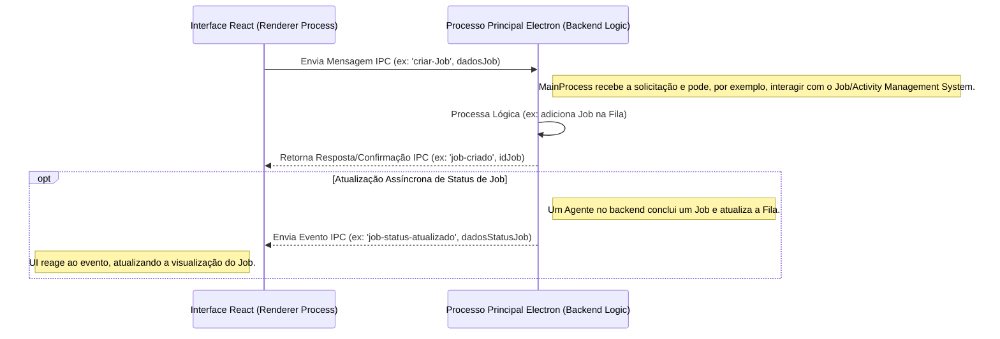
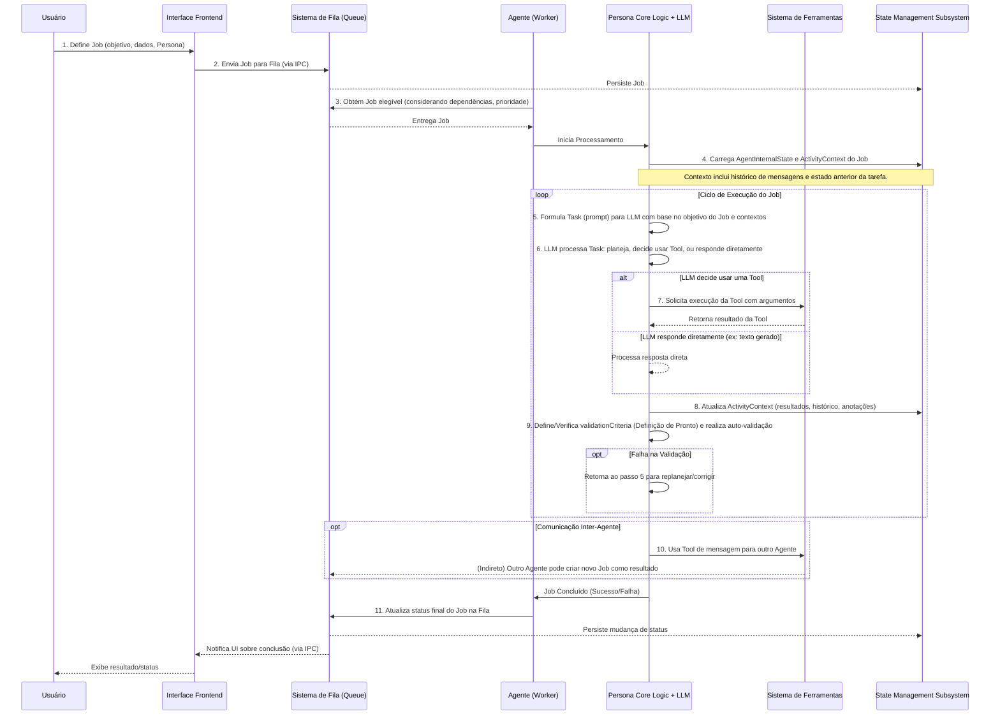

# Project Wiz: Visão Conceitual para Desenvolvedores

Este documento oferece uma visão geral do Project Wiz sob uma perspectiva mais técnica, focando na arquitetura conceitual, componentes chave, fluxos de trabalho e tecnologias envolvidas. O objetivo é fornecer um entendimento de como o sistema opera internamente em um nível conceitual.

## Arquitetura Geral e Filosofia

O Project Wiz é uma aplicação desktop **Electron**, onde o processo principal do Electron (Node.js) gerencia a lógica de backend (Agentes, Fila de Jobs, estado) e o processo de renderização (Chromium) é responsável pela interface do usuário (UI) construída em **React**. A comunicação entre o frontend (processo de renderização) e o backend (processo principal) ocorre via **IPC (Inter-Process Communication)** do Electron. Esta arquitetura permite que o Project Wiz funcione como uma aplicação local robusta, com acesso ao sistema de arquivos e outros recursos nativos quando necessário, ao mesmo tempo que utiliza tecnologias web modernas para a interface do usuário.

Abaixo, um diagrama simplificado ilustra essa comunicação IPC:


Este mecanismo de IPC é fundamental para a interatividade da aplicação, permitindo que a UI dispare ações no backend e receba atualizações em tempo real sobre o progresso dos Jobs e o estado dos Agentes.

A filosofia central do Project Wiz é a de uma "fábrica de software autônoma" operando localmente. Nela, **Agentes** (lógicas autônomas de processamento) são configurados por **Personas**. As Personas são essencialmente prompts de sistema detalhados e configurações que modelam como um **LLM (Large Language Model)** deve se comportar, qual seu papel, objetivos e estilo de comunicação. Esses Agentes configurados executam **Jobs** (tarefas definidas pelo usuário ou por outros Agentes). Para realizar os Jobs, os Agentes utilizam um conjunto de **Tools** (funcionalidades específicas codificadas no sistema e expostas ao LLM). A maior parte da lógica de "como" um Job é executado é determinada pelo LLM em tempo de execução, que interpreta uma **Task** (um objetivo ou prompt específico derivado do Job) e orquestra as `Tools` disponíveis para cumpri-la.

## Componentes Chave do Backend (Conceitual)

Os componentes do backend são projetados para serem modulares e interagirem de forma coesa para executar os Jobs. Abaixo, um diagrama de blocos ilustra suas principais interações, seguido de uma descrição mais detalhada de cada um:

```mermaid
graph TD
    subgraph Interação Usuário
        UI[Interface Frontend (React)]
    end

    subgraph Núcleo do Backend (Electron Main Process)
        Queue[Job/Activity Management System (Queue)]
        WorkerPool[Worker & Worker Pool (Gerenciador de Agentes)]
        PersonaLogic[Persona Core Logic / Autonomous Agent]
        TaskManager[Task Execution System (Formulador de Prompt para LLM)]
        ToolRegistry[Tool Framework/Registry (Definição e Acesso a Tools)]
        StateManager[State Management Subsystem (SQLite via Drizzle)]
        LLMIntegration[LLM Integration Point (AI SDK)]
    end

    UI -- 1. Criação/Monitoramento de Jobs (via IPC) --> Queue
    WorkerPool -- 2. Obtém Jobs da --> Queue
    WorkerPool -- 3. Delega Job para Instância de --> PersonaLogic
    PersonaLogic -- 4. Carrega/Salva Estado (AgentInternalState, ActivityContext) --> StateManager
    PersonaLogic -- 5. Usa para Raciocínio e Decisão --> LLMIntegration
    PersonaLogic -- 6. Decide e Formula Task para --> TaskManager
    TaskManager -- Formula Prompt --> LLMIntegration
    LLMIntegration -- Retorna resposta do LLM --> PersonaLogic
    PersonaLogic -- LLM solicita uso de Tool --> ToolRegistry
    ToolRegistry -- Executa Tool e retorna resultado --> PersonaLogic
    PersonaLogic -- 9. Reporta Conclusão/Progresso do Job --> WorkerPool
    WorkerPool -- 10. Atualiza Status na --> Queue
    Queue -- Notifica (via IPC) --> UI
```

*   **Persona Core Logic (Autonomous Agent):** Este não é a Persona em si (que é uma configuração), mas a lógica de software que *utiliza* uma configuração de Persona para instruir um LLM. É o "motor" de um Agente.
    *   **Responsabilidades Críticas:** Gerencia o ciclo de vida completo de um Job que lhe é atribuído, desde o planejamento inicial até a auto-validação e conclusão. Orquestra a interação entre o LLM e as `Tools`.
    *   **Interações:** Carrega o `AgentInternalState` e o `ActivityContext` do `StateManager`. Formula `Tasks` (prompts) e as envia para o `LLMIntegrationPoint` (via `TaskExecutionSystem`). Recebe as intenções do LLM e, se for para usar uma `Tool`, interage com o `ToolFramework/Registry` para executar a `Tool` e obter seu resultado. Atualiza continuamente os contextos no `StateManager`. Reporta o status final do Job ao `WorkerPool`. Pode também iniciar a comunicação com outros Agentes usando `Tools` específicas.

*   **Job/Activity Management System (Queue):** Inspirado em sistemas robustos como BullMQ e persistido em SQLite (via Drizzle ORM).
    *   **Responsabilidades Críticas:** Gerenciar de forma confiável a fila de `Jobs` de todo o sistema.
    *   **Interações:** Recebe novos `Jobs` da UI (via IPC) ou de Agentes (Sub-Jobs). É consultado pelo `WorkerPool` para obter `Jobs` elegíveis. Armazena e atualiza o status dos `Jobs` (pendente, em execução, concluído, falhou, aguardando dependência, agendado), gerencia dependências (`depends_on_job_ids`, `parent_job_id`), e lida com prioridades. As prioridades podem ser inicialmente definidas pelo usuário ou Agente, mas um Agente também pode, através de `Tools`, influenciar a prioridade de seus próprios `Jobs` ou `Sub-Jobs` na fila. Suporta retentativas configuráveis e agendamento de `Jobs`.

*   **Worker & Worker Pool:** Um "Worker" conceitual representa o loop de processamento assíncrono individual de um Agente autônomo. O "Worker Pool" é o componente que gerencia essas instâncias de Agentes ativos e concorrentes.
    *   **Responsabilidades Críticas:** Garantir que os `Jobs` da `Queue` sejam processados pelos Agentes apropriados e gerenciar a concorrência dos Agentes.
    *   **Interações:** O `WorkerPool` monitora a `Queue`. Quando um `Job` está pronto e um Agente com a Persona correspondente está disponível (ou pode ser instanciado), o `WorkerPool` designa o `Job` a esse Agente (Worker). O Agente (Worker) então executa o `Job` conforme descrito na lógica do `PersonaCoreLogic`. Após a conclusão, o `WorkerPool` atualiza a `Queue`.

*   **Task Execution System:** Este é o mecanismo pelo qual um Agente formula e envia uma `Task` (um objetivo claro, um prompt específico, possivelmente com dados de entrada relevantes) para o LLM. Não se trata de executar uma sequência de passos pré-definidos no código, mas sim de preparar a consulta para que o LLM possa planejar e executar.
    *   **Responsabilidades Críticas:** Transformar um objetivo de alto nível de um `Job` ou um passo intermediário planejado pelo Agente em um prompt eficaz para o LLM.
    *   **Interações:** Recebe o objetivo do `PersonaCoreLogic`, juntamente com o contexto (`ActivityContext`, `AgentInternalState`) e a lista de `Tools` disponíveis. Envia o prompt resultante para o `LLMIntegrationPoint` e retorna a resposta do LLM para o `PersonaCoreLogic`.

*   **Tool Framework/Registry:** Uma coleção de `Tools` pré-desenvolvidas, versionadas e bem definidas, que são expostas ao LLM através do AI SDK.
    *   **Responsabilidades Críticas:** Fornecer um conjunto de capacidades concretas que o LLM pode solicitar para interagir com o ambiente.
    *   **Interações:** O `PersonaCoreLogic` (após instrução do LLM) solicita a execução de uma `Tool` específica ao `ToolFramework/Registry`, passando os argumentos necessários. O Framework executa a `Tool` (que pode ser desde manipulação de arquivos, execução de comandos no terminal, até comunicação inter-agente como `SendMessageToAgentTool` ou `PostToProjectChannelTool`) e retorna o resultado. O LLM "conhece" as `Tools` através das descrições fornecidas pelo AI SDK.

*   **LLM Integration Point:** Abstrai e gerencia a comunicação com diferentes provedores de LLM (ex: OpenAI, DeepSeek), configuráveis pelo usuário.
    *   **Responsabilidades Críticas:** Facilitar a interação confiável e contextualizada com os LLMs.
    *   **Interações:** Recebe prompts do `TaskExecutionSystem`. Gerencia o histórico de conversas (`CoreMessages` ou similar) para manter o contexto nas interações com o LLM dentro de um `ActivityContext`. Aplica configurações específicas da Persona (modelo, temperatura, etc.). Envia o prompt ao LLM e retorna sua resposta. Pode lidar com erros comuns de API, retentativas e rate limiting.

*   **State Management Subsystem (SQLite):** Responsável pela persistência dos estados cruciais da aplicação, utilizando Drizzle ORM sobre SQLite.
    *   **Responsabilidades Críticas:** Garantir a durabilidade e consistência dos dados de longo prazo dos Agentes e do contexto das tarefas ativas.
    *   **Interações:** O `PersonaCoreLogic` lê e escreve no `AgentInternalState` (memória de médio/longo prazo do Agente: conhecimentos acumulados, anotações promovidas, lista de seus Jobs/Activities) e no `ActivityContext` (contexto da tarefa ativa: histórico de mensagens/ações, `validationCriteria` definidos pelo Agente, `validationResult`, e outros metadados do Job). A `Queue` também utiliza este subsistema para persistir os `Jobs`.

## Fluxo de Trabalho Principal (Job Lifecycle)

O ciclo de vida de um Job no Project Wiz envolve uma série de etapas orquestradas, desde sua criação até a conclusão:



1.  **Criação do Job:** O usuário (através da UI) ou um Agente (como parte de um processo interno, criando um Sub-Job) define um novo `Job`. Isso inclui o objetivo principal (que se tornará a `Task` inicial), quaisquer dados de entrada necessários, dependências de outros `Jobs` e a `Persona` (configuração do Agente) que deve executá-lo.
2.  **Envio para a Fila:** O `Job` é enviado para o `Job/Activity Management System (Queue)` e persistido em SQLite. A Fila gerencia seu estado inicial (ex: "pendente" ou "aguardando dependências").
3.  **Obtenção pelo Agente (Worker):** Um Agente (atuando como seu próprio Worker), que corresponde à `Persona` designada e está ocioso, consulta a `Queue` e obtém um `Job` elegível. A elegibilidade considera as dependências e a prioridade, que o próprio Agente pode ter influenciado anteriormente para seus `Jobs` através de `Tools` específicas.
4.  **Carregamento de Contexto:** O Agente carrega seu `AgentInternalState` (sua memória de longo prazo e conhecimentos) e o `ActivityContext` específico do `Job` (que contém o histórico de interações, mensagens anteriores, e o estado atual da tarefa).
5.  **Formulação da Task (Prompt):** O Agente, através de sua `Persona Core Logic`, formula uma `Task` – um prompt detalhado e contextualizado – para o `LLM`. Este prompt é construído usando o objetivo do `Job`, os dados do `ActivityContext` e informações relevantes do `AgentInternalState`.
6.  **Processamento pelo LLM:** O `LLM` processa a `Task`. Com base na configuração da `Persona` e no prompt, o `LLM` pode planejar uma série de passos, decidir usar uma ou mais `Tools` disponíveis para coletar informações ou realizar ações, ou gerar uma resposta direta (ex: um trecho de código, um texto).
7.  **Execução de Tools:** Se o `LLM` decide usar uma `Tool`, o Agente interage com o `Tool Framework/Registry` para executar a `Tool` com os parâmetros fornecidos pelo `LLM`. O resultado da `Tool` é retornado ao Agente.
8.  **Atualização do ActivityContext:** O Agente atualiza o `ActivityContext` do `Job` com os resultados da ação da `Tool`, a resposta do `LLM`, quaisquer erros ocorridos, e o histórico da interação. Este contexto enriquecido é crucial para os próximos ciclos de raciocínio.
9.  **Auto-Validação:** O Agente, como parte de seu planejamento ou ao final de uma sequência de ações, pode definir `validationCriteria` (a "Definição de Pronto" para o `Job` ou um passo importante). Antes de considerar o `Job` concluído, ele realiza uma auto-validação (que pode ser uma sub-Task enviada ao `LLM` para avaliar o resultado contra os critérios). Se a validação falhar, o Agente retorna ao passo 5 para replanejar e corrigir o trabalho.
10. **Comunicação Inter-Agente (Opcional):** Durante sua execução, um Agente pode usar `Tools` de comunicação para interagir com outros Agentes, por exemplo, para solicitar uma informação específica, pedir a execução de um Sub-Job por um Agente mais especializado, ou notificar sobre um evento. Isso pode levar o Agente receptor a criar novos `Jobs` para si em sua própria fila.
11. **Conclusão e Notificação:** Ao concluir o `Job` (seja com sucesso após passar na auto-validação, ou com falha após esgotar retentativas ou encontrar um erro crítico), o Agente atualiza o status final do `Job` na `Queue`. A `Queue` então persiste essa mudança e notifica o frontend (via IPC) para que o usuário seja informado.

## Tecnologias Principais (Stack)

*   **Desktop:** Electron
*   **UI:** React, Tailwind CSS, shadcn/ui (ou inspiração similar com Radix UI para componentes base)
*   **Build/Dev:** Vite
*   **Linguagem:** TypeScript (para frontend, backend e build scripts)
*   **ORM & Banco de Dados:** Drizzle ORM com SQLite (para persistência de estado e fila de Jobs)
*   **Internacionalização (i18n):** LinguiJS
*   **Roteamento (Frontend):** TanStack Router
*   **Validação de Schema:** Zod (para validação de dados de Jobs, configurações, etc.)
*   **Testes:** Vitest (para testes unitários e de integração)
*   **IA:** AI SDK (como Vercel AI SDK ou similar) para interagir com provedores de LLM (OpenAI, DeepSeek, etc.)

## Extensibilidade

O Project Wiz é projetado com extensibilidade em mente:

*   **Novas Tools:** Desenvolvedores podem expandir as capacidades dos Agentes criando novas `Tools`. Para isso, seria necessário:
    *   Definir uma interface clara para a `Tool`: quais argumentos ela aceita (com seus tipos, usando Zod para validação, por exemplo) e o que ela retorna.
    *   Implementar a lógica da `Tool` em TypeScript. Essa lógica pode interagir com o sistema de arquivos, APIs externas, executar comandos, etc., sempre respeitando as permissões do ambiente Electron.
    *   Registrar a `Tool` no `Tool Framework/Registry`, fornecendo uma descrição funcional detalhada. Essa descrição é crucial, pois é como o LLM "aprende" sobre a existência da `Tool` e entende sua utilidade e como invocá-la.

*   **Novas Personas:** A configuração de novas `Personas` é uma forma primária de especializar o comportamento dos Agentes. Isso envolve mais do que apenas definir um nome e um papel. É crucial detalhar seu `goal` (objetivo principal que a Persona deve buscar em suas tarefas) e `backstory` (contexto, conhecimentos prévios, e estilo de atuação) no prompt de sistema que será usado para o LLM. A seleção cuidadosa das `Tools` que são habilitadas para uma determinada Persona também é fundamental, pois define seu escopo de atuação e as capacidades que o LLM pode orquestrar para ela.

*   **Novas Tasks (Prompts):** A verdadeira flexibilidade e poder do sistema residem na capacidade de definir `Tasks` complexas e novas através de prompts bem elaborados, geralmente encapsulados na descrição de um `Job`. Um desenvolvedor ou usuário avançado pode criar novos tipos de `Jobs` que, por sua vez, formulam `Tasks` que instruem o LLM (configurado pela Persona) a utilizar as `Tools` existentes de maneiras inovadoras e criativas para resolver novos tipos de problemas, muitas vezes sem a necessidade de codificar novas `Tools` para cada variação de tarefa.

Esta visão geral deve ajudar a entender a estrutura e o funcionamento conceitual do Project Wiz. O sistema é projetado para ser flexível, com grande parte da orquestração de tarefas delegada à inteligência do LLM, que é cuidadosamente configurado pela Persona e capacitado pelas Tools disponíveis.
