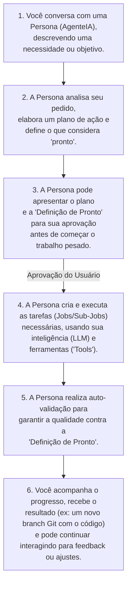

# Project Wiz: Sua Fábrica de Software Pessoal e Inteligente

Olá! Prepare-se para conhecer o Project Wiz, seu novo colega de trabalho superinteligente que vai transformar a maneira como você desenvolve software!

## O que é o Project Wiz?

Imagine ter assistentes virtuais, chamados **Personas** (que são configurações especiais para Agentes de IA), especializados em diferentes áreas do desenvolvimento – como um programador experiente, um analista de testes detalhista ou um redator técnico eficiente. O Project Wiz é uma aplicação para o seu computador, com uma interface amigável parecida com o Discord, onde você interage com esses AgentesIA (Personas) para realizar tarefas de desenvolvimento para você.

É como ter uma pequena "fábrica de software" no seu desktop, onde você é o gerente e os AgentesIA (Personas) são seus trabalhadores dedicados. Eles entendem suas necessidades através de conversas, planejam o trabalho, criam as tarefas (Jobs) necessárias e as executam, automatizando partes do trabalho que são repetitivas, demoradas ou que simplesmente poderiam ser feitas por um especialista.

### Fluxo Básico de Trabalho

Entender como você interage com o Project Wiz é simples. O fluxo principal geralmente segue estes passos:

Este ciclo permite que você delegue tarefas complexas de forma conversacional, aprove planos e acompanhe de perto o trabalho dos seus assistentes virtuais.

## Como o Project Wiz te ajuda no dia a dia?

1.  **Automação de Tarefas via Conversa:**
    *   Você pode pedir a uma Persona para **gerar código**, **analisar código existente**, **escrever documentação**, **criar testes**, e muito mais, tudo através de uma conversa!
    *   Basta descrever o que precisa ser feito em uma conversa com a Persona certa. Ela entende sua necessidade, planeja o trabalho (podendo pedir sua aprovação), cria as tarefas (Jobs) para si mesma e começa a trabalhar. As Personas podem até mesmo se comunicar e colaborar entre si em tarefas mais complexas!
    *   **Por exemplo:** Se você precisa criar a estrutura inicial de arquivos para um novo módulo, conversa com a Persona 'ArquitetaDeSoftware': "Preciso da estrutura para um novo módulo de usuários, com controller, service e repository." Ela pode te apresentar um plano, e após sua aprovação, ela mesma cria os Jobs e usa uma `Tool` de criação de arquivos para gerar essa estrutura.

2.  **Mais Foco no que Realmente Importa:**
    *   Enquanto as Personas cuidam do trabalho pesado que você delegou (e que você aprovou o plano), você ganha tempo para focar nos desafios complexos e criativos do seu projeto.
    *   **Por exemplo:** Peça à Persona 'DesenvolvedorQA': "Crie testes unitários para a funcionalidade de login." Após ela apresentar a estratégia de teste e você aprovar, ela assume grande parte desse trabalho, liberando você.

3.  **Gerenciamento Simplificado e Interativo:**
    *   Na interface inspirada no Discord, você organiza seus projetos e interage com suas Personas.
    *   Você acompanha o progresso dos `Jobs` que as Personas estão executando, revisa os resultados (que podem ser entregues como um novo branch no seu repositório Git) e conversa com elas por chat para dar mais instruções, pedir esclarecimentos ou receber atualizações.
    *   **Por exemplo:** Você vê que a Persona 'Dev Júnior' completou 3 `Jobs` de refatoração. A Persona 'AnalistaDeTestes' marcou um `Job` para sua revisão, indicando um problema, com link para os logs.

4.  **Personas Inteligentes e Configuráveis:**
    *   Você define o perfil de cada Persona (papel, objetivos, estilo de trabalho/backstory). Isso direciona a inteligência artificial (LLM) que a comanda.
    *   Você também gerencia quais "Tools" (ferramentas de desenvolvimento) cada Persona pode usar.
    *   **Por exemplo:** Uma Persona 'RedatoraTécnica' pode ser configurada para ser formal, enquanto a 'DevAdvocate' para ser didática, ambas usando o mesmo LLM, mas com configurações de Persona distintas.

5.  **Ambiente Local e Focado em Você:**
    *   O Project Wiz roda no seu computador. As Personas operam dentro deste ambiente local, acessando o `caminho_working_directory` do seu projeto.
    *   **Por exemplo:** Todo o código do seu projeto permanece na sua máquina. A Persona, ao realizar um Job de codificação, tipicamente criará um novo branch Git dentro do seu repositório local para realizar as alterações, garantindo isolamento e controle.

## Em resumo:

O Project Wiz é seu parceiro para tornar o desenvolvimento de software mais rápido e eficiente. Você **solicita e delega tarefas através de conversas** com suas Personas (AgentesIA), **aprova seus planos de ação**, acompanha o progresso dos `Jobs` que elas criam e gerenciam, e recebe os resultados de forma integrada (como branches Git), tudo em um ambiente local e controlado por você.
