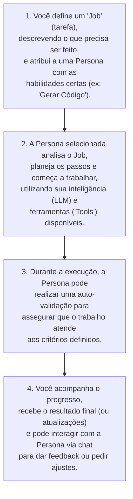

# Project Wiz: Sua Fábrica de Software Pessoal e Inteligente

Olá! Prepare-se para conhecer o Project Wiz, seu novo colega de trabalho superinteligente que vai transformar a maneira como você desenvolve software!

## O que é o Project Wiz?

Imagine ter assistentes virtuais, chamados **Personas**, que são como membros da sua equipe especializados em diferentes áreas do desenvolvimento – como um programador experiente, um analista de testes detalhista ou um redator técnico eficiente. O Project Wiz é uma aplicação para o seu computador, com uma interface amigável parecida com o Discord, onde você pode "contratar" e gerenciar essas Personas para realizar tarefas de desenvolvimento para você.

É como ter uma pequena "fábrica de software" no seu desktop, onde você é o gerente e as Personas são seus trabalhadores dedicados, prontas para automatizar aquelas partes do trabalho que são repetitivas, demoradas ou que simplesmente poderiam ser feitas por um especialista.

### Fluxo Básico de Trabalho

Entender como você interage com o Project Wiz é simples. O fluxo principal geralmente segue estes passos:

Este ciclo permite que você delegue tarefas complexas e acompanhe de perto o trabalho dos seus assistentes virtuais.

## Como o Project Wiz te ajuda no dia a dia?

1.  **Automação de Tarefas:**
    *   Você pode pedir a uma Persona para **gerar código** para uma nova funcionalidade, **analisar um código** existente em busca de melhorias, **escrever documentação técnica**, **criar casos de teste**, e muito mais!
    *   Basta você descrever o que precisa ser feito (um "Job"), atribuir a uma Persona com o perfil certo, e ela começa a trabalhar. As Personas podem até mesmo se comunicar e colaborar entre si em tarefas mais complexas, como se fossem uma equipe real!
    *   **Por exemplo:** Se você precisa criar a estrutura inicial de vários arquivos para um novo módulo (como controllers, services, repositories em um projeto backend), em vez de fazer manualmente, você pode definir um Job para uma Persona 'Arquiteta de Software'. Esta Persona pode usar uma `Tool` de criação de arquivos para gerar essa estrutura baseada em um template ou descrição que você forneceu, economizando seu tempo e garantindo consistência.

2.  **Mais Foco no que Realmente Importa:**
    *   Enquanto as Personas cuidam do trabalho pesado, você ganha tempo para se concentrar nos desafios mais complexos e criativos do seu projeto, como pensar na arquitetura da solução, interagir com clientes, ou inovar em novas funcionalidades.
    *   **Por exemplo:** Imagine que você gastaria horas escrevendo testes unitários para cobrir todas as variações de uma nova funcionalidade complexa. Uma Persona 'Desenvolvedora QA', especializada em testes, pode assumir grande parte desse trabalho, analisando o código da funcionalidade e gerando os testes necessários. Isso libera você para desenhar a próxima grande funcionalidade do seu sistema ou para discutir requisitos com o Product Owner.

3.  **Gerenciamento Simplificado e Interativo:**
    *   Na interface do Project Wiz (inspirada no Discord!), você organiza seus projetos de software.
    *   Para cada projeto, você vê quais Personas estão ativas, quais Jobs estão em andamento (com indicadores visuais de status e progresso), quais foram concluídos e os que podem precisar da sua atenção devido a erros (com notificações e links para os detalhes).
    *   Você acompanha o progresso, revisa os resultados gerados pelas Personas e conversa com elas por chat para dar instruções, pedir esclarecimentos ou receber atualizações. Você pode até ver um "status de atividade" da sua Persona principal, similar ao que o Discord mostra!
    *   **Por exemplo:** Ao abrir o Project Wiz pela manhã, você pode ver no seu painel de controle que a Persona 'Dev Júnior' completou 3 Jobs de refatoração de código durante a noite. Ao mesmo tempo, a Persona 'Analista de Testes' encontrou um problema em um Job de teste de integração e marcou-o para sua revisão, com um link direto para os logs detalhados e o erro específico encontrado, permitindo que você investigue rapidamente.

4.  **Personas Inteligentes e Configuráveis:**
    *   Você define o perfil de cada Persona (papel, objetivos, estilo de trabalho/backstory). Isso ajuda a inteligência artificial (LLM) que a comanda a atuar da forma esperada, adaptando sua comunicação e abordagem.
    *   Você também gerencia quais "Tools" (ferramentas de desenvolvimento, como acesso a arquivos, terminal, ou ferramentas de comunicação) cada Persona pode usar, controlando suas capacidades.
    *   **Por exemplo:** Você pode ter uma Persona 'Redatora Técnica' configurada com um `backstory` que enfatiza clareza e precisão, e um `goal` para produzir documentação para desenvolvedores experientes. Outra Persona, a 'Dev Advocate', pode ter um `backstory` que valoriza a didática e exemplos práticos, com o `goal` de criar tutoriais para iniciantes. Ambas podem usar o mesmo modelo de LLM subjacente, mas suas configurações de Persona distintas moldam significativamente o estilo e o conteúdo da sua saída.

5.  **Ambiente Local e Focado em Você:**
    *   O Project Wiz roda no seu computador, garantindo que você tenha controle total sobre seus projetos e como as Personas os acessam. As Personas operam dentro deste ambiente local.
    *   É um ambiente focado na sua produtividade individual, onde você e suas Personas colaboram diretamente, sem a complexidade de uma plataforma online multi-usuário.
    *   **Por exemplo:** Todo o código do seu projeto em desenvolvimento e quaisquer dados sensíveis ou chaves de API que você possa, opcionalmente, fornecer a uma Persona (através de configuração segura) permanecem na sua máquina. A Persona acessa apenas os arquivos e informações que você permite dentro do contexto de um Job específico e do ambiente controlado do Project Wiz, garantindo segurança e privacidade aos seus dados.

## Em resumo:

O Project Wiz é seu parceiro para tornar o desenvolvimento de software mais rápido, eficiente e até mais prazeroso. Ele te dá o poder de ter múltiplos especialistas virtuais (as Personas) trabalhando para você e até colaborando entre si, automatizando tarefas e te ajudando a entregar projetos incríveis com mais agilidade. Você define os "Jobs", acompanha o progresso e interage com suas Personas, tudo em um ambiente local e controlado por você.
