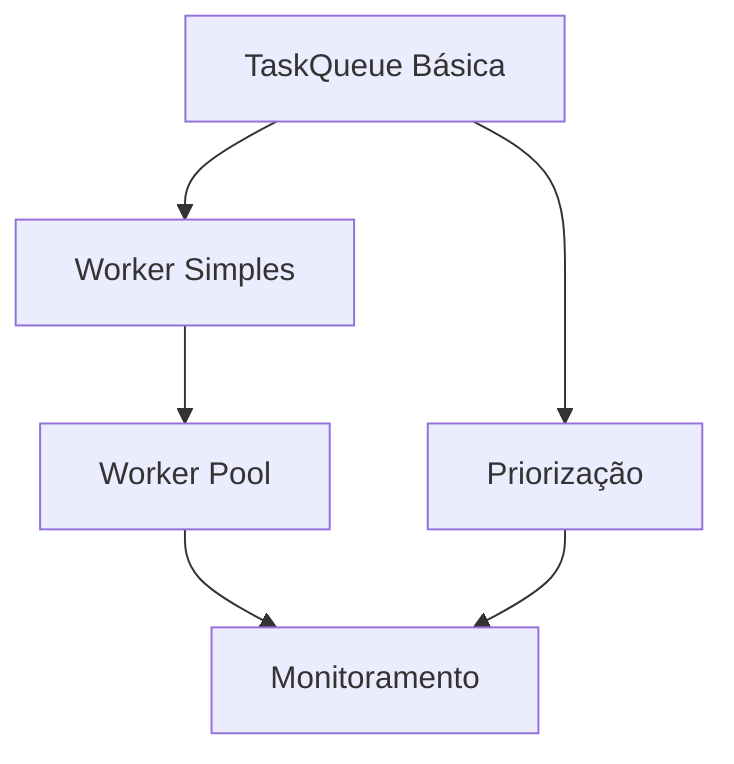

# Plano de Execução - JobQueue e WorkerManager

## 1. Cronograma Detalhado

### Fase 1 - Núcleo (20/06)
| Componente | Tarefas                                                                         | Responsável | Entregáveis                                             |
| ---------- | ------------------------------------------------------------------------------- | ----------- | ------------------------------------------------------- |
| TaskQueue  | - Implementar persistência Drizzle - Criar interface IPC - Testes básicos | Backend     | `task-drizzle.repository.ts` `task-queue.service.ts` |
| TaskWorker | - Executor básico de tarefas - Health checks simples                         | Backend     | `task-worker.service.ts`                                |

### Fase 2 - Worker Pool (27/06)
| Componente  | Tarefas                                                    | Responsável | Entregáveis              |
| ----------- | ---------------------------------------------------------- | ----------- | ------------------------ |
| WorkerPool  | - Implementar pool dinâmico - Gerenciar recursos        | Backend     | `worker-pool.service.ts` |
| Priorização | - Implementar TaskPriority.vo - Política de priorização | Backend     | `task-priority.vo.ts`    |

### Fase 3 - Monitoramento (04/07)
| Componente | Tarefas                                       | Responsável | Entregáveis               |
| ---------- | --------------------------------------------- | ----------- | ------------------------- |
| Dashboard  | - Métricas básicas - Visualização de filas | Frontend    | `queue-dashboard.tsx`     |
| Monitor    | - Coleta de métricas - Alertas básicos     | DevOps      | `task-monitor.service.ts` |

## 2. Dependências Críticas

## 3. Alocação de Recursos
- **Backend**: 2 desenvolvedores (Fases 1 e 2)
- **Frontend**: 1 desenvolvedor (Fase 3)
- **DevOps**: 1 engenheiro (Fase 3)

## 4. Critérios de Qualidade
### Por Fase
| Fase | Métricas                                          | Processo Revisão         |
| ---- | ------------------------------------------------- | ------------------------ |
| 1    | - 100% cobertura interfaces - Testes IPC       | Pair programming + PR    |
| 2    | - Load testing básico - Validação prioridades  | Code review arquitetural |
| 3    | - SLA 99% disponibilidade - Alertas funcionais | Revisão cross-team       |

## 5. Checklist Finalização
- [ ] Documentação atualizada
- [ ] Testes de integração
- [ ] Validação performance
- [ ] Treinamento time

## 6. Riscos e Mitigação
| Risco              | Probabilidade | Impacto | Ação                       |
| ------------------ | ------------- | ------- | -------------------------- |
| Atraso Worker Pool | Média         | Alto    | Iniciar protótipo paralelo |
| Problemas IPC      | Baixa         | Crítico | Testes contratuais early   |
| Limitação SQLite   | Média         | Médio   | Benchmark prévio           |