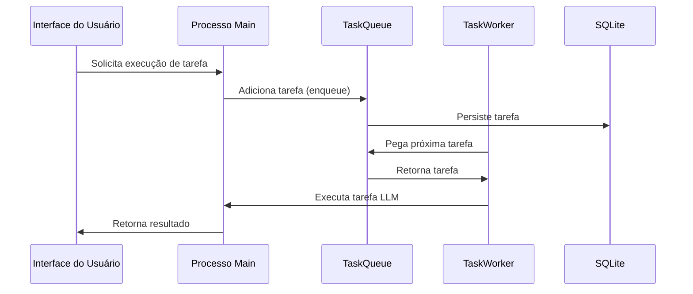

# Plano de Implementação - JobQueue e WorkerManager (ElectronJS)

## 1. Visão Geral
Implementação de um sistema de filas local para gerenciamento de tarefas de agentes LLM dentro do ambiente ElectronJS, utilizando SQLite via Drizzle para persistência.

## 2. Estrutura de Diretórios
```plaintext
src/
├── core/
│   ├── domain/
│   │   ├── entities/
│   │   │   └── task/
│   │   │       ├── task.entity.ts
│   │   │       └── value-objects/
│   │   │           ├── task-id.vo.ts
│   │   │           ├── task-priority.vo.ts
│   │   │           └── task-status.vo.ts
│   └── application/
│       ├── use-cases/
│       │   ├── enqueue-task.usecase.ts
│       │   ├── process-task.usecase.ts
│       │   └── manage-task-workers.usecase.ts
│       └── ports/
│           ├── task-queue.interface.ts
│           ├── task-worker.interface.ts
│           └── task-repository.interface.ts
├── infrastructure/
│   ├── repositories/
│   │   └── task-drizzle.repository.ts
│   └── services/
│       ├── task-queue.service.ts
│       └── task-worker.service.ts
```

## 3. Componentes Principais

### TaskQueue
- Gerencia fila de tarefas local
- Persistência via Drizzle/SQLite
- Priorização básica de tarefas
- Comunicação via IPC no Electron

### TaskWorker
- Executor de tarefas LLM
- Gerencia recursos locais
- Implementa health checks simples

## 4. Fluxo de Trabalho


## 5. Critérios de Aceitação

### TaskQueue
- [ ] Persistência em SQLite via Drizzle
- [ ] Comunicação via IPC do Electron
- [ ] Suporta filas prioritárias
- [ ] Limite máximo de tarefas concorrentes

### TaskWorker
- [ ] Execução isolada de tarefas LLM
- [ ] Monitoramento de recursos
- [ ] Recuperação de falhas básica
- [ ] Integração com sistema existente

## 6. Padrões de Implementação
- Value Objects seguindo `*.vo.ts`
- Entidades com campos encapsulados
- Use cases retornando `Result<T>`
- Repositórios implementando interfaces
- Zero dependências externas adicionais
- Comunicação via IPC do Electron

## 7. Esquema do Banco de Dados
```typescript
// src/infrastructure/services/drizzle/schemas/tasks.ts
import { sqliteTable, text, integer } from 'drizzle-orm/sqlite-core';

export const tasks = sqliteTable('tasks', {
  id: text('id').primaryKey(),
  type: text('type').notNull(),
  payload: text('payload', { mode: 'json' }).notNull(),
  priority: integer('priority').default(0),
  status: text('status').notNull(),
  createdAt: integer('created_at', { mode: 'timestamp' }).notNull(),
  startedAt: integer('started_at', { mode: 'timestamp' }),
  completedAt: integer('completed_at', { mode: 'timestamp' }),
});
```

## 8. Considerações de Performance
- Otimizado para baixa quantidade de tarefas concorrentes
- Foco em estabilidade e não throughput
- Gerenciamento de memória para tarefas LLM
- Timeout configurável por tarefa

## 9. Rastreabilidade e Correspondência

### Matriz de Rastreabilidade
| Componente      | Caso de Uso Relacionado     | Issue Correspondente         | Status Implementação |
| --------------- | --------------------------- | ---------------------------- | -------------------- |
| TaskQueue       | enqueue-task.usecase.ts     | implement-queue-manager.md   | Parcial              |
| TaskWorker      | process-task.usecase.ts     | implement-worker-pool.md     | Documentado          |
| Retry Mechanism | retry-failed-job.usecase.ts | implement-retry-mechanism.md | Planejado            |

### Gaps e Ações
1. **Worker Pool**:
   - Adicionar documentação na seção de arquitetura
   - Implementar interface WorkerPool no TaskWorker

2. **Priorização de Jobs**:
   - Definir política de priorização na TaskQueue
   - Implementar TaskPriority.vo.ts

3. **Monitoramento**:
   - Adicionar health checks no TaskWorker
   - Implementar métricas básicas

## 10. Template para Issues

```markdown
## Relação com Plano
Item do Plão: [referência à seção do plano]

### Critérios de Aceitação
- [ ] Implementação conforme padrões arquiteturais
- [ ] Testes unitários cobrindo casos principais
- [ ] Documentação atualizada

### Rastreabilidade
Componente: [nome do componente]
Caso de Uso: [use-case-relacionado.md]
```

## 11. Roadmap Atualizado
1. Fase 1 (Atual):
   - Implementação básica da TaskQueue
   - Worker simples sem pool

2. Fase 2 (Próxima):
   - Worker Pool (issue #123)
   - Priorização de tarefas (issue #124)

3. Fase 3 (Futura):
   - Monitoramento avançado
   - Dependências entre jobs