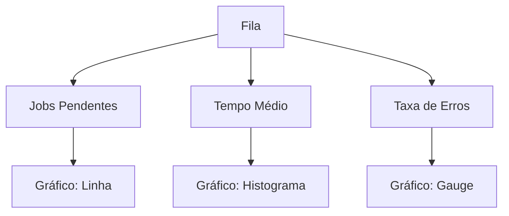

# Monitoramento de Filas

## Visão Geral

### Componentes do Monitoramento
- **Coletor**: Coleta métricas em tempo real
- **Armazenamento**: Banco de séries temporais (Prometheus)
- **Visualização**: Grafana para dashboards
- **Alerting**: Configuração de regras e notificações

## Métricas Principais

### Métricas da Fila
| Métrica                 | Tipo      | Descrição                                   |
| ----------------------- | --------- | ------------------------------------------- |
| `queue.size`            | Gauge     | Jobs pendentes na fila                      |
| `queue.processing_time` | Histogram | Tempo médio de processamento                |
| `queue.wait_time`       | Histogram | Tempo médio na fila antes de ser processado |
| `queue.error_rate`      | Rate      | Taxa de jobs com erro                       |

## Alertas Padrão

```typescript
// alerts-config.ts
interface AlertRule {
  name: string;
  expr: string;
  duration: string;
  severity: 'warning' | 'critical';
  annotations: {
    summary: string;
    description: string;
  };
}

const defaultAlerts: AlertRule[] = [
  {
    name: 'HighQueueSize',
    expr: 'queue.size > 1000',
    duration: '5m',
    severity: 'warning',
    annotations: {
      summary: 'Fila com tamanho elevado',
      description: 'A fila possui mais de 1000 jobs pendentes'
    }
  },
  {
    name: 'HighErrorRate',
    expr: 'rate(queue.error_rate[5m]) > 0.1',
    duration: '10m',
    severity: 'critical',
    annotations: {
      summary: 'Alta taxa de erros',
      description: 'Mais de 10% dos jobs estão falhando'
    }
  }
];
```

## Dashboard Exemplo

### Painel Principal


## Queries Úteis

```sql
-- Jobs falhados nas últimas 24h
SELECT job_type, COUNT(*) 
FROM jobs 
WHERE status = 'failed' 
  AND created_at > NOW() - INTERVAL '24 hours'
GROUP BY job_type
ORDER BY COUNT(*) DESC;

-- Tempo médio de processamento por tipo
SELECT job_type, AVG(processing_time)
FROM jobs
WHERE completed_at IS NOT NULL
GROUP BY job_type;
```

## Integração

### Sistemas Externos
- **Slack**: Notificações de alertas
- **PagerDuty**: Escalonamento crítico
- **Datadog**: Agregação de métricas
- **Webhooks**: Integração customizada

## Configuração

```yaml
monitoring:
  interval: "30s"
  retention: "30d"
  exporters:
    - prometheus
    - datadog
  alert_channels:
    - slack: "#alerts"
    - email: "team@example.com"