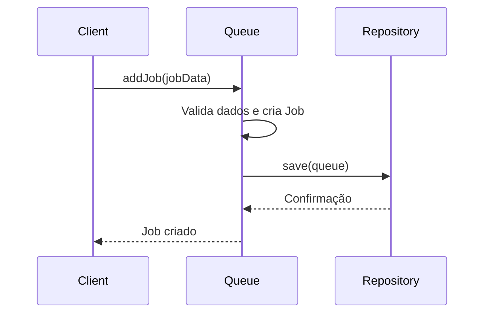
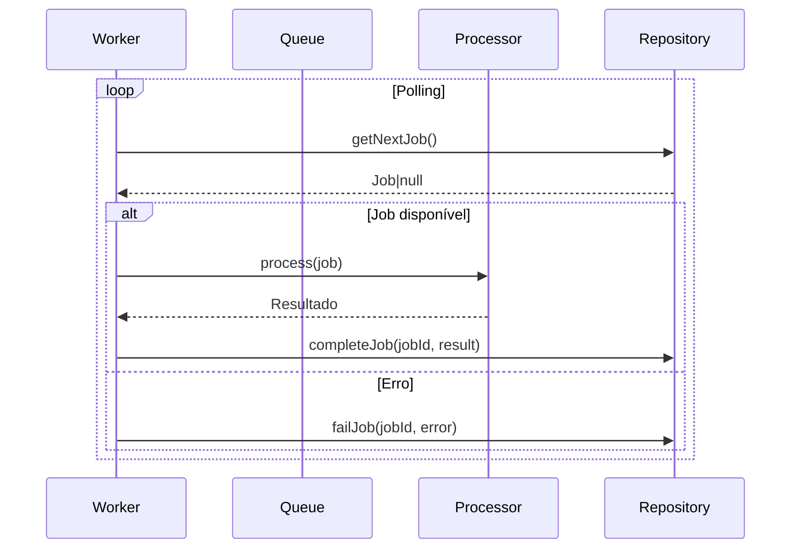
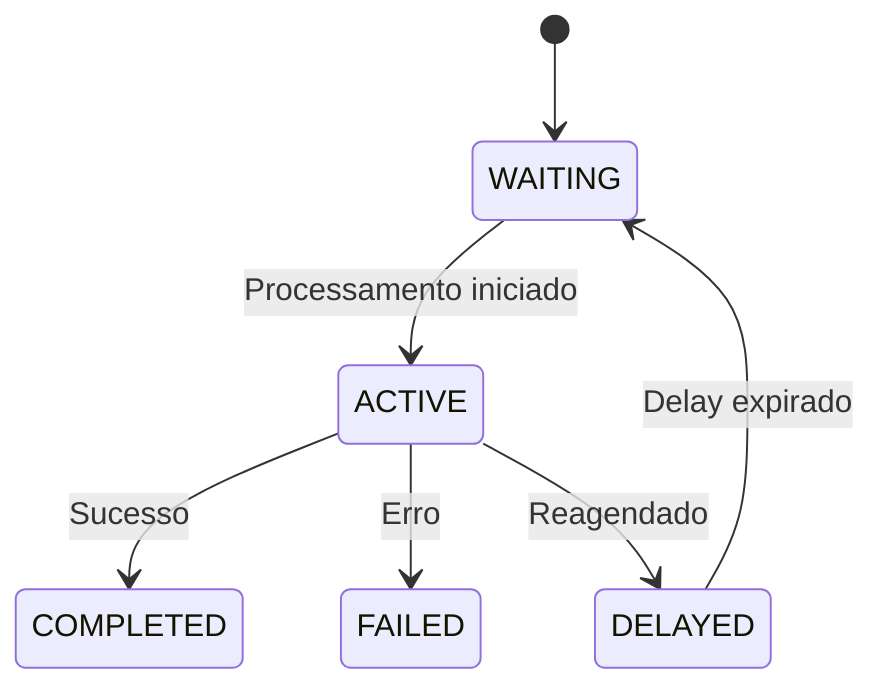

# Arquitetura do Sistema de Filas - Documentação Completa

## 1. Visão Geral do Sistema
Sistema de processamento assíncrono baseado em filas seguindo princípios de Clean Architecture, com os seguintes objetivos:

- **Escalabilidade**: Processamento paralelo controlado por níveis de concorrência
- **Resiliência**: Estados de job bem definidos e transições seguras
- **Extensibilidade**: Adição de novos tipos de processors sem modificar o core
- **Consistência**: Garantia de processamento exatamente uma vez (at-least-once)

## 2. Componentes Arquiteturais

### 2.1 Hierarquia de Pastas
```
src/
├── core/
│   ├── domain/
│   │   ├── entities/
│   │   │   ├── queue/       # Agregado principal
│   │   │   └── jobs/        # Entidade Job e value objects
│   │   ├── services/        # WorkerService
│   │   └── ports/
│   │       ├── repositories # Interfaces de persistência
│   │       └── queue        # Interfaces de processamento
├── infrastructure/
│   └── repositories/
│       └── drizzle/         # Implementação concreta
```

### 2.2 Diagrama de Classes
```mermaid
classDiagram
    direction TB

    %% Entidades de Domínio
    class Queue {
        +string id
        +string name
        +number concurrency
        +Job[] jobs
        +addJob(Job): Queue
        +getNextJob(): Job|null
        +markJobAsCompleted(string, any): void
        +markJobAsFailed(string, Error): void
    }

    class Job<Input,Output> {
        +string id
        +string queueId
        +string name
        +Input data
        +Output result
        +JobOptions opts
        +JobStatus status
        +moveToWaiting(): boolean
        +moveToActive(): boolean
        +moveToComplete(data:Output): void
        +moveToFail(error:Error): void
    }

    class JobStatus {
        +WAITING
        +ACTIVE
        +COMPLETED
        +FAILED
        +DELAYED
        +is(JobStatusType): boolean
        +moveTo(JobStatusType): boolean
    }

    %% Interfaces
    class IQueueRepository extends IRepository {
        <<interface>>
    }

    class IProcessor {
        <<interface>>
        +process(Job): Promise~any~
    }

    %% Serviços
    class WorkerService {
        -Queue queue
        -IProcessor processor
        +start(): Promise~void~
        +stop(): void
    }

    %% Relacionamentos
    Queue "1" *-- "*" Job
    Job "1" *-- "1" JobStatus
    WorkerService --> IQueueRepository
    WorkerService --> IProcessor
```

## 3. Fluxos de Trabalho Principaux

### 3.1 Adição de Novo Job


### 3.2 Processamento de Jobs


## 4. Estados e Transições

### 4.1 Diagrama de Estados (Job)


## 5. Decisões Arquiteturais

### 5.1 Hierarquia de Componentes
| Camada         | Componentes                  | Responsabilidade                       |
| -------------- | ---------------------------- | -------------------------------------- |
| Domínio        | Queue, Job, WorkerService    | Lógica de negócio central              |
| Aplicação      | Casos de Uso (opcional)      | Orquestração de fluxos                 |
| Interfaces     | IQueueRepository, IProcessor | Contratos para infraestrutura          |
| Infraestrutura | DrizzleQueueRepository       | Implementação concreta de persistência |

### 5.2 Princípios Aplicados
1. **Clean Architecture**
   - Domínio independente de frameworks
   - Dependências invertidas (interfaces definem contratos)

2. **Domain-Driven Design**
   - Agregados bem definidos (Queue como raiz)
   - Entidades com identidade (Job)
   - Value Objects (JobStatus)

3. **SOLID**
   - Single Responsibility (cada classe com um propósito)
   - Open/Closed (extensível via Processors)
   - Dependency Inversion (depende de abstrações)

## 6. Nomenclaturas e Convenções

### 6.1 Tipos de Arquivos
| Tipo          | Sufixo/Prefixo  | Exemplo                     |
| ------------- | --------------- | --------------------------- |
| Entidade      | .entity.ts      | queue.entity.ts             |
| Interface     | I*.interface.ts | IProcessor.interface.ts     |
| Serviço       | *.service.ts    | worker.service.ts           |
| Implementação | drizzle.*.ts    | drizzle.queue.repository.ts |

### 6.2 Padrões de Nomeação
- **Classes**: PascalCase (Queue, JobStatus)
- **Métodos**: camelCase (getNextJob, moveToComplete)
- **Variáveis**: camelCase (activeJobsCount)
- **Constantes**: UPPER_CASE (JOB_STATUS_VALUES)

## 7. Considerações de Implementação

### 7.1 Dependências Externas
- **Persistência**: Drizzle ORM (implementando IQueueRepository)
- **Logging**: Estratégia a ser definida (via interface)

### 7.2 Tratamento de Erros
- Erros de domínio: lançados como exceções específicas
- Erros de infraestrutura: encapsulados e tratados
- Retry automático para falhas transitórias

## 8. Evolução Arquitetural

### 8.1 Roadmap
1. Implementação básica (WorkerService + Drizzle)
2. Sistema de eventos para notificações

### 8.2 Pontos de Extensão
- **Novos Processors**: Implementar IProcessor
- **Estratégias de Polling**: Configuráveis por fila
- **Priorização**: Plugins de algoritmo

ORGANIZAÇÃO DAS TAREFAS

## Plano de Execução: Implementação do Sistema de Filas 

Este plano detalha as micro-tarefas necessárias para implementar a arquitetura do Sistema de Filas. Cada item representa uma tarefa detalhada para a construção dos componentes e fluxos descritos.

---

| ID      | Tarefa                                                                                                                     | Parent | Dependência | Descrição Detalhada                                                                                                 |
| ------- | -------------------------------------------------------------------------------------------------------------------------- | ------ | ----------- | ------------------------------------------------------------------------------------------------------------------- |
| **1.0** | **Estrutura de Pastas Inicial**                                                                                            |        |             | Criação da hierarquia de pastas fundamental conforme especificado na `Hierarquia de Pastas`.                        |
| 1.1     | Criar pasta `src/`                                                                                                         | 1.0    |             | Pasta raiz do código-fonte.                                                                                         |
| 1.2     | Criar pasta `src/core/`                                                                                                    | 1.0    | 1.1         | Pasta para a lógica de domínio.                                                                                     |
| 1.3     | Criar pasta `src/core/domain/`                                                                                             | 1.2    |             | Pasta para as entidades e serviços de domínio.                                                                      |
| 1.4     | Criar pasta `src/core/domain/entities/`                                                                                    | 1.3    |             | Pasta para as definições das entidades.                                                                             |
| 1.5     | Criar pasta `src/core/domain/entities/queue/`                                                                              | 1.4    |             | Subpasta para a entidade `Queue` (agregado principal).                                                              |
| 1.6     | Criar pasta `src/core/domain/entities/jobs/`                                                                               | 1.4    |             | Subpasta para a entidade `Job` e value objects relacionados.                                                        |
| 1.7     | Criar pasta `src/core/domain/services/`                                                                                    | 1.3    |             | Pasta para os serviços de domínio.                                                                                  |
| 1.8     | Criar pasta `src/core/ports/`                                                                                              | 1.2    |             | Pasta para as interfaces (portas).                                                                                  |
| 1.9     | Criar pasta `src/core/ports/repositories/`                                                                                 | 1.8    |             | Subpasta para as interfaces de persistência.                                                                        |
| 1.10    | Criar pasta `src/core/ports/queue/`                                                                                        | 1.8    |             | Subpasta para as interfaces de processamento de fila.                                                               |
| 1.11    | Criar pasta `src/infrastructure/`                                                                                          | 1.0    | 1.1         | Pasta para implementações concretas e detalhes de infraestrutura.                                                   |
| 1.12    | Criar pasta `src/infrastructure/repositories/`                                                                             | 1.11   |             | Subpasta para as implementações concretas de repositórios.                                                          |
| 1.13    | Criar pasta `src/infrastructure/repositories/drizzle/`                                                                     | 1.12   |             | Subpasta para a implementação do Drizzle ORM.                                                                       |
| **2.0** | **Implementação de Value Objects e Entidades de Domínio**                                                                  |        | 1.13        | Desenvolvimento das classes e interfaces do core do sistema, seguindo o `Diagrama de Classes`.                      |
| 2.1     | Criar arquivo `job-status.ts` em `src/core/domain/entities/jobs/`                                                          | 2.0    |             | Definir a classe `JobStatus` com as propriedades `WAITING`, `ACTIVE`, `COMPLETED`, `FAILED`, `DELAYED`.             |
| 2.2     | Implementar método `is(JobStatusType)` em `JobStatus`                                                                      | 2.1    |             | Adicionar método para verificar o estado atual.                                                                     |
| 2.3     | Implementar método `moveTo(JobStatusType)` em `JobStatus`                                                                  | 2.1    |             | Adicionar método para gerenciar transições de estado.                                                               |
| 2.4     | Criar arquivo `job-options.ts` (ou similar) para `JobOptions` em `src/core/domain/entities/jobs/`                          | 2.0    |             | Definir a estrutura para `JobOptions` (não detalhada na doc, mas implícita).                                        |
| 2.5     | Criar arquivo `job.entity.ts` em `src/core/domain/entities/jobs/`                                                          | 2.0    | 2.1, 2.4    | Definir a classe `Job<Input, Output>` com propriedades `id`, `queueId`, `name`, `data`, `result`, `opts`, `status`. |
| 2.6     | Implementar métodos `moveToWaiting()`, `moveToActive()`, `moveToComplete(data:Output)`, `moveToFail(error:Error)` em `Job` | 2.5    |             | Adicionar a lógica de transição de estado da entidade `Job`.                                                        |
| 2.7     | Criar arquivo `queue.entity.ts` em `src/core/domain/entities/queue/`                                                       | 2.0    | 2.5         | Definir a classe `Queue` com propriedades `id`, `name`, `concurrency`, `Job[] jobs`.                                |
| 2.8     | Implementar método `addJob(Job)` em `Queue`                                                                                | 2.7    |             | Adicionar lógica para adicionar um `Job` à fila.                                                                    |
| 2.9     | Implementar método `getNextJob()` em `Queue`                                                                               | 2.7    |             | Adicionar lógica para obter o próximo `Job` disponível.                                                             |
| 2.10    | Implementar método `markJobAsCompleted(string, any)` em `Queue`                                                            | 2.7    |             | Adicionar lógica para marcar um `Job` como completo.                                                                |
| 2.11    | Implementar método `markJobAsFailed(string, Error)` em `Queue`                                                             | 2.7    |             | Adicionar lógica para marcar um `Job` como falho.                                                                   |
| **3.0** | **Definição de Interfaces (Ports)**                                                                                        |        | 2.11        | Criação das interfaces que definem os contratos para a camada de infraestrutura.                                    |
| 3.1     | Criar arquivo `irepository.interface.ts` (ou base) em `src/core/ports/repositories/`                                       | 3.0    |             | Definir a interface base para repositórios.                                                                         |
| 3.2     | Criar arquivo `iqueue-repository.interface.ts` em `src/core/ports/repositories/`                                           | 3.0    | 3.1         | Definir a interface `IQueueRepository` que estende `IRepository`.                                                   |
| 3.3     | Criar arquivo `iprocessor.interface.ts` em `src/core/ports/queue/`                                                         | 3.0    |             | Definir a interface `IProcessor<Input,Output>` com o método `process(Job<Input,Output>): Promise<Output             | undefined | void>`. |
| **4.0** | **Implementação do Serviço de Domínio (`WorkerService`)**                                                                  |        | 3.3         | Desenvolvimento do serviço que orquestra o processamento assíncrono.                                                |
| 4.1     | Criar arquivo `worker.service.ts` em `src/core/domain/services/`                                                           | 4.0    | 2.7         | Definir a classe `WorkerService` com as dependências `Queue` e `IProcessor`.                                        |
| 4.2     | Implementar método `start()` em `WorkerService`                                                                            | 4.1    |             | Adicionar lógica para iniciar o Worker, incluindo o loop de polling.                                                |
| 4.3     | Implementar método `stop()` em `WorkerService`                                                                             | 4.1    |             | Adicionar lógica para parar o Worker.                                                                               |
| 4.4     | Implementar o fluxo de processamento de Jobs dentro de `WorkerService` (`getNextJob`, `process`, `completeJob/failJob`)    | 4.2    |             | Detalhar a orquestração do fluxo de trabalho do Job, conforme o `Fluxos de Trabalho Principaux`.                    |
| **5.0** | **Implementação da Infraestrutura (Persistência Drizzle)**                                                                 |        | 4.4         | Desenvolvimento da implementação concreta do repositório utilizando Drizzle ORM.                                    |
| 5.1     | Instalar dependências do Drizzle ORM (e driver DB, se necessário)                                                          | 5.0    |             | Instalação das bibliotecas para Drizzle.                                                                            |
| 5.2     | Definir schemas Drizzle para `Queue` e `Job` em `src/infrastructure/repositories/drizzle/`                                 | 5.1    | 2.5, 2.7    | Mapear as entidades `Queue` e `Job` para o ORM Drizzle.                                                             |
| 5.3     | Criar arquivo `drizzle.queue.repository.ts` em `src/infrastructure/repositories/drizzle/`                                  | 5.0    | 3.2, 5.2    | Implementar a classe `DrizzleQueueRepository` que estende `IQueueRepository`.                                       |
| 5.4     | Implementar métodos de persistência em `DrizzleQueueRepository` (e.g., `save`, `findById`, etc.)                           | 5.3    |             | Desenvolver a lógica de interação com o banco de dados via Drizzle para os métodos do repositório.                  |
| **6.0** | **Considerações de Implementação (Conforme Documentação)**                                                                 |        | 5.4         | Abordagem de aspectos transversais conforme as `Considerações de Implementação`.                                    |
| 6.1     | Implementar `Retry automático para falhas transitórias`                                                                    | 6.0    | 4.4         | Adicionar lógica para re-tentar operações que falham devido a problemas temporários.                                |