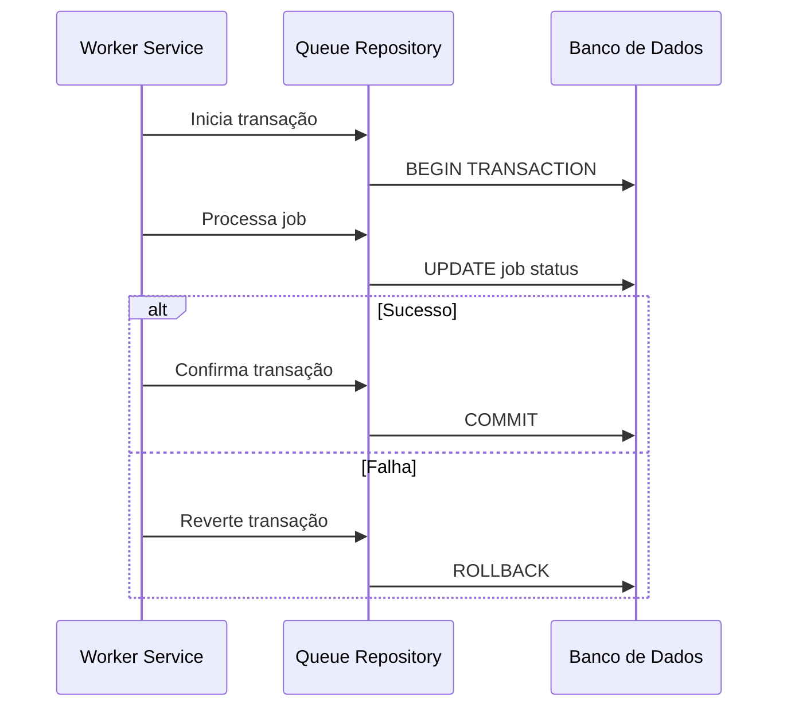

# Sistema de Filas - Project Wiz

## Visão Geral
O sistema de filas do Project Wiz é responsável por gerenciar a execução assíncrona de tarefas, garantindo processamento confiável e escalável.

## Gerenciamento de Transações

### Padrão Implementado
O sistema utiliza um padrão de transações distribuídas com os seguintes princípios:
- Atomicidade: Operações são completas ou totalmente revertidas
- Consistência: O sistema mantém estado válido após cada transação
- Isolamento: Transações concorrentes não interferem entre si
- Durabilidade: Resultados confirmados persistem após falhas

### Diagrama de Sequência


### Exemplo de Wrapper de Transações
```typescript
async function withTransaction<T>(
  db: Database,
  fn: (tx: Transaction) => Promise<T>
): Promise<T> {
  const tx = await db.begin();
  try {
    const result = await fn(tx);
    await tx.commit();
    return result;
  } catch (error) {
    await tx.rollback();
    throw error;
  }
}

// Uso:
await withTransaction(db, async (tx) => {
  await processJob(tx, job);
  await updateJobStatus(tx, job.id, 'completed');
});
```

### Fluxo de Tratamento de Erros
1. Erros são capturados no wrapper de transação
2. O sistema registra o erro para diagnóstico
3. Transação é revertida (ROLLBACK)
4. Job é marcado como falha com motivo do erro
5. Sistema pode reenfileirar para retentativa conforme política

## Implementação
O sistema implementa o padrão de transações descrito acima, utilizando o Drizzle ORM para gerenciamento do banco de dados. Para decisões arquiteturais detalhadas, consulte o [ADR-002: Padrão de Transações no DrizzleQueueRepository](./adr/002-transaction-pattern.md).

[Demais seções existentes...]