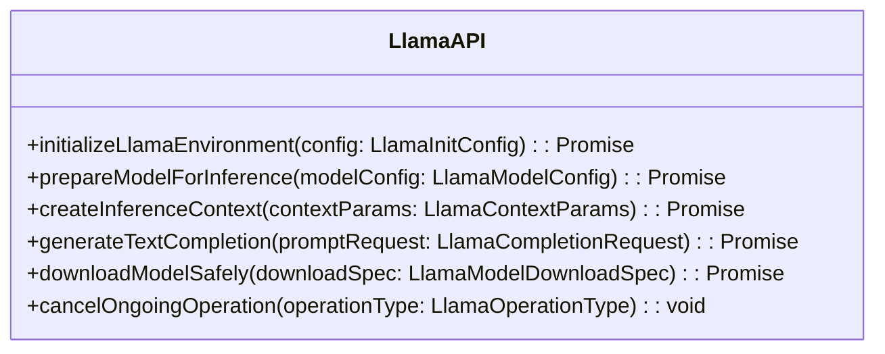

# Plano de Refatoração para electronAPI.d.ts

## Objetivo

Refatorar a interface LlamaAPI seguindo rigorosamente as diretrizes de código limpo, garantindo tipagem estrita, clareza e manutenibilidade.

## Diretrizes de Código Limpo Aplicadas

### 1. Tipagem Estrita

- Eliminar completamente o uso de `any`
- Usar tipos literais e interfaces específicas
- Implementar guardas de tipo para uniões

### 2. Nomes Reveladores de Intenção

- Renomear métodos para serem mais descritivos
- Usar verbos que indiquem claramente a ação
- Evitar abreviações não padrão

### 3. Responsabilidade Única

- Garantir que cada método tenha uma única responsabilidade
- Separar claramente as preocupações de inicialização, carregamento e processamento

### 4. Documentação Focada no "Por Que"

- Adicionar comentários que expliquem a razão de implementações específicas
- Evitar comentários que apenas descrevam o código

### 5. Gerenciamento de Tipos

```typescript
// Exemplo de tipo de erro personalizado
enum LlamaAPIErrorCode {
  InitializationFailed = "LLAMA_INIT_001",
  ModelLoadError = "LLAMA_LOAD_002",
  ContextCreationError = "LLAMA_CONTEXT_003",
}

interface LlamaAPIError extends Error {
  code: LlamaAPIErrorCode;
  context?: Record<string, unknown>;
}
```

## Diagrama de Estrutura Proposta



## Mudanças Propostas

1. Métodos com nomes mais descritivos da intenção
2. Uso de tipos genéricos com restrições
3. Suporte para callbacks com tipos específicos
4. Tratamento de erros robusto e personalizado
5. Preservar a estrutura global do `Window.electronAPI`

## Considerações de Implementação

- Usar tipos genéricos para máxima flexibilidade
- Seguir rigorosamente as diretrizes de tipagem estrita
- Manter compatibilidade com a implementação existente
- Documentar decisões de design não óbvias

## Benefícios Esperados

- Código mais legível e autodocumentado
- Tipagem extremamente precisa
- Melhor suporte para diferentes operações de LLM
- Redução de possíveis erros em tempo de compilação
- Consistência com a definição de tipos em `llama-types.ts`

## Próximos Passos

- Implementar refatoração no modo Code
- Criar testes unitários para cada método
- Realizar revisão de código
- Atualizar documentação relacionada
- Validar compatibilidade com implementações existentes

## Princípios Fundamentais

- **Clareza > Concisão**
- **Tipos > Comentários**
- **Prevenção > Correção**
