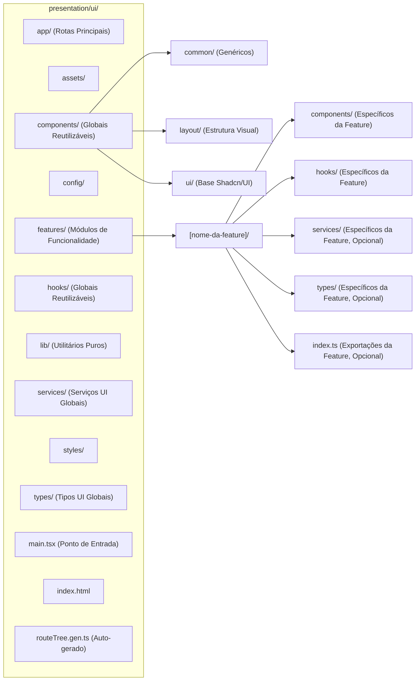

# ADR-027: Estrutura de Diretórios e Convenções de Nomenclatura para o Frontend

**Status:** Proposto (Considerado Aprovado Conforme Instrução)

**Contexto:**
Uma estrutura de diretórios bem definida e convenções de nomenclatura consistentes são cruciais para a organização, navegabilidade e manutenibilidade do código do frontend (`src_refactored/presentation/ui/`). A análise da estrutura existente, do `routeTree.gen.ts` (TanStack Router) e da documentação de arquitetura (`docs/reference/01-software-architecture.md`) informa esta decisão.

**Decisão:**

Serão adotados os seguintes padrões para a estrutura de diretórios e convenções de nomenclatura no frontend:

**1. Estrutura Principal de Diretórios em `src_refactored/presentation/ui/`:**

A estrutura visa agrupar arquivos por funcionalidade (feature-sliced) e por tipo, promovendo coesão e baixo acoplamento.

*   **`app/`**: Contém os componentes de rota (páginas) e layouts definidos pelo TanStack Router (usando convenção baseada em arquivos).
    *   **Porquê:** Convenção do TanStack Router para file-based routing. Separa os pontos de entrada de rotas da lógica de features reutilizáveis.
*   **`assets/`**: Recursos estáticos (imagens, fontes, etc.).
*   **`components/`**: Componentes React globais e reutilizáveis em múltiplas features.
    *   `common/`: Componentes UI genéricos, pequenos, sem lógica de negócio (e.g., `Button`, `Spinner`, `ModalBase`).
    *   `layout/`: Componentes para a estrutura visual principal da aplicação (e.g., `AppShell`, `Sidebar`, `HeaderLayout`).
    *   `ui/`: Componentes base da biblioteca Shadcn/UI (copiados via CLI, e.g., `button.tsx`, `dialog.tsx`).
    *   **Porquê:** Promove reuso e consistência visual para elementos comuns.
*   **`config/`**: Configurações centrais da UI (e.g., instância do router, query client, i18n).
*   **`features/<nome-da-feature>/`**: Diretório chave para organização modular. Cada subdiretório representa uma funcionalidade de negócio principal (e.g., `project`, `user-auth`, `chat`).
    *   `components/`: Componentes React reutilizáveis *exclusivamente* dentro desta feature.
    *   `hooks/`: Hooks React com lógica de UI, estado e efeitos colaterais específicos da feature.
    *   `services/` (opcional): Funções/classes encapsulando chamadas IPC ou lógica de busca de dados específica da feature, se não justificar um serviço global em `ui/services/`.
    *   `types/` (opcional): Definições de tipo TypeScript específicas desta feature.
    *   `index.ts` (opcional): Ponto de entrada para exportar elementos públicos da feature.
    *   **Porquê (Feature-Sliced Design):** Alta coesão, baixo acoplamento entre features, facilita desenvolvimento paralelo e manutenção.
*   **`hooks/`**: Hooks React globais, utilitários e reutilizáveis em múltiplas features (e.g., `useDebounce`, `useLocalStorage`, mas NÃO os hooks de IPC que devem ser usados via `IPCService`).
*   **`lib/`**: Utilitários JavaScript/TypeScript puros (não-React) globais (e.g., `cn` para classnames, helpers de data/string).
*   **`services/`**: Serviços globais da UI, principalmente o `IPCService.ts` que abstrai a comunicação com o processo principal do Electron.
*   **`styles/`**: Arquivos de estilo globais (e.g., `globals.css` com Tailwind base, variáveis de tema).
*   **`types/`**: Definições de tipo TypeScript globais para a UI.
*   **`main.tsx`**: Ponto de entrada da aplicação React (renderiza o Root, providers globais).
*   **`index.html`**: Arquivo HTML principal.
*   **`routeTree.gen.ts`**: Gerado pelo TanStack Router. NÃO DEVE SER EDITADO MANUALMENTE.

**2. Convenções de Nomenclatura para Arquivos e Diretórios no Frontend:**

*   **Diretórios:**
    *   Nomes de diretório DEVEM ser em `kebab-case`.
        *   Exemplos: `user-authentication`, `project-settings`, `common-components`.
    *   Exceção: Diretórios em `app/` que mapeiam para rotas dinâmicas do TanStack Router seguem a convenção do router (e.g., `$projectId`).
*   **Arquivos de Componentes React (.tsx):**
    *   DEVEM ser nomeados em `PascalCase.tsx`.
        *   Exemplos: `UserProfileCard.tsx`, `ProjectList.tsx`, `MainLayout.tsx`.
    *   **Justificativa:** Convenção padrão e amplamente reconhecida no ecossistema React. Facilita a identificação de componentes.
*   **Arquivos de Hooks Customizados (.ts ou .tsx):**
    *   DEVEM ser nomeados em `useCamelCase.ts` ou `usePascalCase.ts` (preferência por `useCamelCase.ts`). Adicionar o sufixo `.hook.ts` é opcional, mas pode ajudar na clareza se houver muitos arquivos utilitários no mesmo diretório (e.g. `use-project-filters.ts` ou `useProjectFilters.hook.ts`).
        *   Exemplos: `useAuth.ts`, `useProjectData.ts`, `use-form-validation.hook.ts`.
    *   **Justificativa:** Convenção do React para hooks (`use...`). `camelCase` ou `PascalCase` para o nome do hook em si é comum.
*   **Outros Arquivos TypeScript na UI (.ts):**
    *   (Serviços, tipos, utilitários, configurações, esquemas Zod para UI) DEVEM ser nomeados em `kebab-case.ts`.
        *   Exemplos: `ipc.service.ts`, `project.types.ts`, `date-utils.ts`, `router.config.ts`, `login-form.schema.ts`.
*   **Arquivos de Estilo (se existirem CSS/SCSS customizado mínimo):**
    *   `kebab-case.css` ou `kebab-case.module.css`.

**3. Relação entre `app/` (Rotas) e `features/`:**
    *   Componentes de rota em `app/` (e.g., `app/app/projects/$projectId/index.tsx`) são responsáveis por definir a estrutura da página para uma rota específica e buscar os dados necessários para essa rota (usando `useIpcQuery` via `IPCService`).
    *   Estes componentes de rota então compõem e passam dados para componentes mais granulares e reutilizáveis localizados nos diretórios `features/<nome-da-feature>/components/` e `components/common/` ou `components/layout/`.
    *   **Exemplo:** `app/app/projects/$projectId/index.tsx` (página de detalhes do projeto) pode usar `<ProjectDetailHeader />` e `<ProjectOverviewTab />` de `features/project/components/details/`.
    *   **Justificativa:** Separa a lógica de roteamento e busca de dados de alto nível (nas páginas de `app/`) da lógica de apresentação e interação de componentes específicos de features (em `features/`).

**Consequências:**
*   Estrutura de diretórios do frontend clara, modular e escalável.
*   Convenções de nomenclatura consistentes que facilitam a identificação do tipo e propósito dos arquivos.
*   Melhor organização e separação de responsabilidades dentro da camada de UI.
*   Alinhamento com as convenções do TanStack Router e do ecossistema React.

---
**Notas de Implementação para LLMs:**
*   Ao criar uma nova funcionalidade de UI, crie um diretório em `features/` (e.g., `features/new-feature/`).
*   Dentro do diretório da feature, crie subdiretórios para `components`, `hooks`, `types`, etc., conforme necessário.
*   Componentes React devem ser `PascalCase.tsx`. Outros arquivos TS (hooks, services, utils) devem ser `kebab-case.ts`.
*   Para criar uma nova página/rota, adicione a estrutura de arquivos apropriada em `app/` (e.g., `app/app/new-feature-route/index.tsx`). Este componente de página então usará os componentes da sua feature.
*   Siga rigorosamente as convenções de nomenclatura para arquivos e diretórios.
