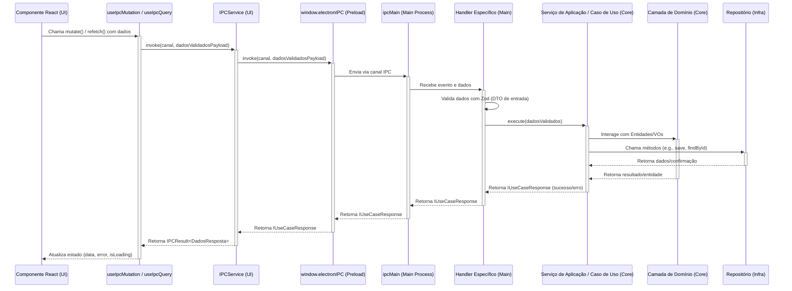

# Arquitetura de Software - Project Wiz

Este documento descreve a arquitetura de software para o Project Wiz. A arquitetura é projetada para ser robusta, escalável, manutenível e testável, aderindo às melhores práticas modernas e aos requisitos específicos do projeto. Todo o código e identificadores seguem as convenções detalhadas na **ADR-028: Convenções Abrangentes de Nomenclatura**.

## 1. Princípios Arquiteturais Fundamentais

A arquitetura do Project Wiz é guiada por um conjunto de princípios fundamentais que visam garantir a qualidade, flexibilidade e longevidade do sistema.

```mermaid
graph TD
    Users[Usuários / Clientes Externos] --> PA[Camada de Apresentação (Electron UI, CLI, etc.)];
    PA --> AL[Camada de Aplicação (Casos de Uso, Serviços de Aplicação)];
    AL --> DL[Camada de Domínio (Entidades, VOs, Serviços de Domínio)];
    AL --> PortsAdapters[Portas (Abstrações para Infraestrutura)];
    IL[Camada de Infraestrutura (Adaptadores, Persistência, Dispositivos)] --> PortsAdapters;

    subgraph " "
      direction LR
      SharedKernel[Kernel Compartilhado (Erros, DTOs Comuns, Utilitários Base)]
    end

    PA --> SharedKernel;
    AL --> SharedKernel;
    DL --> SharedKernel;
    IL --> SharedKernel;


    subgraph "Interface do Usuário / Mecanismos de Entrega"
        PA
    end
    subgraph "Lógica de Negócios Principal"
        DL
        AL
    end
    subgraph "Dependências Externas / Frameworks"
        IL
    end
    subgraph "Transversal (Cross-Cutting)"
        SharedKernel
    end

    style DL fill:#FAA,stroke:#333,stroke-width:2px
    style AL fill:#AFE,stroke:#333,stroke-width:2px
    style PA fill:#DAE,stroke:#333,stroke-width:2px
    style IL fill:#ADD,stroke:#333,stroke-width:2px
    style PortsAdapters fill:#FCC,stroke:#333,stroke-width:2px
    style SharedKernel fill:#EED,stroke:#333,stroke-width:2px

    classDef default fill:#fff,stroke:#333,stroke-width:2px;
```

*   **Clean Architecture:**
    *   **Descrição:** O sistema segue rigorosamente os princípios da Clean Architecture. Esta abordagem organiza a codebase em camadas concêntricas (Domínio, Aplicação, Infraestrutura), com uma regra estrita de dependência: todas as dependências fluem para dentro. Isso garante que a lógica de negócios central (Domínio e Aplicação) seja independente de frameworks externos, UI, e detalhes de banco de dados.
    *   **Manifestação no Project Wiz:**
        *   A separação estrita entre `core/domain`, `core/application`, e `infrastructure` é um exemplo direto.
        *   Casos de Uso (`core/application`) dependem de interfaces de repositório (`core/domain/**/ports`) que são implementadas na `infrastructure`.
        *   Entidades e VOs (`core/domain`) não têm conhecimento de Drizzle ORM ou Electron.
    *   **ADRs Relevantes:** Implicitamente em todas as ADRs que definem interações entre camadas (e.g., ADR-011, ADR-012, ADR-017, ADR-018). A visualização detalhada das camadas e suas responsabilidades é apresentada na seção "3. Camadas Arquiteturais".

*   **Object Calisthenics:**
    *   **Descrição:** Um conjunto de nove "exercícios" ou regras de programação que, quando aplicados, tendem a produzir código orientado a objetos extremamente limpo, legível, coeso e de fácil manutenção. São regras mais prescritivas que os princípios SOLID.
    *   **Manifestação no Project Wiz:** As regras incluem "Apenas um nível de indentação por método", "Não use a palavra-chave ELSE", "Envolva todas as primitivas e strings", "Sem getters/setters para estado mutável", entre outras.
    *   **ADRs Relevantes:** **ADR-016: Aplicação Prática de Object Calisthenics no Project Wiz** detalha como cada uma das 9 regras é interpretada e aplicada no contexto do projeto, com exemplos. Padrões para Entidades e VOs (ADR-010) também reforçam várias dessas regras.

*   **SOLID:**
    *   **Descrição:** Acrônimo para cinco princípios de design que tornam os sistemas de software mais fáceis de entender, flexíveis e manuteníveis.
        *   **S (Single Responsibility Principle):** Uma classe deve ter apenas uma razão para mudar.
        *   **O (Open/Closed Principle):** Entidades de software devem ser abertas para extensão, mas fechadas para modificação.
        *   **L (Liskov Substitution Principle):** Subtipos devem ser substituíveis por seus tipos base.
        *   **I (Interface Segregation Principle):** Clientes não devem ser forçados a depender de interfaces que não usam.
        *   **D (Dependency Inversion Principle):** Módulos de alto nível não devem depender de módulos de baixo nível. Ambos devem depender de abstrações. Abstrações não devem depender de detalhes. Detalhes devem depender de abstrações.
    *   **Manifestação no Project Wiz:**
        *   **SRP:** Classes de Serviço de Aplicação e Casos de Uso focados em tarefas específicas. Entidades e VOs com responsabilidades bem definidas (ADR-010, ADR-012).
        *   **OCP:** Uso de interfaces (portas) para adaptadores permite a adição de novas implementações sem modificar o código que usa a interface (ADR-018).
        *   **LSP:** Relevante ao considerar herança, embora a composição seja frequentemente preferida.
        *   **ISP:** Interfaces de repositório específicas por entidade (ADR-011) e interfaces de adaptadores focadas (ADR-018).
        *   **DIP:** A Clean Architecture em si é uma manifestação do DIP. A camada de Aplicação depende de abstrações (interfaces de repositório, de adaptadores), não de implementações concretas da Infraestrutura. InversifyJS (ADR-019) é usado para gerenciar essas inversões.
    *   **ADRs Relevantes:** Reforçado em ADR-010, ADR-011, ADR-012, ADR-018, ADR-019.

*   **DRY (Don't Repeat Yourself):**
    *   **Descrição:** Evitar a duplicação de código e lógica. Conhecimento e comportamento devem ser definidos em um único local canônico.
    *   **Manifestação no Project Wiz:** Criação de VOs para encapsular lógica de validação comum (ADR-010), uso de serviços de aplicação para orquestrar lógica reutilizável (ADR-012), e criação de hooks customizados na UI (ADR-025).
    *   **ADRs Relevantes:** Mencionado em `docs/developer/coding-standards.md`.

*   **KISS (Keep It Simple, Stupid):**
    *   **Descrição:** Preferir soluções simples e diretas em vez de complexidade desnecessária ou excesso de engenharia.
    *   **Manifestação no Project Wiz:** Adoção de padrões claros e bem definidos nas ADRs visa simplificar as decisões de design. Evitar over-engineering em fases iniciais.
    *   **ADRs Relevantes:** Mencionado em `docs/developer/coding-standards.md`.

*   **Modularidade e Separação de Responsabilidades (Separation of Concerns - SoC):**
    *   **Descrição:** Cada componente, módulo e camada do sistema deve ter responsabilidades bem definidas e distintas, minimizando sobreposições.
    *   **Manifestação no Project Wiz:** A própria Clean Architecture é um forte exemplo de SoC. A divisão em `core/domain`, `core/application`, `infrastructure` e `presentation` reflete isso. A estrutura de "features" na UI (ADR-027) também promove SoC.
    *   **ADRs Relevantes:** Fundamental para a maioria das ADRs de design (e.g., ADR-010 a ADR-031).

> **Nota sobre Componentes em Fase de Design/Pesquisa:**
> Alguns componentes avançados, especialmente aqueles relacionados à execução detalhada de Agentes de IA (e.g., o framework de `Tools`, `Tasks`, e o gerenciamento de estado interno mais fino do `GenericAgentExecutor` como `ActivityContext`), ainda estão em fase de design e podem evoluir. As ADRs existentes (como ADR-020, ADR-021, ADR-022 para o sistema de Filas/Jobs/Workers) formalizam partes significativas da infraestrutura de execução, mas a interação específica e o ciclo de vida completo do agente com suas ferramentas e contexto de atividade são áreas de desenvolvimento ativo.

## 2. Tecnologias Chave

A seleção de tecnologias visa robustez, produtividade, suporte da comunidade e alinhamento com os princípios arquiteturais.

*   **Application Framework:** ElectronJS (para estrutura de aplicação desktop multiplataforma).
    *   **Justificativa:** Permite o desenvolvimento de aplicações desktop com tecnologias web (HTML, CSS, JavaScript/TypeScript), facilitando a criação de interfaces ricas e o acesso a recursos do sistema operacional.
*   **Frontend (UI - Processo de Renderização):**
    *   **React:** Biblioteca para construção de interfaces de usuário.
        *   **Justificativa (ADR-025):** Vasto ecossistema, modelo de componentes declarativo, bom suporte a TypeScript.
    *   **TypeScript:** Superset de JavaScript que adiciona tipagem estática.
        *   **Justificativa (ADR-015):** Segurança de tipo, melhor manutenibilidade e escalabilidade do código.
    *   **Tailwind CSS:** Framework CSS utility-first.
        *   **Justificativa (ADR-026):** Agilidade no desenvolvimento de UI, consistência visual, e evita CSS customizado excessivo.
    *   **Shadcn/UI:** Coleção de componentes React reutilizáveis, construídos com Radix UI e Tailwind CSS.
        *   **Justificativa (ADR-026):** Fornece componentes acessíveis e bem desenhados, que podem ser customizados diretamente no projeto.
    *   **Vite:** Ferramenta de build e servidor de desenvolvimento.
        *   **Justificativa:** Performance superior em desenvolvimento (HMR rápido) e build otimizado.
    *   **TanStack Router (`@tanstack/react-router`):** Para roteamento na SPA React.
        *   **Justificativa (ADR-027):** Roteamento type-safe, baseado em arquivos (file-based routing), e funcionalidades modernas como rotas aninhadas e lazy loading.
    *   **React Hook Form & Zod:** Para gerenciamento e validação de formulários.
        *   **Justificativa (ADR-025):** Performance, DX, e integração poderosa com Zod para validação type-safe.
*   **Backend/Core Logic (Processo Principal Electron e Lógica de Negócios):**
    *   **TypeScript & Node.js:** Ambiente de execução e linguagem.
    *   **InversifyJS (`inversify`, `reflect-metadata`):** Framework de Injeção de Dependência (DI).
        *   **Justificativa (ADR-019):** Leve, poderoso, bom suporte a TypeScript e decoradores para gerenciar dependências e promover código desacoplado.
*   **AI/LLM Integration:** AI SDK (`ai` library).
    *   **Justificativa:** Biblioteca moderna e flexível para interagir com diversos Modelos de Linguagem Grandes (LLMs).
*   **Database/Persistence:** SQLite (via `better-sqlite3`) com Drizzle ORM (`drizzle-orm`, `drizzle-kit`).
    *   **Justificativa (ADR-017):** SQLite para portabilidade e facilidade de uso em uma aplicação desktop. Drizzle ORM por ser um ORM moderno, leve, type-safe e com boa integração com TypeScript.
*   **Testes Automatizados:** Vitest.
    *   **Justificativa (ADR-029):** Framework de testes moderno, rápido, com API compatível com Jest e excelente integração com Vite e TypeScript.

## 3. Camadas Arquiteturais (Clean Architecture)

A arquitetura do Project Wiz é baseada nos princípios da Clean Architecture, que organiza o software em camadas concêntricas. Esta estrutura promove a separação de responsabilidades, testabilidade e independência de frameworks e tecnologias externas. A regra fundamental é a **Regra de Dependência**: o código fonte só pode depender de camadas mais internas, nunca de camadas mais externas.

### Visualização das Camadas Principais
(Esta visualização é uma representação da Clean Architecture clássica, adaptada para o contexto do projeto)
```mermaid
graph TD
    A[Frameworks & Drivers (Ex: Electron, React, Drizzle, APIs Externas)] --> B(Adaptadores de Interface (Ex: Controladores, Presenters, Gateways/Repositórios))
    B --> C(Casos de Uso / Serviços de Aplicação)
    C --> D(Entidades / Objetos de Valor / Serviços de Domínio)

    subgraph "Camada de Infraestrutura (Infrastructure Layer)"
        A
    end
    subgraph "Camada de Adaptadores (Interface Adapters Layer)"
        B
    end
    subgraph "Camada de Aplicação (Application Layer)"
        C
    end
    subgraph "Camada de Domínio (Domain Layer)"
        D
    end
    style D fill:#FAA,stroke:#333,stroke-width:2px
    style C fill:#AFE,stroke:#333,stroke-width:2px
    style B fill:#ADD,stroke:#333,stroke-width:2px
    style A fill:#DAE,stroke:#333,stroke-width:2px
```
*   **Fluxo de Controle:** O fluxo de controle geralmente começa em uma camada externa (e.g., UI), passa pelos adaptadores, chega à camada de aplicação (casos de uso), que então orquestra as entidades de domínio. Os dados retornam pelo mesmo caminho.
*   **Interfaces (Portas):** As interfaces definidas nas camadas internas (e.g., interfaces de repositório no domínio, interfaces de adaptadores na aplicação) atuam como "portas" que são implementadas pelas camadas externas.

A seguir, detalhamos as principais camadas conforme implementadas no Project Wiz, localizadas em `src_refactored/`.

### 3.1. Camada de Domínio (`core/domain/`)

*   **Propósito:** Contém a lógica de negócios mais pura e central da aplicação, representando as regras e conceitos fundamentais do domínio do Project Wiz. Esta camada é o coração do software e deve ser completamente independente de qualquer outra camada em termos de dependências de código fonte (não deve importar nada de `application`, `infrastructure` ou `presentation`).
*   **Componentes Chave:**
    *   **Entidades (`*.entity.ts`):**
        *   **Papel:** Representam objetos de negócio com uma identidade única que persiste ao longo do tempo e através de diferentes estados (e.g., `User`, `Project`, `JobEntity`, `LLMProviderConfig`). Elas encapsulam atributos e, crucialmente, a lógica de negócios e as regras (invariantes) que governam seu estado.
        *   **Padrões (ADR-010):**
            *   Instanciadas via método estático `create()` que contém validação (usando Zod) e lógica de inicialização. Construtores são privados.
            *   Preferem imutabilidade funcional: métodos que alteram o estado retornam uma nova instância da entidade com o estado atualizado.
            *   Implementam `toPersistence()` para converter o estado da entidade para um POJO serializável e `static fromPersistenceData()` para reconstruir a entidade a partir de dados persistidos.
        *   **Exemplo (Estrutura Conceitual):**
            ```typescript
            // // src_refactored/core/domain/user/user.entity.ts
            // export class User extends AbstractEntity<UserId, InternalUserProps> {
            //   private constructor(props: InternalUserProps) { super(props); }
            //   public static create(props: UserProps): Result<User, EntityError> { /* validação com Zod, criação */ }
            //   public get email(): UserEmail { return this.props.email; }
            //   public changeEmail(newEmail: UserEmail): Result<User, EntityError> { /* validação, retorna new User(...) */ }
            //   public toPersistence(): UserPersistenceData { /* ... */ }
            //   public static fromPersistenceData(data: UserPersistenceData): User { /* ... */ }
            // }
            ```
    *   **Objetos de Valor (VOs - `*.vo.ts`):**
        *   **Papel:** Representam conceitos descritivos do domínio que não possuem uma identidade única, sendo definidos por seus atributos. São imutáveis e comparados por valor. (e.g., `UserEmail`, `JobId`, `ProjectName`, `MonetaryValue`).
        *   **Padrões (ADR-010):**
            *   Estritamente imutáveis (todas as propriedades `readonly`).
            *   Validação de regras intrínsecas e formato no método estático `create()` (usando Zod). Construtores privados.
            *   Método `equals()` para comparação estrutural (herdado de `AbstractValueObject`).
            *   Podem ter métodos que expõem seus valores primitivos (e.g., `get value()`).
        *   **Exemplo (Estrutura Conceitual):**
            ```typescript
            // // src_refactored/core/domain/user/value-objects/user-email.vo.ts
            // export class UserEmail extends AbstractValueObject<UserEmailProps> {
            //   private constructor(props: UserEmailProps) { super(props); }
            //   public static create(email: string): Result<UserEmail, ValueError> { /* validação Zod, normalização */ }
            //   public get value(): string { return this.props.value; }
            // }
            ```
    *   **Serviços de Domínio (`*.domain-service.ts` - se necessário):**
        *   **Papel:** Encapsulam lógica de domínio que não pertence naturalmente a uma única Entidade ou VO, ou que coordena operações entre múltiplas Entidades de forma agnóstica à aplicação. São stateless.
        *   **Aplicação no Project Wiz:** Atualmente, a maioria da lógica de coordenação parece residir nos Serviços de Aplicação. Serviços de Domínio seriam introduzidos se uma operação de negócio complexa envolver múltiplas entidades e não se encaixar bem em nenhuma delas individualmente, nem for específica de um único caso de uso da aplicação.
        *   **Exemplo Conceitual:** Um `ProjectCollaborationService` que lida com regras complexas sobre como múltiplos usuários podem interagir em um projeto.
    *   **Interfaces de Repositório (`<entidade>-repository.interface.ts`):**
        *   **Papel:** Definem os contratos (portas) que a camada de domínio (e aplicação) utiliza para persistir e recuperar Entidades. Especificam *o quê* precisa ser persistido, mas não *como*.
        *   **Localização (ADR-011):** `core/domain/<nome-da-entidade>/ports/`.
        *   **Padrões (ADR-011):**
            *   Nomenclatura `I[NomeDaEntidade]Repository`.
            *   Métodos CRUD padrão (`findById`, `save` com semântica upsert, `delete`).
            *   IDs de entidade como parâmetros devem ser os VOs de ID específicos (e.g., `findById(id: UserId)`).
            *   Retornos são `Promise<Entidade | null>` ou `Promise<Entidade[]>`.
            *   Podem incluir métodos de consulta específicos do domínio (e.g., `IUserRepository.findByEmail(email: UserEmail)`).
    *   **Eventos de Domínio (`*.domain-event.ts` - Opcional/Futuro):**
        *   **Papel:** Representam ocorrências significativas dentro do domínio que outros partes do sistema (inclusive outros domínios ou a camada de aplicação) podem ter interesse em reagir.
        *   **Padrão:** Se implementados, seriam objetos imutáveis, nomeados no passado (e.g., `UserRegisteredEvent`), e poderiam ser despachados por Entidades ou Serviços de Domínio.

### 3.2. Camada de Aplicação (`core/application/`)

*   **Propósito:** Contém a lógica específica da aplicação, orquestrando os casos de uso do sistema. Ela atua como uma ponte entre a camada de Domínio (onde reside a lógica de negócios pura) e as camadas externas (Apresentação e Infraestrutura). Esta camada define o que a aplicação pode fazer.
*   **Componentes Chave:**
    *   **Casos de Uso (Interactors - `*.use-case.ts`):**
        *   **Papel:** Implementam operações ou user stories específicos da aplicação (e.g., `CreateProjectUseCase`, `AssignAgentToJobUseCase`, `ProcessUserPaymentUseCase`). Cada Caso de Uso representa uma interação completa e significativa com o sistema.
        *   **Estrutura:**
            *   Orquestram o fluxo de dados: recebem DTOs de entrada, utilizam interfaces de repositório para buscar ou persistir entidades de domínio, invocam métodos em entidades ou serviços de domínio para executar a lógica de negócios, e retornam DTOs de saída.
            *   São stateless (ou seu estado é gerenciado externamente se forem operações de longa duração).
        *   **Padrões (ADR-012):**
            *   Implementam a interface `IUseCase<TInput, TOutputPort>`.
            *   Validam DTOs de entrada usando esquemas Zod co-localizados (`*.schema.ts`).
            *   Retornam `Promise<IUseCaseResponse<TOutputData, TErrorDetails>>` (conforme ADR-008) para indicar sucesso ou falha de forma padronizada.
        *   **Exemplo (Estrutura Conceitual):**
            ```typescript
            // // src_refactored/core/application/use-cases/project/create-project.use-case.ts
            // @injectable()
            // export class CreateProjectUseCase implements IUseCase<CreateProjectInput, IUseCaseResponse<ProjectDto, CoreError>> {
            //   constructor(@inject(PROJECT_REPOSITORY_TOKEN) private projectRepo: IProjectRepository) {}
            //   async execute(input: CreateProjectInput): Promise<IUseCaseResponse<ProjectDto, CoreError>> {
            //     // 1. Validar input com CreateProjectInputSchema.parse(input)
            //     // 2. Chamar Project.create(...)
            //     // 3. Chamar this.projectRepo.save(project)
            //     // 4. Mapear project para ProjectDto
            //     // 5. Retornar successUseCaseResponse(projectDto) ou errorUseCaseResponse(error)
            //   }
            // }
            ```
    *   **Serviços de Aplicação (`*.service.ts`):**
        *   **Papel:** Coordenam tarefas e operações que não se encaixam em um único Caso de Uso CRUD-like, ou que encapsulam lógica de aplicação mais complexa envolvendo múltiplas entidades de domínio, múltiplos Casos de Uso, ou interações com portas da camada de aplicação.
        *   **Exemplos no Project Wiz:** `GenericAgentExecutor` (orquestra a execução de agentes), `ChatService` (gerencia a lógica de interações de chat), `WorkerService` (processa jobs da fila, ADR-022).
        *   **Padrões (ADR-012):**
            *   Devem ser `@injectable()` e receber dependências via construtor.
            *   Métodos públicos representam suas capacidades. Se um método é um ponto de entrada principal, pode retornar `IUseCaseResponse`.
    *   **Portas (Interfaces para Infraestrutura - `core/application/ports/` ou `core/ports/adapters/`):**
        *   **Papel:** Definem contratos (interfaces) para funcionalidades que dependem de detalhes de infraestrutura ou sistemas externos, mas são necessárias pela camada de aplicação. A camada de aplicação depende dessas interfaces, e a camada de Infraestrutura as implementa.
        *   **Exemplos:**
            *   `ILLMAdapter` (ADR-018): Para interagir com Modelos de Linguagem Grandes.
            *   `AbstractQueue` (ADR-020): Para interagir com o sistema de filas.
            *   `ILogger` (ADR-013): Para logging.
            *   `IFileSystem`, `IVersionControlSystem` (se definidos).
    *   **DTOs (Data Transfer Objects) / Esquemas de Entrada:**
        *   **Padrão:** Zod é usado para definir os esquemas para os DTOs de entrada dos Casos de Uso e Serviços de Aplicação. Estes esquemas garantem que os dados recebidos pela camada de aplicação sejam válidos antes do processamento.
        *   **Localização:** Co-localizados com o Caso de Uso/Serviço em arquivos `*.schema.ts`.
    *   **Factories (`*.factory.ts` - se necessário):**
        *   **Papel:** Responsáveis pela criação de objetos complexos, especialmente se a criação envolver lógica ou a resolução de múltiplas dependências que não devem poluir os Casos de Uso ou Serviços.
        *   **Exemplo no Project Wiz:** A análise indicou um `TaskFactory` conceitual. Se a criação de `ITask` ou outros objetos complexos for necessária, uma fábrica pode ser implementada aqui.

A camada de aplicação é crucial para manter a lógica de domínio pura, pois ela lida com a orquestração e a adaptação de dados entre o mundo externo (UI, infraestrutura) e o núcleo de negócios.

### 3.3. Camada de Infraestrutura (`infrastructure/`)

*   **Propósito:** Contém todas as implementações concretas de detalhes externos à aplicação. Esta camada lida com frameworks, acesso a banco de dados, interação com sistemas de arquivos, comunicação com APIs de terceiros, e a interface do usuário (UI) no contexto de ser um mecanismo de entrega. Ela implementa as interfaces (portas) definidas pelas camadas de Aplicação e Domínio.
*   **Componentes Chave:**
    *   **Implementações de Persistência (`infrastructure/persistence/drizzle/`):**
        *   **Papel:** Implementações concretas das Interfaces de Repositório (definidas em `core/domain/**/ports/`) usando Drizzle ORM e SQLite.
        *   **Padrões (ADR-017):**
            *   Definição de esquemas de tabela Drizzle em `infrastructure/persistence/drizzle/schema/`.
            *   Implementações de repositório (e.g., `DrizzleJobRepository`) com lógica de consulta e mapeamento.
            *   Mappers (`*.mapper.ts`) para converter entre POJOs de persistência de entidade e formatos Drizzle.
            *   Implementação de `save` como "upsert".
            *   Tratamento de erros de banco de dados, encapsulando-os em `InfrastructureError` (ADR-014).
        *   **Diagrama de Interação (Conceitual):**
            ```mermaid
            graph LR
                AppService[Serviço de Aplicação] -- Chama --> RepoInterface(IJobRepository)
                subgraph Camada de Infraestrutura
                    DrizzleRepoImpl[DrizzleJobRepository] -- Implementa --> RepoInterface
                    DrizzleRepoImpl -- Usa --> DrizzleMapper[JobDrizzleMapper]
                    DrizzleRepoImpl -- Interage com --> DrizzleClient[Cliente Drizzle (db)]
                    DrizzleClient -- Executa SQL --> SQLite[(SQLite DB)]
                    DrizzleMapper -- Converte --> JobSchema[job.schema.ts]
                end
                style DrizzleRepoImpl fill:#ADD
                style DrizzleMapper fill:#ADD
                style DrizzleClient fill:#ADD
            ```
    *   **Implementações de Fila (`infrastructure/queue/drizzle/`):**
        *   **Papel:** Implementação concreta do sistema de filas, usando Drizzle para persistir jobs.
        *   **Padrões (ADR-020):**
            *   `DrizzleQueueFacade` implementa `AbstractQueue`.
            *   Compõe `QueueServiceCore`, `JobProcessingService`, `QueueMaintenanceService` para gerenciar o ciclo de vida e processamento de jobs.
    *   **Adaptadores (`infrastructure/adapters/`):**
        *   **Papel:** Encapsulam a comunicação com serviços externos (LLMs, APIs de terceiros, etc.), implementando as interfaces (portas) definidas em `core/ports/adapters/`.
        *   **Padrões (ADR-018):**
            *   Tradução de requisições/respostas entre o formato da aplicação e o formato do serviço externo.
            *   Tratamento de erros específico do adaptador, encapsulando falhas externas em `InfrastructureError` ou subclasses.
            *   Logging de interações.
            *   Configuração injetável (API keys, URLs).
            *   Implementações mock para testes (e.g., `MockLLMAdapter`).
        *   **Diagrama de Fluxo de Adaptador (Conceitual):**
            ```mermaid
            sequenceDiagram
                participant AppService as Serviço de Aplicação
                participant AdapterPort as ILLMAdapter (Porta)
                participant AdapterImpl as OpenAILLMAdapter (Infra)
                participant ExternalAPI as API Externa (OpenAI)

                AppService->>+AdapterPort: generateText(prompt)
                AdapterPort->>+AdapterImpl: generateText(prompt)
                AdapterImpl->>+ExternalAPI: Requisição HTTP (prompt)
                ExternalAPI-->>-AdapterImpl: Resposta HTTP
                AdapterImpl-->>-AdapterPort: Promise<LLMResponse>
                AdapterPort-->>-AppService: Promise<LLMResponse>
            ```
    *   **Processo Principal Electron e Handlers IPC (`presentation/electron/main/`):**
        *   **Papel:** Embora parte da camada de apresentação, o setup do processo principal e seus handlers IPC atuam como infraestrutura do ponto de vista da UI (renderer), lidando com requisições da UI e orquestrando ações no backend.
        *   **Padrões:** ADR-023 (Configuração e Segurança do Main Process), ADR-024 (Padrões IPC e Preload).
    *   **Container de Injeção de Dependência (`infrastructure/ioc/inversify.config.ts`):**
        *   **Papel:** Configura o container InversifyJS, registrando todas as bindings entre interfaces (tokens) e suas implementações concretas, definindo escopos de ciclo de vida.
        *   **Padrões (ADR-019):** Uso de Symbols como tokens, escopos (`inSingletonScope`), injeção via construtor.

### 3.4. Arquitetura Frontend (UI - React) (`presentation/ui/`)

A interface do usuário (UI) do Project Wiz é uma Single Page Application (SPA) construída com React, TypeScript e Vite, localizada em `src_refactored/presentation/ui/`. Ela é responsável por toda a interação visual com o usuário e comunica-se com o processo principal do Electron via IPC.

*   **Princípios de Design da UI (ADR-025):**
    *   Uso exclusivo de Componentes Funcionais e Hooks.
    *   Separação de responsabilidades (componentes de página/feature "smart" vs. componentes de apresentação "dumb").
    *   Gerenciamento de estado local (`useState`, `useReducer`), compartilhado (Context API, levantar estado), estado de servidor (hooks IPC, com consideração futura para TanStack Query), e estado global (Context API, com consideração futura para Zustand/Jotai).
    *   Criação de Hooks Customizados para lógica reutilizável.
    *   Tratamento de efeitos colaterais com `useEffect` (dependências e cleanup corretos).
    *   Uso de React Hook Form e Zod para formulários.
    *   Otimizações de performance (memoização criteriosa, virtualização, lazy loading).
    *   Acessibilidade (A11y) como prioridade.
    *   Uso de Error Boundaries.
    *   Interação com roteamento via TanStack Router.

*   **Estilização (ADR-026):**
    *   Tailwind CSS como motor principal (utility-first).
    *   Uso de componentes Shadcn/UI como blocos de construção customizáveis.
    *   Gerenciamento de nomes de classe com `clsx` e `tailwind-merge` (via função `cn`).
    *   Design responsivo (mobile-first) e tematização (dark mode) com variáveis CSS e Tailwind.
    *   Linting para classes Tailwind.

*   **Estrutura de Diretórios e Nomenclatura (ADR-027):**
    *   Organização principal em `app/` (rotas), `components/` (globais), `features/` (módulos), `hooks/` (globais), `lib/`, `services/` (IPCService), `styles/`, `types/`.
    *   Nomenclatura: Diretórios em `kebab-case`. Componentes React `PascalCase.tsx`. Hooks `useCamelCase.ts`. Outros arquivos TS `kebab-case.ts`.
    *   **Diagrama da Estrutura de Diretórios Frontend:**
        ```mermaid
        graph LR
            subgraph "presentation/ui/"
                AppDir["app/ (Rotas Principais)"]
                AssetsDir["assets/"]
                ComponentsDir["components/ (Globais Reutilizáveis)"]
                ConfigDir["config/"]
                FeaturesDir["features/ (Módulos de Funcionalidade)"]
                HooksDir["hooks/ (Globais Reutilizáveis)"]
                LibDir["lib/ (Utilitários Puros)"]
                ServicesDir["services/ (Serviços UI Globais)"]
                StylesDir["styles/"]
                TypesDir["types/ (Tipos UI Globais)"]
                MainTSX["main.tsx (Ponto de Entrada)"]
                IndexHTML["index.html"]
                RouteTreeGen["routeTree.gen.ts (Auto-gerado)"]
            end

            ComponentsDir --> CDCommon["common/ (Genéricos)"]
            ComponentsDir --> CDLayout["layout/ (Estrutura Visual)"]
            ComponentsDir --> CDUI["ui/ (Base Shadcn/UI)"]

            FeaturesDir --> FeatureADir["[nome-da-feature]/"]
            FeatureADir --> FAC["components/ (Específicos da Feature)"]
            FeatureADir --> FAH["hooks/ (Específicos da Feature)"]
            FeatureADir --> FAS["services/ (Específicos da Feature, Opcional)"]
            FeatureADir --> FAT["types/ (Específicos da Feature, Opcional)"]
            FeatureADir --> FAI["index.ts (Exportações da Feature, Opcional)"]
        ```

*   **Comunicação IPC (ADR-024):**
    *   O `IPCService` (`presentation/ui/services/ipc.service.ts`) abstrai as chamadas `window.electronIPC` (exposto pelo preload script).
    *   Hooks como `useIpcQuery` e `useIpcMutation` (em `presentation/ui/hooks/ipc/`) utilizam o `IPCService` para interagir com o backend, gerenciando estados de loading, error e data para os componentes. É crucial que estes hooks usem a API correta exposta pelo preload, conforme corrigido na ADR-024.

## 4. Principais Padrões de Design e Conceitos Aplicados

*   **Repository Pattern:**
    *   **Descrição:** Decoupla a lógica de domínio e aplicação dos mecanismos de persistência de dados. O domínio define a interface do repositório (o contrato), e a infraestrutura fornece a implementação concreta.
    *   **Aplicação no Project Wiz:** Interfaces como `IUserRepository`, `IJobRepository` são definidas em `core/domain/**/ports/` (ADR-011). Implementações concretas como `DrizzleUserRepository` residem em `infrastructure/persistence/drizzle/` (ADR-017).
*   **Service Layer (Application Services & Domain Services):**
    *   **Descrição:** Encapsula a lógica de aplicação (Application Services) ou lógica de domínio que não pertence a uma única entidade (Domain Services).
    *   **Aplicação no Project Wiz:** Serviços de Aplicação (e.g., `GenericAgentExecutor`, `ChatService`) em `core/application/services/` orquestram casos de uso e interações (ADR-012). Serviços de Domínio são menos proeminentes atualmente, mas a arquitetura os permite.
*   **Factory Pattern:**
    *   **Descrição:** Usado para criar instâncias de objetos complexos, especialmente quando a criação envolve lógica ou a resolução de múltiplas dependências.
    *   **Aplicação no Project Wiz:** A criação de Entidades e VOs usa um método estático `create()` que atua como uma fábrica, encapsulando validação e lógica de inicialização (ADR-010). Para objetos mais complexos como `ITask` (se formalizado), uma classe Factory dedicada poderia ser usada.
*   **Value Objects (VOs):**
    *   **Descrição:** Objetos imutáveis definidos por seus atributos, usados para representar conceitos descritivos do domínio.
    *   **Aplicação no Project Wiz:** Amplamente utilizado para IDs, emails, status, etc., conforme ADR-010.
*   **Entities:**
    *   **Descrição:** Objetos com identidade única que representam conceitos centrais do domínio.
    *   **Aplicação no Project Wiz:** `User`, `JobEntity`, `Project`, etc., conforme ADR-010.
*   **Use Cases/Interactors:**
    *   **Descrição:** Classes que definem e executam operações específicas da aplicação, orquestrando o domínio.
    *   **Aplicação no Project Wiz:** Casos de Uso em `core/application/use-cases/` implementando `IUseCase` e retornando `IUseCaseResponse` (ADR-012, ADR-008).
*   **Dependency Injection (DI):**
    *   **Descrição:** Padrão para fornecer dependências a um objeto em vez de ele mesmo criá-las.
    *   **Aplicação no Project Wiz:** InversifyJS é usado para gerenciar e injetar dependências em todo o backend (ADR-019).
*   **Facade Pattern:**
    *   **Descrição:** Fornece uma interface simplificada para um subsistema complexo.
    *   **Aplicação no Project Wiz:** `DrizzleQueueFacade` atua como uma fachada para os serviços internos do sistema de filas (`QueueServiceCore`, `JobProcessingService`, etc.) (ADR-020).
*   **Asynchronous Processing (Jobs & Queue):**
    *   **Descrição:** Padrão para lidar com tarefas de longa duração ou que podem ser executadas em segundo plano.
    *   **Aplicação no Project Wiz:**
        *   **Jobs/Activities:** `JobEntity` representa unidades de trabalho (ADR-010).
        *   **Queue:** `AbstractQueue` e `DrizzleQueueFacade` gerenciam o ciclo de vida dos jobs (ADR-020).
        *   **Workers:** `WorkerService` consome jobs da fila e os processa (ADR-022).
        *   **Processor Function:** Lógica específica que executa o trabalho de um job (ADR-021).
        *   **Agents & Tools:** `GenericAgentExecutor` (um tipo de ProcessorFunction) usa `IAgentTool` para realizar tarefas.

## 5. Exemplos de Fluxo de Dados

### 5.1. Fluxo de Interação da UI (Renderer) para o Processo Principal (Main)

Este diagrama ilustra uma interação típica iniciada na UI, como a criação de um novo projeto.


*   **Descrição do Fluxo:**
    1.  Um componente React (e.g., formulário de criação de projeto) coleta dados e chama uma função de um hook customizado (e.g., `useCreateProjectMutation.mutate(formData)`).
    2.  O hook utiliza o `IPCService` para fazer uma chamada `invoke` a um canal IPC específico (e.g., `"PROJECT:CREATE"`), passando os dados do formulário.
    3.  O `IPCService` chama o método correspondente exposto pelo script de preload (`window.electronIPC.invoke(...)`).
    4.  O script de preload encaminha a chamada para o `ipcMain` no processo principal.
    5.  O `ipcMain` direciona a chamada para o handler IPC registrado para aquele canal (e.g., em `project.handlers.ts`).
    6.  O handler IPC valida os dados recebidos usando um esquema Zod.
    7.  O handler invoca o Caso de Uso apropriado (e.g., `CreateProjectUseCase.execute(validatedData)`).
    8.  O Caso de Uso interage com a Camada de Domínio (cria/atualiza entidades, VOs) e com Interfaces de Repositório para persistência.
    9.  O Repositório (implementação na Camada de Infraestrutura) realiza a operação no banco de dados.
    10. A resposta (sucesso ou erro, encapsulada em `IUseCaseResponse`) propaga de volta pela mesma cadeia até o componente React, que atualiza a UI.

### 5.2. Fluxo de Processamento de Job (Worker)

Este diagrama expande o fluxo de como um `WorkerService` processa um job da fila, focando na interação com a `ProcessorFunction` (que pode ser um `GenericAgentExecutor`).

```mermaid
sequenceDiagram
    participant WorkerSvc as WorkerService
    participant Queue as AbstractQueue (DI)
    participant JobRepo as IJobRepository (via Queue)
    participant JobEntity as JobEntity (Instância)
    participant ProcessorFn as ProcessorFunction (e.g., GenericAgentExecutor.process)
    participant AgentServices as Sub-Serviços do Agente (Interaction, Tool, State)
    participant LLMAdapter as ILLMAdapter (DI no Agente)

    loop Polling Loop
        WorkerSvc->>+Queue: fetchNextJobAndLock(workerId, lockDuration)
        Queue->>+JobRepo: findAndLockNextAvailableJob()
        JobRepo-->>-Queue: jobData | null
        Queue-->>-WorkerSvc: jobEntity | null
    end

    alt Job Encontrado
        WorkerSvc->>WorkerSvc: _instrumentJobForWorker(jobEntity)
        WorkerSvc->>WorkerSvc: setupLockRenewal(jobEntity)
        WorkerSvc->>+ProcessorFn: process(jobEntityInstrumentada)
        ProcessorFn->>+AgentServices: Orquestra lógica do agente (e.g., decide próxima ação)
        AgentServices->>+LLMAdapter: Interage com LLM (se necessário)
        LLMAdapter-->>-AgentServices: Resposta do LLM
        AgentServices-->>-ProcessorFn: Resultado da etapa do agente
        Note right of ProcessorFn: ProcessorFn chama job.addLog(), job.updateProgress()
        ProcessorFn-->>-WorkerSvc: Retorna Resultado (R)
        WorkerSvc->>WorkerSvc: clearLockRenewal()
        WorkerSvc->>+Queue: markJobAsCompleted(jobId, workerId, resultado, jobEntity)
        Queue->>+JobRepo: updateJob(jobEntityCompletada)
        JobRepo-->>-Queue: Promise<void>
        Queue-->>-WorkerSvc: Promise<void>
    else Job Não Encontrado ou Erro no Processador
        alt Erro no Processador
            ProcessorFn-->>-WorkerSvc: Lança Exceção (Error)
            WorkerSvc->>WorkerSvc: clearLockRenewal()
            WorkerSvc->>+Queue: markJobAsFailed(jobId, workerId, erro, jobEntity)
            Queue->>+JobRepo: updateJob(jobEntityFalhada)
            JobRepo-->>-Queue: Promise<void>
            Queue-->>-WorkerSvc: Promise<void>
        else Nenhum Job / Erro ao buscar
            WorkerSvc->>WorkerSvc: Aguarda pollingIntervalMs
        end
    end
```
*   **Descrição do Fluxo:**
    1.  `WorkerService` faz polling na `AbstractQueue` usando `fetchNextJobAndLock()`. A fila (e seu `IJobRepository`) encontra um job disponível, aplica um lock e retorna a `JobEntity`.
    2.  `WorkerService` instrumenta a `JobEntity` (sobrescrevendo `addLog` e `updateProgress` para que também chamem a fila para persistência).
    3.  `WorkerService` inicia a renovação periódica do lock para o job.
    4.  A `ProcessorFunction` (e.g., `GenericAgentExecutor.process`) é chamada com a `JobEntity` instrumentada.
    5.  Dentro da `ProcessorFunction`:
        *   A lógica do agente é executada, potencialmente envolvendo sub-serviços (e.g., `AgentInteractionService`, `AgentToolService`, `AgentStateService`).
        *   Pode haver chamadas a `ILLMAdapter` para interagir com o modelo de linguagem.
        *   A `ProcessorFunction` chama `job.addLog()` e `job.updateProgress()` na instância recebida. O `WorkerService` garante que estas chamadas sejam persistidas.
    6.  Se a `ProcessorFunction` completar com sucesso, ela retorna o resultado (`R`).
    7.  `WorkerService` para a renovação do lock e chama `AbstractQueue.markJobAsCompleted()`. A fila atualiza o job no repositório.
    8.  Se a `ProcessorFunction` lançar um erro, `WorkerService` captura o erro, para a renovação do lock e chama `AbstractQueue.markJobAsFailed()`. A fila atualiza o job.
    9.  Se nenhum job for encontrado, o `WorkerService` aguarda e tenta novamente.

Estes fluxos ilustram como as diferentes camadas e componentes interagem, mantendo a separação de responsabilidades e aderindo aos padrões definidos nas ADRs.
