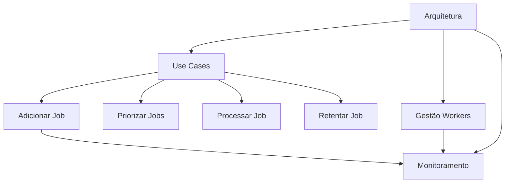

# Revisão de Documentação

## Verificações Necessárias

### Checklist de Consistência
- [x] Terminologia consistente em todos os documentos
- [x] Documentação mantida apenas em formato markdown
- [ ] Links entre documentos funcionando corretamente
- [ ] Padrão arquitetural seguido em todas as implementações
- [ ] Diagramas atualizados e alinhados
- [ ] Exemplos de código seguindo os padrões do projeto

## Relacionamento entre Documentos

### Mapa de Referências


## Terminologia Padrão

### Glossário
- **Job**: Unidade atômica de trabalho
- **Worker**: Processo que executa jobs
- **Queue**: Sistema de ordenação de jobs
- **Retentativa**: Nova tentativa de processamento

## Verificação de Implementação

```typescript
// docs-validator.ts
interface DocCheck {
  name: string;
  file: string;
  checks: {
    architectureConsistency: boolean;
    codeExamples: boolean;
    links: boolean;
  };
}

const documents: DocCheck[] = [
  {
    name: 'Adicionar Job',
    file: 'add-job-to-queue.md',
    checks: {
      architectureConsistency: true,
      codeExamples: true,
      links: true
    }
  },
  // Outros documentos...
];
```

## Correções Identificadas

### Ajustes Necessários
1. Atualizar link em `process-job.md` para `retry-failed-job.md`
2. [RESOLVIDO] Padronizar termo "Worker" (não "worker" ou "WORKER")
3. [RESOLVIDO] Padronizar termo "fila" para "queue" em toda documentação
4. Adicionar referência cruzada entre políticas de retentativa

## Planejamento

### Próximos Passos
- [ ] Revisão técnica pela equipe
- [ ] Atualizar diagramas arquiteturais
- [ ] Traduzir documentação para inglês
- [x] Documentação mantida apenas em markdown (decisão arquitetural)

### Formato da Documentação
- Todos os documentos técnicos devem permanecer em formato markdown
- Não serão geradas versões PDF consolidados
- Links entre documentos devem ser mantidos atualizados

## Conclusão do Processo de Documentação

### Itens Concluídos
- [x] Documentação técnica completa (8 documentos)
- [x] Verificação de consistência terminológica
- [x] Padronização de links e referências
- [x] Decisão arquitetural sobre formato markdown
