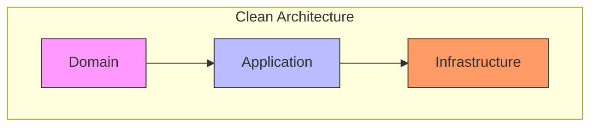
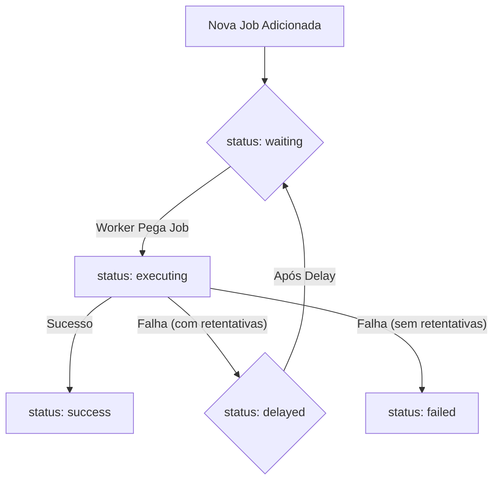

# Arquitetura do Sistema de Processamento Assíncrono (Jobs & Workers)

Este documento detalha a arquitetura de backend do Project Wiz responsável pelo processamento assíncrono de tarefas, bem como aspectos gerais da arquitetura da aplicação. Ele descreve os componentes chave como Jobs, Tasks, a Fila (Queue), Workers, Agentes, e como eles interagem para permitir a execução de trabalho automatizado pelas Personas. A aplicação é construída com Electron, com o frontend utilizando React e TanStack Router para roteamento, e Lingui para internacionalização.

## 1. Visão Geral do Sistema de Processamento Assíncrono

O sistema de processamento assíncrono, também referido como sistema de agentes autônomos, é projetado para gerenciar e executar unidades de trabalho chamadas **Jobs** por **Workers** (que são instâncias de [Agentes](./02-agent-framework.md)), tudo orquestrado por uma **Fila (Queue)** com persistência inicial em SQLite. Este sistema é fundamental para a operação do `project-wiz`, atuando como o núcleo de negócio que permite a execução de tarefas complexas de forma automatizada e inteligente. O objetivo é fornecer um mecanismo robusto e escalável para a automação de tarefas no Project Wiz.

## 2. Abordagem Arquitetural: Clean Architecture

A arquitetura do sistema de Agentes Autônomos e Processamento de Jobs do `project-wiz` foi projetada seguindo os princípios da **Clean Architecture**. O objetivo principal é garantir que as regras de negócio mais importantes (o "coração" do sistema) sejam independentes de detalhes externos, como banco de dados, frameworks ou interfaces de usuário.

A Clean Architecture organiza o código em camadas concêntricas, onde as dependências sempre fluem de fora para dentro. Isso significa que as camadas mais internas (mais próximas do centro) não sabem nada sobre as camadas mais externas.

- **Camadas Internas:** Contêm as regras de negócio mais abstratas e importantes.
- **Camadas Externas:** Contêm detalhes de implementação, como banco de dados, UI, frameworks, etc.

Essa estrutura torna o sistema mais fácil de testar, manter e evoluir, pois as mudanças em detalhes externos (como trocar o banco de dados) não afetam a lógica de negócio central.

### Domain Layer (O Núcleo)

**Propósito:** O Domain Layer é o coração da aplicação, contendo as regras de negócio e a lógica essencial que não depende de frameworks ou tecnologias externas. É a camada mais interna e estável da arquitetura.

**Componentes Principais:**
- **Entidades:** Representam os conceitos de negócio com estado e comportamento. Possuem identidade e ciclo de vida (ex: Job, Worker, AgentInternalState).
- **Value Objects:** Representam valores descritivos que não possuem identidade única. São imutáveis e definidos por seus atributos (ex: JobId, ActivityType).
- **Interfaces de Repositório:** Contratos que definem como os dados do domínio podem ser persistidos e recuperados. A implementação desses contratos reside na camada de Infraestrutura (ex: IJobRepository).

### Application Layer (Casos de Uso)

**Propósito:** O Application Layer contém a lógica de aplicação que orquestra as interações entre o Domain Layer e o Infrastructure Layer. Define os casos de uso da aplicação.

**Componentes Principais:**
- **Use Cases:** Classes que implementam fluxos de trabalho específicos (ex: CreateJobUseCase, ProcessJobUseCase).
- **Ports (Interfaces de Saída):** Interfaces que a camada de Aplicação usa para "falar" com o mundo exterior (a camada de Infraestrutura), sem saber quem está do outro lado (ex: IJobQueue, IWorkerPool).
- **Serviços de Aplicação:** Componentes que coordenam a lógica de negócio (ex: AutonomousAgent, ProcessJobService).
- **Factories:** Componentes para criar objetos complexos (ex: TaskFactory). Responsáveis pela criação de objetos complexos, como entidades ou Value Objects, garantindo que sejam criados em um estado válido.

### Infrastructure Layer (Implementações)

**Propósito:** O Infrastructure Layer lida com os detalhes técnicos e externos da aplicação, como bancos de dados, frameworks, serviços externos e interfaces de usuário. É a camada mais externa e volátil.

**Componentes Principais:**
- **Repositórios:** Implementações concretas das Interfaces de Repositório definidas no Domain Layer. Responsáveis pela comunicação com o banco de dados (ex: JobDrizzleRepository).
- **Adapters:** Implementações concretas das interfaces de Ports da Aplicação para interagir com tecnologias externas (ex: OpenAILLMAdapter para LLMs, FileSystemToolAdapter para acesso a arquivos). Adaptam interfaces externas (como APIs de terceiros ou sistemas de arquivos) para que possam ser utilizadas pela camada de Aplicação através das Ports.
- **Serviços de Infraestrutura:** Implementações concretas de serviços definidos nas Ports da camada de Aplicação (ex: serviço de envio de e-mail, serviço de mensageria, ChildProcessWorkerPoolService).
- **Workers (Infraestrutura):** Processos ou threads que executam tarefas em segundo plano, muitas vezes interagindo com filas ou sistemas de mensageria. (Nota: Estes 'Workers' são um conceito geral da camada de infraestrutura, distintos dos 'Workers' específicos do sistema de Jobs detalhados posteriormente).

O diagrama abaixo ilustra a estrutura de camadas e o fluxo de dependências:



## 3. Princípios Fundamentais do Sistema de Agentes

Estes são os princípios que guiam o design e o comportamento do nosso sistema de Agentes Autônomos, pensando em como eles operam e interagem para realizar tarefas de forma eficiente e autônoma.

### Orquestrador de Atividades Contínuo

Imagine o agente como um trabalhador incansável que nunca para. Ele está sempre de olho em uma lista de tarefas (atividades) que precisam ser feitas. Ele não tem um horário de "fim" ou um estado final onde ele simplesmente desliga. Ele está sempre ativo, pegando a próxima tarefa mais importante para trabalhar ou esperando que novas tarefas apareçam. Pense nisso como um ciclo sem fim de "ver tarefa -> fazer tarefa -> ver tarefa...".

### Entradas como Novas Atividades

Qualquer coisa que o agente precise processar, seja uma mensagem que você envia, uma informação que ele recebe de outro sistema, ou até mesmo um lembrete interno que ele gera, é transformada em uma "nova atividade". Essa nova atividade é adicionada à lista de tarefas do agente. Isso garante que tudo o que precisa ser feito seja registrado e considerado na hora de decidir qual tarefa é a mais importante para fazer em seguida. É como se cada nova solicitação ou evento virasse um novo item na lista de afazeres do agente.

### Raciocínio Contextual do LLM

O "cérebro" do agente, que é um modelo de linguagem grande (LLM), não tenta pensar em tudo o que está acontecendo no sistema de uma vez só. Em vez disso, quando ele vai trabalhar em uma tarefa específica, ele foca **apenas nas informações e no histórico relacionados àquela tarefa**. Ele não se preocupa com conversas ou contextos de outras tarefas que ele possa estar gerenciando. Isso ajuda o agente a se manter focado e a tomar decisões que são realmente relevantes para a atividade atual, sem se confundir com informações de outros assuntos.

### Validação Pré-Execução Crítica

Antes de o agente realmente _fazer_ alguma coisa, especialmente se for usar uma ferramenta (como rodar um comando ou acessar um sistema), ele faz uma pausa para pensar: "Eu tenho tudo o que preciso para fazer isso?". Ele verifica se todas as condições necessárias foram atendidas, se ele tem as informações corretas e se a ação faz sentido naquele momento. Se ele perceber que falta alguma coisa ou que a ação não é apropriada, ele não executa. Em vez disso, ele pode criar uma nova tarefa para conseguir a informação que falta ou resolver o problema antes de tentar novamente. É um passo de segurança para evitar erros e ações desnecessárias.

### Planos Fragmentados e Iterativos

Quando o agente tem um objetivo grande, ele não tenta planejar todos os passos do início ao fim de uma vez só. Em vez disso, ele cria um plano inicial com os primeiros passos. Conforme ele vai executando esses passos e aprendendo mais, ele pode ajustar o plano, quebrar tarefas grandes em tarefas menores (sub-atividades) ou até mesmo criar novas tarefas se surgirem necessidades inesperadas. Isso torna o agente mais flexível e capaz de lidar com situações complexas ou que mudam ao longo do tempo. O plano vai sendo construído e refinado "em pedaços" e de forma contínua.

### Histórico de Conversa por Atividade

Este é um ponto muito importante para evitar confusão. Cada tarefa (atividade) que o agente gerencia tem seu **próprio histórico de mensagens e interações**. Isso significa que a conversa que o agente teve com você ou com outros sistemas sobre a Tarefa A fica separada da conversa sobre a Tarefa B. Quando o "cérebro" do agente (o LLM) precisa pensar sobre a Tarefa A, ele só vê o histórico da Tarefa A. Isso impede que ele misture informações de diferentes tarefas e garante que ele sempre tenha o contexto correto para a tarefa em que está trabalhando no momento.

## 4. Conceitos Fundamentais do Sistema de Jobs & Workers

*   **Job**: A representação persistida de uma unidade de trabalho no sistema. É um registro de dados que descreve "o que" precisa ser feito. Uma Job é gerenciada exclusivamente pela Fila.
*   **Task**: É a lógica de execução em memória para um tipo específico de trabalho. A Task sabe "como" interagir com serviços externos (incluindo LLMs) para realizar a parte computacional de uma Job. A Task não se preocupa com persistência ou status de fila e é geralmente instanciada e executada por um [Agente](./02-agent-framework.md).
*   **Fila (Queue)**: O componente central responsável pelo gerenciamento do ciclo de vida das Jobs. Ela persiste o estado das Jobs, controla as transições de status, gerencia retentativas, atrasos e dependências.
*   **Worker (do sistema de Jobs)**: Uma classe que monitora a Fila por Jobs atribuídos a um [Agente](./02-agent-framework.md) específico. O Worker é responsável por pegar Jobs da Fila, orquestrar sua execução pelo Agente e notificar a Fila sobre o desfecho.
*   **Agente**: Refere-se à entidade lógica ([Persona](./02-agent-framework.md#agent)) que executa a Task. A função de processamento que o Worker invoca é um método da classe do Agente, que por sua vez utiliza as [Tools](./02-agent-framework.md#tools) configuradas.

## 5. Entidade Job

A entidade `Job` armazena todas as informações necessárias para o gerenciamento de uma unidade de trabalho pela Fila.

*   `id`: Identificador único da Job.
*   `name`: Nome descritivo da Job.
*   `payload`: Dados de entrada para a Job, definidos no momento da criação e geralmente não alterados durante a execução.
*   `data`: Um campo onde a Job pode armazenar informações dinâmicas durante sua execução (ex: resultados parciais, estado interno da Task).
*   `result`: O resultado final da execução da Job.
*   `max_attempts`: Número máximo de tentativas permitidas para a Job em caso de falha.
*   `attempts`: Contador do número de tentativas já realizadas.
*   `max_retry_delay`: O tempo máximo de espera entre as retentativas.
*   `retry_delay`: O tempo de espera base para a próxima retentativa, geralmente aumentado exponencialmente: `((attempts+1) ** 2) * retry_delay`.
*   `delay`: Tempo de espera adicional antes que uma Job no estado `delayed` seja movida para `waiting`.
*   `priority`: Valor numérico que define a prioridade da Job na Fila. **Menor número significa MAIOR prioridade.**
*   `status`: O estado atual da Job no ciclo de vida:
    *   `waiting`: Aguardando para ser processada, seja por estar nova na fila ou após um `delay`.
    *   `delayed`: Execução postergada, geralmente após uma falha com retentativa ou se a Job foi criada para iniciar em um momento futuro.
    *   `success`: Concluída com sucesso.
    *   `failed`: Concluída com erro após todas as tentativas.
    *   `executing`: Atualmente sendo processada por um Worker/Agente.
*   `depends_on`: Lista de `jobIds` dos quais esta Job depende. A Job só se tornará `waiting` (pronta para execução) quando todas as suas dependências estiverem com status `success`. O resultado das Jobs dependentes pode ser injetado no `payload` ou `data` desta Job.

### 5.1. Transição de Status da Job (Fluxo Simplificado)

O diagrama abaixo ilustra um fluxo simplificado das transições de status de uma Job. Para um diagrama de estado mais completo, consulte o [Ciclo de Vida de um Job no README principal](../../../README.md#ciclo-de-vida-de-um-job).



*   **`new` (implícito) -> `waiting`**: Uma nova Job é adicionada à Fila.
*   **`waiting` -> `executing`**: Um Worker ([Agente](./02-agent-framework.md)) pega a Job para processar.
*   **`executing` -> `success`**: A Job é concluída com sucesso.
*   **`executing` -> `delayed`**: Ocorre um erro, mas ainda há tentativas restantes. A Job é colocada em `delayed` antes de voltar para `waiting`.
*   **`executing` -> `failed`**: Ocorre um erro e não há mais tentativas, ou a falha é definitiva.
*   **`delayed` -> `waiting`**: Após o tempo de `delay`, a Job está pronta para ser re-executada.
*   **Jobs com `depends_on`**: Ficam em `waiting` (ou um estado similar de espera) se suas dependências não estiverem `success`.

## 6. Fluxos Operacionais e Ciclo de Vida

### 6.1. Fluxo de Dados e Controle do Sistema

Descreve o fluxo geral de dados e controle de uma Activity no sistema de agentes autônomos, desde sua iniciação até sua conclusão ou re-agendamento, detalhando como os dados e o controle passam entre os principais componentes.

**Visão Geral do Fluxo**

O fluxo de uma Activity começa com a sua criação, passa pelo enfileiramento, é processada por um Worker que interage com o AutonomousAgent, que por sua vez utiliza Tasks, Tools e LLMs. O resultado do processamento é então retornado para a fila, que atualiza o status da Activity.

**Diagrama do Fluxo de Dados e Controle**

```mermaid
graph TD
    subgraph External
        User[Usuário/Sistema Externo]
    end

    subgraph Infrastructure
        IPC[Electron IPC Handlers]
        Drizzle[Drizzle/SQLite]
        WorkerProcess[Worker Process]
        ToolAdapters[Implementações de Tools]
        LLMAdapters[Implementações de LLMs]
        JobRepoImpl[JobRepository (Drizzle)]
        AgentStateRepoImpl[AgentStateRepository (Drizzle)]
        QueueImpl[Queue (Implementação)]
        WorkerPoolImpl[WorkerPool (Implementação)]
    end

    subgraph Application
        ProcessJobService[ProcessJobService]
        CreateJobUC[CreateJobUseCase]
        ProcessJobUC[ProcessJobUseCase]
        QueueInterface[JobQueue Interface]
        WorkerPoolInterface[WorkerPool Interface]
        AutonomousAgentService[AutonomousAgent Service]
        IAgentServiceInterface[IAgentService Interface]
        TaskFactory[TaskFactory]
        LLMInterface[LLM Interface]
        ToolInterface[Tool Interface]
        JobRepoInterface[JobRepository Interface]
        AgentStateRepoInterface[AgentStateRepository Interface]
    end

    subgraph Domain
        JobEntity[Job/Activity Entity]
        WorkerEntity[Worker Entity]
        QueueEntity[Queue Entity]
        AgentStateEntity[AgentInternalState Entity]
        ActivityContextVO[ActivityContext VO]
        TaskInterface[Task Interface]
        ToolInterfaceDomain[Tool Interface]
    end

    User --> IPC
    IPC --> ProcessJobService
    ProcessJobService --> CreateJobUC
    CreateJobUC --> JobEntity
    CreateJobUC --> ActivityContextVO
    CreateJobUC --> QueueInterface
    QueueInterface --> QueueImpl
    QueueImpl --> JobRepoInterface
    JobRepoInterface --> JobRepoImpl
    JobRepoImpl --> Drizzle

    QueueImpl -- Notifica --> WorkerPoolInterface
    WorkerPoolInterface --> WorkerPoolImpl
    WorkerPoolImpl --> WorkerProcess

    WorkerProcess --> QueueInterface: Get Job (Status PENDING -> EXECUTING)
    QueueInterface --> QueueImpl
    QueueImpl --> JobRepoInterface
    JobRepoInterface --> JobRepoImpl

    WorkerProcess --> AutonomousAgentService: processActivity(Job)
    AutonomousAgentService --> AgentStateRepoInterface: Load State
    AgentStateRepoInterface --> AgentStateRepoImpl
    AgentStateRepoImpl --> Drizzle

    AutonomousAgentService --> LLMInterface: Reason (with AgentState + ActivityContext)
    LLMInterface --> LLMAdapters

    AutonomousAgentService -- Decides Task --> IAgentServiceInterface
    IAgentServiceInterface --> TaskFactory
    TaskFactory --> TaskInterface

    TaskInterface --> ToolInterfaceDomain: Use Tool
    ToolInterfaceDomain --> ToolInterface: Use Tool (Application Port)
    ToolInterface --> ToolAdapters

    TaskInterface --> LLMInterface: Use LLM
    LLMInterface --> LLMAdapters

    ToolAdapters --> WorkerProcess: Tool Result
    LLMAdapters --> WorkerProcess: LLM Result

    TaskInterface --> IAgentServiceInterface: Task Result
    IAgentServiceInterface --> AutonomousAgentService: Task Result

    AutonomousAgentService -- Updates --> JobEntity: Update ActivityContext
    AutonomousAgentService -- Returns Result --> WorkerProcess

    WorkerProcess --> QueueInterface: Notify Status (FINISHED/FAILED/DELAYED)
    QueueInterface --> QueueImpl
    QueueImpl --> JobRepoInterface
    JobRepoInterface --> JobRepoImpl

    JobEntity --> ActivityContextVO
    JobEntity --> AgentStateEntity
    JobEntity --> WorkerEntity
    JobEntity --> QueueEntity

    AgentStateEntity --> AgentStateRepoInterface
    ActivityContextVO --> JobEntity
    WorkerEntity --> WorkerPoolInterface
    QueueEntity --> QueueInterface

    style Domain fill:#f9f,stroke:#333
    style Application fill:#bbf,stroke:#333
    style Infrastructure fill:#f96,stroke:#333
    style External fill:#ccf,stroke:#333
```

**Descrição Detalhada do Fluxo**

1.  **Iniciação da Activity:**
    - Um evento externo (e.g., requisição do usuário via UI) é capturado pelos `Electron IPC Handlers` (Infrastructure).
    - O `IPC Handler` invoca o `ProcessJobService` (Application).
    - `ProcessJobService` usa o `CreateJobUseCase` (Application) para criar uma `Job` (Domain), representando a Activity, incluindo o `ActivityContext` inicial.
    - `CreateJobUseCase` adiciona a `Job` à fila via `JobQueue Interface` (Application).
    - `QueueImpl` (Infrastructure) persiste a `Job` (status `PENDING`) via `JobRepository` (Infrastructure).

2.  **Consumo pela Fila e Worker:**
    - `QueueImpl` notifica `WorkerPool Interface` (Application) sobre a nova `Job`.
    - `WorkerPoolImpl` (Infrastructure) gerencia os `Worker Processes`.
    - Um `Worker Process` (Infrastructure) obtém a `Job` da `QueueInterface`.
    - `QueueImpl` atualiza o status da `Job` para `EXECUTING`.

3.  **Processamento pelo AutonomousAgent:**
    - `Worker Process` invoca `AutonomousAgent Service` (Application) com a `Job`.
    - O agente carrega seu `AgentInternalState` (Domain) via `AgentStateRepository` (Application/Infrastructure).
    - `AutonomousAgent Service` usa `LLM Interface` (Application) para interagir com o LLM, passando `AgentInternalState` e `ActivityContext`.
    - `LLMAdapters` (Infrastructure) processam a requisição e retornam a resposta.

4.  **Execução da Task (se necessário):**
    - Se o LLM decide executar uma Task, `AutonomousAgent Service` invoca `IAgentService Interface` (Application).
    - `IAgentService` usa `TaskFactory` (Application) para instanciar a `Task` (Domain).
    - A `Task` executa, podendo usar `Tools` (Domain/Application/Infrastructure) e/ou `LLMs`.
    - O resultado da `Task` retorna ao `IAgentService Interface` e, em seguida, ao `AutonomousAgent Service`.

5.  **Atualização da Activity e Continuação/Conclusão:**
    - `AutonomousAgent Service` atualiza o `ActivityContext` na `Job` com o resultado/reflexões.
    - Decide se a Activity concluiu. Se não, pode indicar re-agendamento (e.g., retornando `undefined`). Se sim, retorna o resultado final ao `Worker Process`.

6.  **Conclusão ou Re-agendamento pela Fila:**
    - `Worker Process` notifica `Queue Interface` sobre o status final (`FINISHED`, `FAILED`, `DELAYED`).
    - `QueueImpl` atualiza o status da `Job`. Se `DELAYED`, a `Job` retorna a `PENDING` após o delay.

### 6.2. O Loop do Agente Autônomo

O Agente Autônomo opera em um ciclo contínuo, iterando sobre as atividades e adaptando-se às necessidades. O "Loop Agente" representa graficamente esse fluxo, mostrando como o agente processa as atividades sob sua responsabilidade, desde a obtenção da próxima atividade até a atualização de seu status e contexto.

```mermaid
graph TD
    A[Início / Lista de Atividades] --> B(Obtém Próxima Atividade)

    B --> C{É uma Atividade Decomposta?}

    C -- Não --> F[Analise Intenção]

    C -- Sim --> D[Pega Próxima Subtask da]

    D --> E{É necessário contexto adicional?}

    E -- Sim --> G[Coleta de Contexto]
    G --> A % Retorna ao início para processar a atividade de coleta de contexto

    E -- Não --> F

    F --> H[Transformar em itens acionáveis (Sub Atividade ou Atividades)]

    H --> I[Processa Próxima SubAtividade Pendente]

    I --> J{A Subtask Atual precisa ser dividida em subtasks?}

    J -- Sim --> A % Novas subtasks são criadas, volta para a lista de atividades

    J -- Não --> K[Geração da Saída]

    K --> L[Atualização de Status/Contexto]

    L --> A % Loop contínuo do agente
```

**Etapas do Loop:**

- **Início / Lista de Atividades:** Observa todas as atividades gerenciadas pelo `ActivityManager`.
- **Obtém Próxima Atividade:** Seleciona a atividade mais relevante/prioritária (guiado pelo LLM). Novas entradas externas tornam-se atividades de alta prioridade.
- **É uma Atividade Decomposta?:** Se for uma solicitação de alto nível (e.g., `USER_REQUEST` inicial), vai para "Analise Intenção". Se já possui um plano/sub-tarefas, vai para "Pega Próxima Subtask".
- **Pega Próxima Subtask:** Identifica o próximo passo no plano de execução.
- **É necessário contexto adicional?:** Valida se possui informações/pré-requisitos. Se faltar, vai para "Coleta de Contexto". Senão, avança.
- **Coleta de Contexto:** Planeja e executa ações para obter informações ausentes (nova interação com usuário, outro agente, ou ferramenta). Retorna ao "Início".
- **Analise Intenção:** O LLM interpreta o propósito da atividade/sub-atividade, requisitos e resultados esperados, usando `activityHistory` e `activityNotes`.
- **Transformar em itens acionáveis:** Planejamento concreto, quebrando o objetivo em passos executáveis (novas `subActivities` ou `plannedSteps` na `Activity` principal).
- **Processa Próxima SubAtividade Pendente:** Executa a ação concreta (chamada de ferramenta, mensagem, atualização interna). Resultado adicionado ao `activityHistory`.
- **A Subtask Atual precisa ser dividida?:** Reflete sobre o resultado. Se a sub-tarefa é complexa ou precisa de mais decomposição, novas sub-tarefas são geradas e o ciclo retorna ao "Início". Senão, vai para "Geração da Saída".
- **Geração da Saída:** Formula e envia a saída final da etapa (mensagem, confirmação de ferramenta).
- **Atualização de Status/Contexto:** Atualiza o status da atividade e o `AgentInternalState`.
- **Fim / Loop Agente:** Retorna ao "Início" para a próxima atividade, mantendo operação contínua.


## 7. Componentes e Fluxo de Interação

### 7.1. Fila (`Queue`)

*   **Responsabilidade Principal**: Gerenciamento de estado e ciclo de vida das **Jobs**.
*   **Persistência**: As Jobs são persistidas em SQLite (inicialmente), utilizando Drizzle ORM. As alterações de schema são gerenciadas através de **migrações versionadas**.
*   **Funções**: A Fila é a **única** responsável por atualizar o `status` de uma Job, incrementar `attempts`, gerenciar `delay`, `depends_on`, e armazenar `result`. Ela recebe notificações do Worker sobre o desfecho da execução.

### 7.2. Processos da Aplicação Electron e Integração IPC

O Project Wiz, sendo uma aplicação Electron, é dividido em processos principais:

*   **Processo Main (Electron):**
    *   Responsável pela manipulação do ciclo de vida das janelas da aplicação.
    *   Gerencia a comunicação IPC (Inter-Process Communication) tipada com os processos de renderer.
    *   Coordena o gerenciamento dos [Agentes](./02-agent-framework.md) (Personas).
    *   Realiza a integração com APIs externas, como a API do GitHub (utilizando Octokit).
*   **Processo Renderer (React):**
    *   Constrói e renderiza a interface do usuário utilizando React, componentes Radix UI e Tailwind CSS.
    *   Gerencia o roteamento da interface com TanStack Router.
    *   Comunica-se com o Processo Main via IPC para operações de backend e acesso a recursos nativos.

A integração com o Electron e a comunicação Inter-processos (IPC) entre o Main Process e o Renderer Process são tratadas inteiramente na camada de **Infraestrutura** (conforme descrito na seção Clean Architecture). Isso garante que a lógica de negócio (Domain e Application) não tenha conhecimento sobre o ambiente Electron, mantendo-a portátil. Os handlers de IPC no Main Process (Infraestrutura) recebem requisições da interface (Renderer Process) e utilizam os Use Cases e Serviços da camada de Aplicação para realizar as operações.

### 7.3. Worker (Orquestrador de Jobs do Agente)

*   **Responsabilidade Principal**: Orquestrar a execução das Jobs por um [Agente](./02-agent-framework.md) específico.
*   **Funcionamento**:
    1.  Monitora a Fila por Jobs disponíveis que correspondem ao ID do Agente que ele serve.
    2.  Recebe a função de processamento (um método da classe do [Agente](./02-agent-framework.md)) que será executada.
    3.  Pega a **Job** da Fila (transacionando seu status para `executing`).
    4.  Chama a função de processamento do [Agente](./02-agent-framework.md), passando a Job.
    5.  **Captura exceções (`throw new Error`)** lançadas pela função de processamento do Agente.
    6.  Com base no sucesso ou no erro capturado, o Worker notifica a Fila para que esta atualize o status da Job e armazene o resultado ou erro.

### 7.4. Agente

*   **Responsabilidade Principal**: Executar a lógica da **Task** associada a uma Job, utilizando suas [Tools](./02-agent-framework.md#tools) e capacidades de IA.
*   **Funcionamento**:
    1.  Recebe uma **Job** do Worker.
    2.  Instancia a classe **Task** apropriada (que sabe interagir com LLMs e outras ferramentas), usando os dados da Job e as [Tools](./02-agent-framework.md#tools) disponíveis para o Agente.
    3.  Executa a `taskInstance`. O Agente em si não interage diretamente com a Fila ou gerencia o status da Job; essa é uma responsabilidade do Worker e da Fila.

#### 7.4.1. Regras de Retorno do Agente (para o Worker)

*   **Retorno de Sucesso (retorna um valor):**
    *   **Significado**: A Task concluiu seu trabalho para esta Job.
    *   **Ação do Worker**: Notifica a Fila sobre o sucesso e o resultado. A Fila marca a **Job como `success`**.
*   **Retorno Vazio (`return;` ou `return undefined/null`):**
    *   **Significado**: A Task não concluiu, mas não houve um erro. Pode necessitar de mais passos ou ser uma tarefa de longa duração que será re-agendada.
    *   **Ação do Worker**: Notifica a Fila sobre a necessidade de continuação. A Fila coloca a **Job em `delayed`** (e depois `waiting` se o delay for 0), para que possa ser retomada ou verificada posteriormente.
*   **Lançamento de Erro (`throw new Error`):**
    *   **Significado**: Ocorreu uma falha na execução da Task.
    *   **Ação do Worker**: Captura a exceção e notifica a Fila sobre a falha. A Fila lida com as **retentativas** (se `attempts < max_attempts`, movendo para `delayed`) ou marca a Job como `failed`.

### 7.5. Task

*   **Responsabilidade Principal**: Encapsular a lógica de interação com LLMs e o uso de [Tools](./02-agent-framework.md#tools) específicas para um tipo de Job.
*   **Funcionamento**:
    *   Recebe os dados da Job e as [Tools](./02-agent-framework.md#tools) injetadas pelo Agente.
    *   Realiza chamadas à LLM usando o `ai-sdk` ou outras bibliotecas de IA.
    *   A LLM pode solicitar a execução de [Tools](./02-agent-framework.md#tools) fornecidas.
    *   O retorno da Task (ou a ausência dele) e o lançamento de erros seguem as regras definidas para o Agente.

## 8. Mecanismos de Comunicação Adicionais

Além da interação com LLMs:

*   **IPC Tipado:** A comunicação entre o processo Main do Electron e os processos Renderer é feita através de IPC, com um esforço para manter essa comunicação tipada, garantindo maior segurança e robustez no desenvolvimento. (Nota: Detalhes da integração IPC já movidos para a seção 7.2).
*   **APIs Externas:** O sistema interage com APIs externas, como a API do GitHub (via Octokit), para funcionalidades como análise de repositórios e integração com issues/pull requests.

## 9. Interação com LLMs e Tools (Dentro das Tasks)

*   As chamadas para LLMs são feitas primariamente dentro das Tasks, utilizando SDKs como `ai-sdk` (veja [Integração com LLMs](./04-llm-integration.md)).
*   As [Tools](./02-agent-framework.md#tools) são fornecidas à LLM durante essas chamadas, permitindo que o modelo solicite ações no sistema (ler arquivos, executar comandos, etc.).
*   Uma "step" de execução de uma Job por uma Task pode envolver múltiplas interações com a LLM e suas Tools. Uma "step" geralmente termina quando a LLM invoca uma Tool especial como `finalAnswer` (ou similar) ou quando a Task decide que completou uma unidade lógica de trabalho.
*   A Tool `finalAnswer` (ou um mecanismo similar) normalmente indica se a Task considera a Job como um todo concluída (`taskFinished: true`) ou se apenas uma etapa foi finalizada (`taskFinished: false`).
*   As **Tools** são um conceito central e são detalhadas no documento [Estrutura do Agente (Agent Framework)](./02-agent-framework.md#tools). Elas podem ser genéricas (disponíveis para muitos Agentes, como `FilesystemTool`) ou específicas de uma Task/Job.

## 10. Build e Implantação

*   **Build do Frontend/Renderer:** Vite é utilizado para um build otimizado do código do frontend.
*   **Empacotamento da Aplicação:** Electron Forge é a ferramenta utilizada para empacotar a aplicação Electron para distribuição.

## 11. Conclusão

A arquitetura do Project Wiz é projetada para ser flexível e robusta, permitindo a automação de tarefas complexas através de Agentes de IA e uma clara separação de responsabilidades entre os processos e componentes. A utilização de um sistema de Jobs e Fila, juntamente com a interação com LLMs e Tools, forma o núcleo da capacidade de automação. Futuras melhorias podem incluir diferentes implementações de Fila, estratégias de priorização mais avançadas e maior observabilidade do sistema.

[end of docs/technical-documentation/01-architecture.md]
