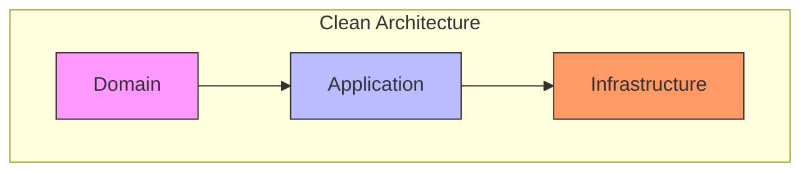
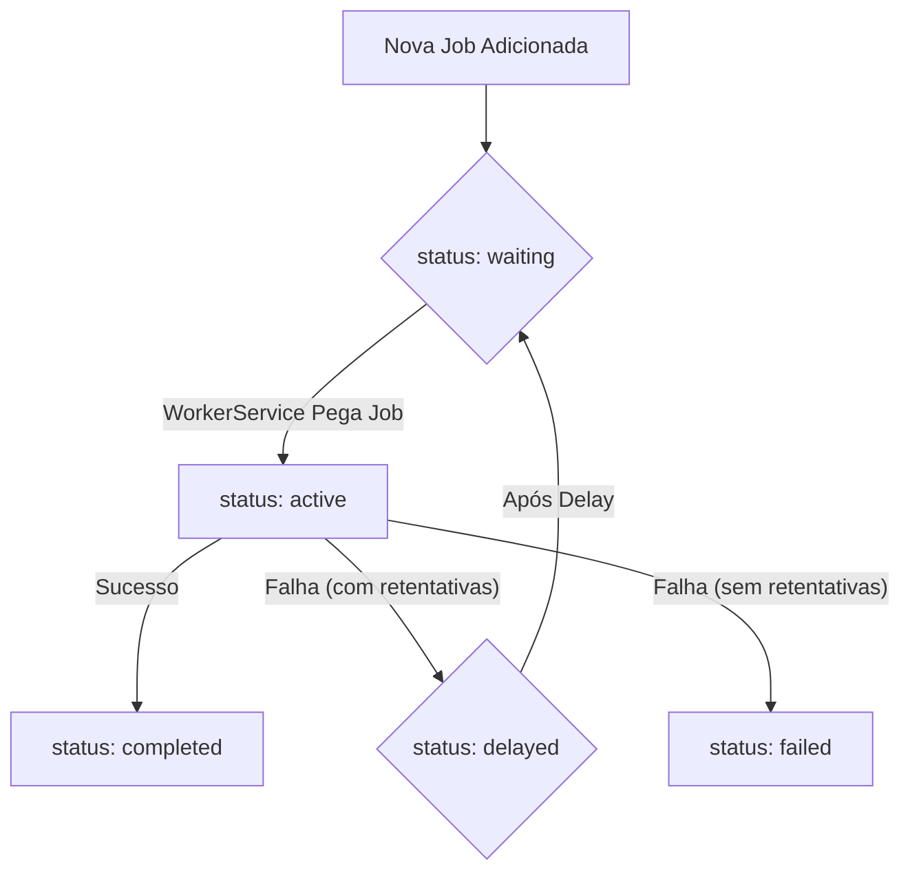

# Arquitetura do Sistema de Processamento Assíncrono (Jobs & Workers)

Este documento detalha a arquitetura de backend do Project Wiz responsável pelo processamento assíncrono de tarefas, bem como aspectos gerais da arquitetura da aplicação. Ele descreve os componentes chave como Jobs, Tasks, a Fila (Queue), Workers, Agentes, e como eles interagem para permitir a execução de trabalho automatizado pelas Personas. A aplicação é construída com Electron, com o frontend utilizando React e TanStack Router para roteamento, e Lingui para internacionalização.

## 1. Visão Geral do Sistema de Processamento Assíncrono

O sistema de processamento assíncrono, também referido como sistema de agentes autônomos, é projetado para gerenciar e executar unidades de trabalho chamadas **Jobs** por **Workers** (que são instâncias de [Agentes](./02-agent-framework.md)), tudo orquestrado por uma **Fila (Queue)** com persistência inicial em SQLite. Este sistema é fundamental para a operação do `project-wiz`, atuando como o núcleo de negócio que permite a execução de tarefas complexas de forma automatizada e inteligente. O objetivo é fornecer um mecanismo robusto e escalável para a automação de tarefas no Project Wiz.

## 2. Abordagem Arquitetural: Clean Architecture

A arquitetura do sistema de Agentes Autônomos e Processamento de Jobs do `project-wiz` foi projetada seguindo os princípios da **Clean Architecture**. O objetivo principal é garantir que as regras de negócio mais importantes (o "coração" do sistema) sejam independentes de detalhes externos, como banco de dados, frameworks ou interfaces de usuário.

A Clean Architecture organiza o código em camadas concêntricas, onde as dependências sempre fluem de fora para dentro. Isso significa que as camadas mais internas (mais próximas do centro) não sabem nada sobre as camadas mais externas.

- **Camadas Internas:** Contêm as regras de negócio mais abstratas e importantes.
- **Camadas Externas:** Contêm detalhes de implementação, como banco de dados, UI, frameworks, etc.

Essa estrutura torna o sistema mais fácil de testar, manter e evoluir, pois as mudanças em detalhes externos (como trocar o banco de dados) não afetam a lógica de negócio central. Processos de revisão de código e refatoração são aplicados continuamente para assegurar a aderência a estes princípios arquiteturais, resultando em melhorias na qualidade do código, coesão e redução da complexidade ciclomática.

### Domain Layer (O Núcleo)

**Propósito:** O Domain Layer é o coração da aplicação, contendo as regras de negócio e a lógica essencial que não depende de frameworks ou tecnologias externas. É a camada mais interna e estável da arquitetura.

**Componentes Principais:**
- **Entidades:** Representam os conceitos de negócio com estado e comportamento. Possuem identidade e ciclo de vida. As entidades centrais implementadas são:
    - `Job`: Representa uma unidade de trabalho ou atividade, contendo um `ActivityContext` em seu campo `data` para armazenar o estado e histórico da atividade.
    - `AgentInternalState`: Mantém o estado interno de um agente, como seu objetivo atual ou notas.
    - `Worker`: Representa um executor de jobs, associado a um agente específico.
- **Value Objects (VOs):** Representam valores descritivos que não possuem identidade única, garantindo validade e consistência. Principais VOs implementados incluem:
    - Para Jobs: `JobId`, `JobStatus` (e.g., pending, waiting, active, completed, failed, cancelled), `JobName`, `JobPriority`, `JobAttempts`.
    - Para Activities (dentro do Job): `ActivityType` (e.g., USER_REQUEST, AGENT_ACTION), `ActivityHistoryEntry`, `ActivityHistory`, `ActivityContext`.
    - Para Agentes: `AgentId`.
    - Para Workers: `WorkerId`, `WorkerStatus`.
- **Interfaces de Repositório:** Contratos que definem como os dados do domínio podem ser persistidos e recuperados. A implementação desses contratos reside na camada de Infraestrutura. Interfaces definidas:
    - `IJobRepository`
    - `IAgentStateRepository`
    - `IWorkerRepository`
    - `IRepository` (interface genérica base).
- **Lógica de Negócio:** A lógica de negócio mais complexa, especialmente transições de estado e coordenação entre entidades, é gerenciada por serviços na Camada de Aplicação, mantendo as entidades focadas em seu estado e regras intrínsecas.

### Application Layer (Casos de Uso)

**Propósito:** O Application Layer contém a lógica de aplicação que orquestra as interações entre o Domain Layer e o Infrastructure Layer. Define os casos de uso e os serviços que suportam as operações do sistema.

**Componentes Principais:**
- **Serviços de Aplicação:** Componentes que coordenam a lógica de negócio e orquestram os Use Cases e Entidades. Serviços implementados incluem:
    - `QueueService`: Gerencia a fila de jobs, incluindo adição, recuperação e atualização de status dos jobs.
    - `JobDefinitionService`: Responsável por criar e definir novos jobs com base nas entradas do sistema.
    - `AutonomousAgent`: Orquestra o processamento de uma atividade (job), utilizando LLMs e Tasks para atingir um objetivo.
    - `WorkerService`: Gerencia o ciclo de vida dos workers, designando jobs para eles processarem através do `AutonomousAgent`.
    - `TaskFactory`: Responsável por instanciar as `ITask`s corretas com base no tipo de tarefa a ser executada.
- **Ports (Interfaces):** Definem contratos para comunicação com a camada de Infraestrutura (adapters) ou para definir os limites dos serviços da aplicação. Principais ports definidos:
    - `IQueueService`
    - `IJobDefinitionService`
    - `IWorkerService`
    - `IAgentServiceFacade` (para simplificar interações com o `AutonomousAgent`)
    - `ILLMAdapter` (para abstrair a comunicação com diferentes Modelos de Linguagem)
    - `ITask` (para definir a estrutura de uma tarefa executável)
    - `ITool` (para definir a estrutura de uma ferramenta que uma `ITask` pode usar)
- **Use Cases (Exemplos Futuros/Implícitos):** Embora alguns use cases (`CreateUserUseCase`, `CreateLLMProviderConfigUseCase`) tenham sido implementados para funcionalidades de usuário/configuração, os fluxos principais do sistema de jobs (como `ProcessJobUseCase`) são atualmente orquestrados pelos serviços de aplicação. `ProcessJobUseCase` foi explicitamente mockado durante a integração inicial.
- **Injeção de Dependência (DI):** Utilizada para fornecer dependências aos serviços e outros componentes, promovendo baixo acoplamento e testabilidade.

### Infrastructure Layer (Implementações)

**Propósito:** O Infrastructure Layer lida com os detalhes técnicos e externos da aplicação, como bancos de dados, frameworks, serviços externos e interfaces de usuário. É a camada mais externa e volátil.

**Componentes Principais:**
- **Repositórios e Persistência:**
    - **Drizzle ORM com SQLite:** É a principal tecnologia de persistência utilizada.
    - Implementações concretas das Interfaces de Repositório:
        - `JobDrizzleRepository`: Para persistência de `Job` entities.
        - `AgentStateDrizzleRepository`: Para persistência de `AgentInternalState` entities.
        - `WorkerDrizzleRepository`: Para persistência de `Worker` entities.
    - Os schemas Drizzle correspondentes (`jobs.ts`, `agent-states.ts`, `workers.ts`) mapeiam as entidades do domínio para as tabelas do banco de dados SQLite. Campos complexos como `ActivityContext` (no `Job`) são serializados (provavelmente como JSON/TEXT).
- **Adapters:**
    - `MockLLMAdapter`: Uma implementação inicial e mockada da interface `ILLMAdapter`, usada para simular interações com um Modelo de Linguagem durante o desenvolvimento e testes.
    - `ElectronIpcHandler`: Adapta a comunicação IPC do Electron para ser usada pelos handlers da aplicação.
- **Ferramentas (Tools):**
    - Implementações iniciais de `ITool` incluem `SimpleEchoTool` (para testes) e um mock de `FileSystemListTool`. Estas são usadas pelo `TaskFactory` e `AutonomousAgent`.
- **Serviços de Infraestrutura:**
    - O `db` (instância Drizzle) é configurado e fornecido como um serviço de infraestrutura.
- **Workers (Infraestrutura):** O `WorkerService` da camada de aplicação interage com os `Worker` entities, mas a infraestrutura de execução real de workers em processos separados (e.g., `ChildProcessWorkerPoolService` mencionado anteriormente) ainda é um conceito a ser plenamente realizado e integrado com o `WorkerService` atual.

O diagrama abaixo ilustra a estrutura de camadas e o fluxo de dependências:



## 3. Princípios Fundamentais do Sistema de Agentes

Estes são os princípios que guiam o design e o comportamento do nosso sistema de Agentes Autônomos, pensando em como eles operam e interagem para realizar tarefas de forma eficiente e autônoma.

### Orquestrador de Atividades Contínuo

Imagine o agente como um trabalhador incansável que nunca para. Ele está sempre de olho em uma lista de tarefas (atividades) que precisam ser feitas. Ele não tem um horário de "fim" ou um estado final onde ele simplesmente desliga. Ele está sempre ativo, pegando a próxima tarefa mais importante para trabalhar ou esperando que novas tarefas apareçam. Pense nisso como um ciclo sem fim de "ver tarefa -> fazer tarefa -> ver tarefa...".

### Entradas como Novas Atividades

Qualquer coisa que o agente precise processar, seja uma mensagem que você envia, uma informação que ele recebe de outro sistema, ou até mesmo um lembrete interno que ele gera, é transformada em uma "nova atividade". Essa nova atividade é adicionada à lista de tarefas do agente. Isso garante que tudo o que precisa ser feito seja registrado e considerado na hora de decidir qual tarefa é a mais importante para fazer em seguida. É como se cada nova solicitação ou evento virasse um novo item na lista de afazeres do agente.

### Raciocínio Contextual do LLM

O "cérebro" do agente, que é um modelo de linguagem grande (LLM), não tenta pensar em tudo o que está acontecendo no sistema de uma vez só. Em vez disso, quando ele vai trabalhar em uma tarefa específica, ele foca **apenas nas informações e no histórico relacionados àquela tarefa**. Ele não se preocupa com conversas ou contextos de outras tarefas que ele possa estar gerenciando. Isso ajuda o agente a se manter focado e a tomar decisões que são realmente relevantes para a atividade atual, sem se confundir com informações de outros assuntos.

### Validação Pré-Execução Crítica

Antes de o agente realmente _fazer_ alguma coisa, especialmente se for usar uma ferramenta (como rodar um comando ou acessar um sistema), ele faz uma pausa para pensar: "Eu tenho tudo o que preciso para fazer isso?". Ele verifica se todas as condições necessárias foram atendidas, se ele tem as informações corretas e se a ação faz sentido naquele momento. Se ele perceber que falta alguma coisa ou que a ação não é apropriada, ele não executa. Em vez disso, ele pode criar uma nova tarefa para conseguir a informação que falta ou resolver o problema antes de tentar novamente. É um passo de segurança para evitar erros e ações desnecessárias.

### Planos Fragmentados e Iterativos

Quando o agente tem um objetivo grande, ele não tenta planejar todos os passos do início ao fim de uma vez só. Em vez disso, ele cria um plano inicial com os primeiros passos. Conforme ele vai executando esses passos e aprendendo mais, ele pode ajustar o plano, quebrar tarefas grandes em tarefas menores (sub-atividades) ou até mesmo criar novas tarefas se surgirem necessidades inesperadas. Isso torna o agente mais flexível e capaz de lidar com situações complexas ou que mudam ao longo do tempo. O plano vai sendo construído e refinado "em pedaços" e de forma contínua.

### Histórico de Conversa por Atividade

Este é um ponto muito importante para evitar confusão. Cada tarefa (atividade) que o agente gerencia tem seu **próprio histórico de mensagens e interações**. Isso significa que a conversa que o agente teve com você ou com outros sistemas sobre a Tarefa A fica separada da conversa sobre a Tarefa B. Quando o "cérebro" do agente (o LLM) precisa pensar sobre a Tarefa A, ele só vê o histórico da Tarefa A. Isso impede que ele misture informações de diferentes tarefas e garante que ele sempre tenha o contexto correto para a tarefa em que está trabalhando no momento.

## 4. Conceitos Fundamentais do Sistema de Jobs & Workers

*   **Job (ou Activity)**: Representa uma unidade de trabalho persistida no sistema, encapsulando uma "atividade" a ser realizada. Contém um `ActivityContext` que armazena o estado, histórico e o objetivo inicial da atividade. É gerenciada pelo `QueueService`.
*   **Task (`ITask`)**: A lógica de execução em memória para um tipo específico de trabalho ou etapa dentro de uma Job/Activity. Uma `ITask` sabe "como" realizar uma ação específica, potencialmente interagindo com `ITool`s ou `ILLMAdapter`. Tasks são instanciadas pela `TaskFactory` e executadas pelo `AutonomousAgent`.
*   **Fila (Queue)**: Gerenciada pelo `QueueService`, é responsável pelo ciclo de vida das Jobs, incluindo seu armazenamento, transições de status (e.g., pending, active, completed), e recuperação para processamento.
*   **Worker**: Representado pela entidade `Worker` e orquestrado pelo `WorkerService`. Um Worker é uma entidade lógica que "pega" Jobs da fila e as atribui a um `AutonomousAgent` para processamento.
*   **Agente (`AutonomousAgent`)**: O serviço responsável por processar uma Job/Activity. Utiliza o `ILLMAdapter` para raciocínio e tomada de decisão, e a `TaskFactory` para executar `ITask`s específicas que, por sua vez, podem usar `ITool`s para interagir com o ambiente ou realizar ações. O `AgentInternalState` armazena o estado de longo prazo do agente.

## 5. Entidade Job

A entidade `Job` (representando uma Activity) armazena todas as informações necessárias para o gerenciamento de uma unidade de trabalho pelo sistema. Suas propriedades (`JobProps`) incluem:

*   `id`: `JobId` - Identificador único da Job (UUID).
*   `name`: `JobName` - Nome descritivo da Job.
*   `status`: `JobStatus` - O estado atual da Job (e.g., `pending`, `waiting`, `active`, `completed`, `failed`, `cancelled`).
*   `priority`: `JobPriority` - Valor numérico que define a prioridade.
*   `attempts`: `JobAttempts` - Contador do número de tentativas já realizadas e o máximo permitido.
*   `payload`: `Record<string, any>` (JSON) - Dados de entrada para a Job, definidos no momento da criação.
*   `data`: `ActivityContext` (VO, serializado como JSON) - Contém o estado dinâmico da atividade, incluindo `activityType`, `goal`, `history`, `currentTask`, `notes`, etc.
*   `result`: `Record<string, any>` (JSON) - O resultado final da execução da Job.
*   `createdAt`: `Date` - Data de criação.
*   `updatedAt`: `Date` - Data da última atualização.
*   `executeAfter`: `Date | null` - Data e hora após a qual a job pode ser executada.
*   `dependsOn`: `string[] | null` - Array de `JobId`s (como strings) dos quais esta Job depende.

(O restante da seção 5 original, como `max_retry_delay`, `retry_delay`, `delay` não são propriedades diretas da `Job` entity em si, mas conceitos gerenciados pelo `QueueService` ou inferidos com base no `JobAttempts` e políticas de retentativa. A lista acima foca nas propriedades da entidade `Job` conforme definida no domínio.)

### 5.1. Transição de Status da Job (Fluxo Simplificado)

O diagrama abaixo ilustra um fluxo simplificado das transições de status de uma Job. Os status aqui (`waiting`, `executing`, `success`, `failed`, `delayed`) correspondem aos valores definidos em `JobStatusValue`. Para um diagrama de estado mais completo, consulte o [Ciclo de Vida de um Job no README principal](../../../README.md#ciclo-de-vida-de-um-job).



*   **`new` (implícito) -> `waiting` ou `pending`**: Uma nova Job é adicionada à Fila pelo `JobDefinitionService` via `QueueService`.
*   **`waiting` -> `active`**: O `WorkerService` pega a Job do `QueueService` para processar.
*   **`active` -> `completed`**: A Job é concluída com sucesso pelo `AutonomousAgent`.
*   **`active` -> `delayed`**: Ocorre um erro, mas ainda há tentativas restantes (`JobAttempts`). A Job é colocada em `delayed` pelo `QueueService`.
*   **`active` -> `failed`**: Ocorre um erro e não há mais tentativas, ou a falha é definitiva.
*   **`delayed` -> `waiting`**: Após o tempo de `delay`, o `QueueService` torna a Job elegível para `waiting` novamente.
*   **Jobs com `depends_on`**: O `QueueService` gerencia o estado de espera dessas jobs até que suas dependências sejam `completed`.

## 6. Fluxos Operacionais e Ciclo de Vida

### 6.1. Fluxo de Dados e Controle do Sistema

Descreve o fluxo geral de dados e controle de uma Job (Activity) no sistema, desde sua iniciação até sua conclusão ou re-agendamento, detalhando como os dados e o controle passam entre os principais componentes.

**Visão Geral do Fluxo**

O fluxo de uma Job (Activity) começa com a sua criação pelo `JobDefinitionService`, passa pelo enfileiramento e gerenciamento pelo `QueueService`. O `WorkerService` obtém a job e a delega ao `AutonomousAgent`, que por sua vez utiliza `ILLMAdapter`, `TaskFactory` e `ITask`s (que podem usar `ITool`s). O resultado do processamento é então retornado ao `WorkerService`, que notifica o `QueueService` para atualizar o status da Job.

**Diagrama do Fluxo de Dados e Controle**

```mermaid
graph TD
    subgraph External
        User[Usuário/Sistema Externo via UI]
    end

    subgraph Infrastructure
        IPC[Electron IPC Handlers]
        Drizzle[Drizzle/SQLite]
        MockLLMAdapterImpl[MockLLMAdapter]
        ToolImpls[Implementações de ITool (e.g., SimpleEchoTool)]
        JobDrizzleRepo[JobDrizzleRepository]
        AgentStateDrizzleRepo[AgentStateDrizzleRepository]
        WorkerDrizzleRepo[WorkerDrizzleRepository]
    end

    subgraph Application
        JobDefService[JobDefinitionService]
        QueueService[QueueService]
        WorkerService[WorkerService]
        AutonomousAgent[AutonomousAgent]
        IAgentServiceFacade[IAgentServiceFacade]
        TaskFactory[TaskFactory]
        ILLMAdapterInterface[ILLMAdapter Interface]
        IToolInterface[ITool Interface]
        IJobRepositoryInterface[IJobRepository Interface]
        IAgentStateRepositoryInterface[IAgentStateRepository Interface]
        IWorkerRepositoryInterface[IWorkerRepository Interface]
        ITaskInterface[ITask Interface]
    end

    subgraph Domain
        JobEntity[Job Entity (com ActivityContext)]
        AgentStateEntity[AgentInternalState Entity]
        WorkerEntity[Worker Entity]
    end

    User -- Requisição --> IPC
    IPC -- Chama handler que usa --> JobDefService
    JobDefService -- Cria Job --> JobEntity
    JobDefService -- Adiciona Job à fila via --> QueueService
    QueueService -- Persiste Job via --> IJobRepositoryInterface
    IJobRepositoryInterface -- implementado por --> JobDrizzleRepo
    JobDrizzleRepo -- usa --> Drizzle

    WorkerService -- Obtém Job da --> QueueService
    WorkerService -- Designa Job para --> AutonomousAgent
    AutonomousAgent -- Carrega/Salva estado via --> IAgentStateRepositoryInterface
    IAgentStateRepositoryInterface -- implementado por --> AgentStateDrizzleRepo
    AgentStateDrizzleRepo -- usa --> Drizzle

    AutonomousAgent -- Usa --> ILLMAdapterInterface
    ILLMAdapterInterface -- implementado por --> MockLLMAdapterImpl

    AutonomousAgent -- Usa --> IAgentServiceFacade
    IAgentServiceFacade -- Usa --> TaskFactory
    TaskFactory -- Cria --> ITaskInterface
    ITaskInterface -- Pode usar --> IToolInterface
    IToolInterface -- implementado por --> ToolImpls

    AutonomousAgent -- Atualiza Job (ActivityContext) e retorna resultado para --> WorkerService
    WorkerService -- Notifica resultado para --> QueueService
    QueueService -- Atualiza status da Job via --> IJobRepositoryInterface

    WorkerService -- Gerencia --> WorkerEntity
    WorkerEntity -- Persistido via --> IWorkerRepositoryInterface
    IWorkerRepositoryInterface -- implementado por --> WorkerDrizzleRepo
    WorkerDrizzleRepo -- usa --> Drizzle

    style Domain fill:#f9f,stroke:#333
    style Application fill:#bbf,stroke:#333
    style Infrastructure fill:#f96,stroke:#333
    style External fill:#ccf,stroke:#333
```

**Descrição Detalhada do Fluxo**

1.  **Criação da Job (Activity):**
    - Um evento externo (e.g., requisição do usuário via UI) é capturado pelos `Electron IPC Handlers` (Infrastructure).
    - O `IPC Handler` invoca o `JobDefinitionService` (Application) para criar uma nova `Job` (Domain). O `JobDefinitionService` popula a `Job` com seu `ActivityContext` inicial.
    - `JobDefinitionService` utiliza o `QueueService` (Application) para adicionar a nova `Job` à fila.
    - `QueueService` persiste a `Job` (status inicial, e.g., `pending` ou `waiting`) utilizando a `IJobRepository` (Application port), implementada pela `JobDrizzleRepository` (Infrastructure).

2.  **Processamento pelo WorkerService e AutonomousAgent:**
    - O `WorkerService` (Application) possui um loop (`startProcessingLoop`) que periodicamente verifica o `QueueService` por jobs disponíveis.
    - Ao encontrar uma job, `WorkerService` a marca como `active` (via `QueueService`) e invoca o `AutonomousAgent` (Application) para processar a job (activity).
    - O `AutonomousAgent` carrega/salva seu `AgentInternalState` (Domain) via `IAgentStateRepository` (Application port).
    - Para tomar decisões e gerar conteúdo, o `AutonomousAgent` interage com um `ILLMAdapter` (Application port), atualmente o `MockLLMAdapter` (Infrastructure).

3.  **Execução da Task (se o Agente decidir):**
    - Com base na decisão do LLM, o `AutonomousAgent` pode precisar executar uma `ITask`.
    - Ele utiliza a `IAgentServiceFacade` (Application port) que, por sua vez, usa a `TaskFactory` (Application) para instanciar a `ITask` apropriada (Domain).
    - A `ITask` executa sua lógica, podendo utilizar `ITool`s (Application port) específicas (implementadas na Infrastructure).
    - O resultado da `ITask` (sucesso, falha, dados de saída) é retornado ao `AutonomousAgent`.

4.  **Atualização da Job e Conclusão:**
    - O `AutonomousAgent` atualiza o `ActivityContext` dentro da `Job` com o resultado da task, novas notas, ou mudanças no histórico.
    - O `AutonomousAgent` retorna um `ProcessActivityResult` (indicando se a job está `completed`, `failed`, ou `in_progress`) para o `WorkerService`.
    - O `WorkerService` notifica o `QueueService` sobre o resultado.
    - `QueueService` atualiza o status final da `Job` (e.g., `completed`, `failed`) ou a mantém como `active` (ou a recoloca em `waiting` se for um `in_progress` que precise de um novo ciclo de polling pelo `WorkerService`).

### 6.2. O Loop do Agente Autônomo

O Agente Autônomo (`AutonomousAgent.processActivity()`) opera em um ciclo para cada job que processa, iterando sobre as etapas necessárias e adaptando-se às necessidades da atividade. O "Loop Agente" representa graficamente esse fluxo, mostrando como o agente processa a atividade sob sua responsabilidade, desde a obtenção da atividade até a atualização de seu status e contexto.

```mermaid
graph TD
    A[Início / Job (Activity) Recebida] --> B(Carrega AgentInternalState)

    B --> F[Analise Intenção/Próximo Passo com LLMAdapter]

    F --> H{Decisão do LLM: Executar ITask?}

    H -- Sim --> I[Usa IAgentServiceFacade & TaskFactory para executar ITask]
    I -- ITask usa ITools --> IToolsExec[Execução de ITool(s)]
    IToolsExec -- Resultado da ITool --> I
    I -- Resultado da ITask --> K[Geração da Saída/Resultado da Etapa]

    H -- Não (e.g., responder diretamente, finalizar) --> K

    K --> L[Atualiza ActivityContext da Job e AgentInternalState]

    L --> M[Retorna ProcessActivityResult (status: completed, failed, in_progress)]
```

**Etapas do Loop (dentro de `AutonomousAgent.processActivity`):**

- **Início / Job (Activity) Recebida:** O `AutonomousAgent` recebe a `Job` do `WorkerService`.
- **Carrega AgentInternalState:** Recupera o estado persistido do agente.
- **Analise Intenção/Próximo Passo com `ILLMAdapter`:** O `AutonomousAgent` interage com o `ILLMAdapter`, fornecendo o `ActivityContext` da Job e o `AgentInternalState` para determinar a próxima ação ou se a Job pode ser concluída.
- **Decisão do LLM: Executar `ITask`?:**
    - **Sim:** Se o LLM indica que uma tarefa específica precisa ser executada.
        - **Usa `IAgentServiceFacade` & `TaskFactory` para executar `ITask`:** A `IAgentServiceFacade` é chamada, que utiliza a `TaskFactory` para criar e executar a `ITask` apropriada.
        - **`ITask` usa `ITool`s:** A `ITask` executada pode, por sua vez, utilizar uma ou mais `ITool`s para interagir com o sistema ou realizar ações. O resultado da(s) `ITool`(s) volta para a `ITask`.
        - **Resultado da `ITask`:** A `ITask` retorna seu resultado para o `AutonomousAgent` (via `IAgentServiceFacade`).
    - **Não:** Se o LLM determina que pode responder diretamente, ou que a Job está completa, ou que falhou de forma irrecuperável.
- **Geração da Saída/Resultado da Etapa:** O `AutonomousAgent` formula o resultado da etapa atual de processamento.
- **Atualiza `ActivityContext` da Job e `AgentInternalState`:** O `ActivityContext` (no campo `data` da Job) é atualizado com o histórico da etapa, quaisquer novas notas ou alterações de estado. O `AgentInternalState` também pode ser atualizado.
- **Retorna `ProcessActivityResult`:** O `AutonomousAgent` retorna um objeto `ProcessActivityResult` ao `WorkerService`, indicando o status (`completed`, `failed`, `in_progress`) e quaisquer dados de saída.

Este loop ocorre para cada invocação de `processActivity`. Se o resultado for `in_progress`, o `WorkerService` pode optar por chamar `processActivity` novamente (num ciclo futuro) se a Job ainda estiver ativa e necessitar de mais processamento.

## 7. Componentes e Fluxo de Interação

### 7.1. Fila (`QueueService`)

*   **Responsabilidade Principal**: Gerenciamento de estado e ciclo de vida das **Jobs** (Activities). O `QueueService` (Application) é o principal responsável.
*   **Persistência**: As Jobs são persistidas em SQLite, utilizando Drizzle ORM através da `IJobRepository` (Application port), implementada pela `JobDrizzleRepository` (Infrastructure). Alterações de schema são gerenciadas por migrações Drizzle.
*   **Funções**: O `QueueService` é responsável por adicionar jobs à fila (via `JobDefinitionService`), recuperar jobs para processamento, atualizar o `status` de uma Job (e.g., `pending`, `waiting`, `active`, `completed`, `failed`, `cancelled`), gerenciar o `JobAttempts` VO, e armazenar `result` e `data` (que contém `ActivityContext`). Ele recebe notificações do `WorkerService` sobre o desfecho da execução da job para realizar essas atualizações.

### 7.2. Processos da Aplicação Electron e Integração IPC

O Project Wiz, sendo uma aplicação Electron, é dividido em processos principais:

*   **Processo Main (Electron):**
    *   Responsável pela manipulação do ciclo de vida das janelas da aplicação.
    *   Gerencia a comunicação IPC (Inter-Process Communication) tipada com os processos de renderer.
    *   Coordena o gerenciamento dos [Agentes](./02-agent-framework.md) (Personas).
    *   Realiza a integração com APIs externas, como a API do GitHub (utilizando Octokit).
*   **Processo Renderer (React):**
    *   Constrói e renderiza a interface do usuário utilizando React, componentes Radix UI e Tailwind CSS.
    *   Gerencia o roteamento da interface com TanStack Router.
    *   Comunica-se com o Processo Main via IPC para operações de backend e acesso a recursos nativos.

A integração com o Electron e a comunicação Inter-processos (IPC) entre o Main Process e o Renderer Process são tratadas inteiramente na camada de **Infraestrutura** (conforme descrito na seção Clean Architecture). Isso garante que a lógica de negócio (Domain e Application) não tenha conhecimento sobre o ambiente Electron, mantendo-a portátil. Os handlers de IPC no Main Process (Infraestrutura) recebem requisições da interface (Renderer Process) e utilizam os Use Cases e Serviços da camada de Aplicação para realizar as operações.

### 7.3. Worker (`WorkerService` e Entidade `Worker`)

*   **Responsabilidade Principal**: Orquestrar a execução das Jobs. O `WorkerService` (Application) é o componente central para isso. Ele gerencia entidades `Worker` (Domain) que representam instâncias de processadores de jobs, cada uma associada a um `AgentId`.
*   **Funcionamento**:
    1.  O `WorkerService` inicia um loop de processamento (`startProcessingLoop`) para cada `Worker` registrado ou ativo.
    2.  Neste loop, ele consulta o `QueueService` por Jobs disponíveis que podem ser processadas pelo `AgentId` associado ao `Worker` (e.g., jobs no estado `waiting` ou `pending`).
    3.  Para cada Job obtida, o `WorkerService` primeiro a marca como `active` (via `QueueService`).
    4.  Em seguida, invoca o método `processActivity` do `AutonomousAgent`, passando a `Job` (com seu `ActivityContext`) e o `AgentId`.
    5.  O `AutonomousAgent` executa a lógica da job (detalhada em 7.4).
    6.  O `WorkerService` recebe o `ProcessActivityResult` do `AutonomousAgent`.
    7.  Com base no resultado (`status` como `completed`, `failed`, ou `in_progress`), o `WorkerService` notifica o `QueueService` para atualizar o status da Job e persistir quaisquer dados de resultado ou contexto atualizado. Se `in_progress`, a job pode ser reavaliada em um ciclo futuro do `WorkerService` se ainda estiver `active`.

### 7.4. Agente (`AutonomousAgent`)

*   **Responsabilidade Principal**: Executar a lógica da `Job` (Activity), utilizando `ITask`s, `ITool`s, e o `ILLMAdapter` para alcançar o objetivo definido no `ActivityContext` da Job.
*   **Componente Central**: O serviço `AutonomousAgent` (Application).
*   **Dependências**:
    - `IAgentServiceFacade` (Application Port): Para executar tasks através da `TaskFactory`.
    - `ILLMAdapter` (Application Port): Para interagir com o modelo de linguagem (e.g., `MockLLMAdapter`).
    - `IAgentStateRepository` (Application Port): Para persistir e carregar o `AgentInternalState`.
*   **Funcionamento (`processActivity` method):**
    1.  Recebe uma `Job` (com seu `ActivityContext`) e o `AgentId` do `WorkerService`.
    2.  Carrega o `AgentInternalState` relevante para o `AgentId`.
    3.  Interage com o `ILLMAdapter` para decidir o próximo passo (e.g., qual `ITask` executar, ou se a job pode ser concluída).
    4.  Se uma `ITask` precisa ser executada, utiliza a `IAgentServiceFacade` (que usa a `TaskFactory`) para obter e executar a instância da `ITask`.
    5.  A `ITask` retorna seu resultado (e.g. `TaskResult`).
    6.  O `AutonomousAgent` atualiza o `ActivityContext` da Job (com histórico, notas, etc.) e o `AgentInternalState`.
    7.  Retorna um `ProcessActivityResult` para o `WorkerService`, indicando o status (`completed`, `failed`, `in_progress`) e quaisquer dados relevantes.

#### 7.4.1. Regras de Retorno do `AutonomousAgent` (para o `WorkerService`)

O método `processActivity` do `AutonomousAgent` retorna um objeto `ProcessActivityResult`, que normalmente inclui:
*   `status`: Um valor como `'completed'`, `'failed'`, ou `'in_progress'`, indicando o resultado do processamento da atividade naquela iteração.
*   `updatedContext`: O `ActivityContext` atualizado, que será salvo no campo `data` da Job.
*   `output`: Qualquer saída direta a ser registrada ou retornada ao usuário (se aplicável), que pode ser salva no campo `result` da Job se for o resultado final.

O `WorkerService` usa esse `ProcessActivityResult` para notificar o `QueueService` sobre como atualizar a Job na fila.

### 7.5. Task (`ITask` e `TaskFactory`)

*   **Responsabilidade Principal**: Encapsular a lógica de execução para uma etapa específica ou tipo de trabalho dentro de uma `Job` (Activity). Uma `ITask` sabe "como" realizar uma ação particular.
*   **Interface**: `ITask` (Application Port, embora conceitualmente próxima ao Domain) define o contrato para todas as tasks, tipicamente com um método `execute(activityContext: ActivityContext, taskSpecificParams?: any, tools?: ITool[]): Promise<TaskResult>`.
*   **Criação**: Tasks são instanciadas pela `TaskFactory` (Application), que determina qual classe de Task concreta criar com base em um identificador de task (e.g., uma string como 'SimpleEchoTask').
*   **Uso**: O `AutonomousAgent`, através da `IAgentServiceFacade`, solicita à `TaskFactory` a execução de uma task.
*   **Funcionalidade**:
    *   Recebe o `ActivityContext` atual e parâmetros específicos para sua execução.
    *   Pode interagir com o `ILLMAdapter` (geralmente passado pelo `AutonomousAgent` ou `TaskFactory` durante a execução, ou acessado como dependência injetada).
    *   Pode utilizar `ITool`s específicas para interagir com o sistema ou serviços externos. Atualmente, tasks como `EchoToolTask` podem instanciar suas próprias tools diretamente. Um sistema mais avançado de injeção de dependência de `ITool`s na `TaskFactory` ou na execução da task é uma área para desenvolvimento futuro.
    *   Retorna um `TaskResult` (que pode incluir `success: boolean`, `output: any`, `updatedContext?: Partial<ActivityContext>`) que o `AutonomousAgent` usa para atualizar o `ActivityContext` da Job e decidir os próximos passos.

## 8. Mecanismos de Comunicação Adicionais

Além da interação com LLMs:

*   **IPC Tipado:** A comunicação entre o processo Main do Electron e os processos Renderer é feita através de IPC, com um esforço para manter essa comunicação tipada, garantindo maior segurança e robustez no desenvolvimento. (Nota: Detalhes da integração IPC já movidos para a seção 7.2).
*   **APIs Externas:** O sistema interage com APIs externas, como a API do GitHub (via Octokit), para funcionalidades como análise de repositórios e integração com issues/pull requests.

## 9. Interação com LLMs e Tools (Dentro das Tasks e pelo `AutonomousAgent`)

*   O `AutonomousAgent` (Application) é o principal consumidor do `ILLMAdapter` (Application Port) para tomada de decisões de alto nível, planejamento e geração de respostas, utilizando o `ActivityContext` da Job e o `AgentInternalState`.
*   As implementações de `ITask` (Application Port / Domain) também podem interagir com o `ILLMAdapter` se sua lógica específica exigir mais raciocínio ou geração de linguagem (o adapter seria passado para o método `execute` da task ou injetado).
*   As `ITool`s (Application Port) são interfaces que definem ações concretas que podem ser executadas.
    *   O `AutonomousAgent` (baseado na decisão do `ILLMAdapter`) determina qual `ITask` executar.
    *   A `ITask` selecionada, ao executar, pode então invocar uma ou mais `ITool`s para realizar suas funções. Por exemplo, uma task para "escrever um arquivo" usaria uma `FileSystemWriteTool` (conceitual).
    *   Atualmente, a `TaskFactory` provê tasks, e algumas tasks (como `EchoToolTask` em testes) podem instanciar suas próprias tools. Um mecanismo mais robusto de descoberta e injeção de `ITool`s nas tasks (possivelmente através da `TaskFactory` ou da `IAgentServiceFacade`) é uma área de evolução.
*   Uma "etapa" de processamento pelo `AutonomousAgent` para uma Job pode envolver:
    1.  Chamada ao `ILLMAdapter` para análise e decisão sobre o próximo passo ou task.
    2.  Se uma task é decidida, sua execução via `IAgentServiceFacade` -> `TaskFactory` -> `ITask`.
    3.  A `ITask` pode, por sua vez, usar `ITool`s ou fazer mais chamadas ao `ILLMAdapter`.
*   O `AutonomousAgent` avalia o resultado da task (ou da sua própria lógica direta) para determinar se a `Job` (Activity) está concluída, falhou, ou se precisa de mais etapas (in_progress), atualizando o `ActivityContext` e retornando o `ProcessActivityResult` ao `WorkerService`.

## 10. Build e Implantação

*   **Build do Frontend/Renderer:** Vite é utilizado para um build otimizado do código do frontend.
*   **Empacotamento da Aplicação:** Electron Forge é a ferramenta utilizada para empacotar a aplicação Electron para distribuição.

## 11. Conclusão

A arquitetura do Project Wiz é projetada para ser flexível e robusta, permitindo a automação de tarefas complexas através de Agentes de IA e uma clara separação de responsabilidades entre os processos e componentes. A utilização de um sistema de Jobs e Fila, juntamente com a interação com LLMs e Tools, forma o núcleo da capacidade de automação. Futuras melhorias podem incluir diferentes implementações de Fila, estratégias de priorização mais avançadas e maior observabilidade do sistema.
