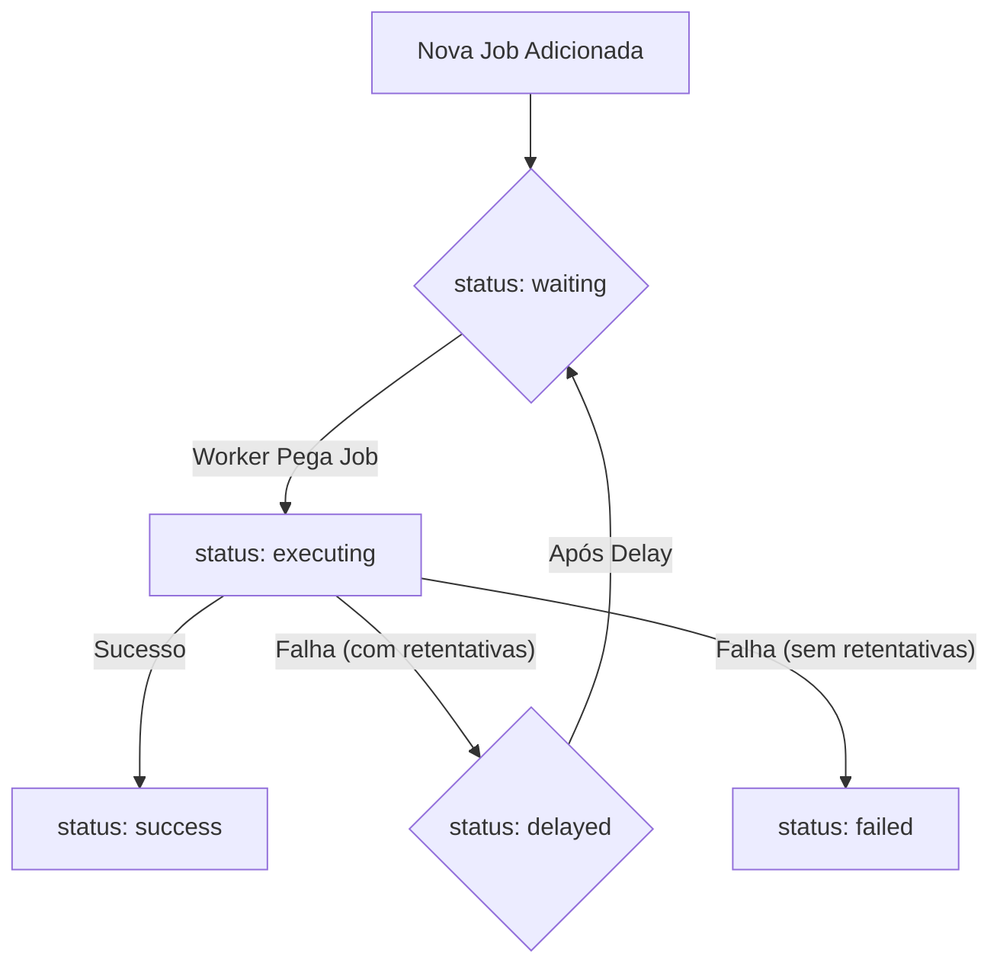

# Arquitetura do Sistema de Processamento Assíncrono (Jobs & Workers)

Este documento detalha a arquitetura de backend do Project Wiz responsável pelo processamento assíncrono de tarefas. Ele descreve os componentes chave como Jobs, Tasks, a Fila (Queue), Workers e Agentes, e como eles interagem para permitir a execução de trabalho automatizado pelas Personas.

## 1. Visão Geral

O sistema é projetado para gerenciar e executar unidades de trabalho chamadas **Jobs** por **Workers** (que são instâncias de [Agentes](./02-agent-framework.md)), tudo orquestrado por uma **Fila (Queue)** com persistência inicial em SQLite. O objetivo é fornecer um mecanismo robusto e escalável para a automação de tarefas no Project Wiz.

## 2. Conceitos Fundamentais

*   **Job**: A representação persistida de uma unidade de trabalho no sistema. É um registro de dados que descreve "o que" precisa ser feito. Uma Job é gerenciada exclusivamente pela Fila.
*   **Task**: É a lógica de execução em memória para um tipo específico de trabalho. A Task sabe "como" interagir com serviços externos (incluindo LLMs) para realizar a parte computacional de uma Job. A Task não se preocupa com persistência ou status de fila e é geralmente instanciada e executada por um [Agente](./02-agent-framework.md).
*   **Fila (Queue)**: O componente central responsável pelo gerenciamento do ciclo de vida das Jobs. Ela persiste o estado das Jobs, controla as transições de status, gerencia retentativas, atrasos e dependências.
*   **Worker**: Uma classe que monitora a Fila por Jobs atribuídos a um [Agente](./02-agent-framework.md) específico. O Worker é responsável por pegar Jobs da Fila, orquestrar sua execução pelo Agente e notificar a Fila sobre o desfecho.
*   **Agente**: Refere-se à entidade lógica ([Persona](./02-agent-framework.md#agent)) que executa a Task. A função de processamento que o Worker invoca é um método da classe do Agente, que por sua vez utiliza as [Tools](./02-agent-framework.md#tools) configuradas.

## 3. Entidade Job

A entidade `Job` armazena todas as informações necessárias para o gerenciamento de uma unidade de trabalho pela Fila.

*   `id`: Identificador único da Job.
*   `name`: Nome descritivo da Job.
*   `payload`: Dados de entrada para a Job, definidos no momento da criação e geralmente não alterados durante a execução.
*   `data`: Um campo onde a Job pode armazenar informações dinâmicas durante sua execução (ex: resultados parciais, estado interno da Task).
*   `result`: O resultado final da execução da Job.
*   `max_attempts`: Número máximo de tentativas permitidas para a Job em caso de falha.
*   `attempts`: Contador do número de tentativas já realizadas.
*   `max_retry_delay`: O tempo máximo de espera entre as retentativas.
*   `retry_delay`: O tempo de espera base para a próxima retentativa, geralmente aumentado exponencialmente: `((attempts+1) ** 2) * retry_delay`.
*   `delay`: Tempo de espera adicional antes que uma Job no estado `delayed` seja movida para `waiting`.
*   `priority`: Valor numérico que define a prioridade da Job na Fila. **Menor número significa MAIOR prioridade.**
*   `status`: O estado atual da Job no ciclo de vida:
    *   `waiting`: Aguardando para ser processada, seja por estar nova na fila ou após um `delay`.
    *   `delayed`: Execução postergada, geralmente após uma falha com retentativa ou se a Job foi criada para iniciar em um momento futuro.
    *   `success`: Concluída com sucesso.
    *   `failed`: Concluída com erro após todas as tentativas.
    *   `executing`: Atualmente sendo processada por um Worker/Agente.
*   `depends_on`: Lista de `jobIds` dos quais esta Job depende. A Job só se tornará `waiting` (pronta para execução) quando todas as suas dependências estiverem com status `success`. O resultado das Jobs dependentes pode ser injetado no `payload` ou `data` desta Job.

### 3.1. Transição de Status da Job (Fluxo Simplificado)

O diagrama abaixo ilustra um fluxo simplificado das transições de status de uma Job. Para um diagrama de estado mais completo, consulte o [Ciclo de Vida de um Job no README principal](../../../README.md#ciclo-de-vida-de-um-job).

*   **`new` (implícito) -> `waiting`**: Uma nova Job é adicionada à Fila.
*   **`waiting` -> `executing`**: Um Worker/Agente pega a Job para processar.
*   **`executing` -> `success`**: A Job é concluída com sucesso.
*   **`executing` -> `delayed`**: Ocorre um erro, mas ainda há tentativas restantes. A Job é colocada em `delayed` antes de voltar para `waiting`.
*   **`executing` -> `failed`**: Ocorre um erro e não há mais tentativas, ou a falha é definitiva.
*   **`delayed` -> `waiting`**: Após o tempo de `delay`, a Job está pronta para ser re-executada.
*   **Jobs com `depends_on`**: Ficam em `waiting` (ou um estado similar de espera) se suas dependências não estiverem `success`.

## 4. Componentes e Fluxo de Interação

### 4.1. Fila (`Queue`)

*   **Responsabilidade Principal**: Gerenciamento de estado e ciclo de vida das **Jobs**.
*   **Persistência**: As Jobs são persistidas em SQLite (inicialmente).
*   **Funções**: A Fila é a **única** responsável por atualizar o `status` de uma Job, incrementar `attempts`, gerenciar `delay`, `depends_on`, e armazenar `result`. Ela recebe notificações do Worker sobre o desfecho da execução.

### 4.2. Worker

*   **Responsabilidade Principal**: Orquestrar a execução das Jobs por um [Agente](./02-agent-framework.md) específico.
*   **Funcionamento**:
    1.  Monitora a Fila por Jobs disponíveis que correspondem ao ID do Agente que ele serve.
    2.  Recebe a função de processamento (um método da classe do [Agente](./02-agent-framework.md)) que será executada.
    3.  Pega a **Job** da Fila (transacionando seu status para `executing`).
    4.  Chama a função de processamento do [Agente](./02-agent-framework.md), passando a Job.
    5.  **Captura exceções (`throw new Error`)** lançadas pela função de processamento do Agente.
    6.  Com base no sucesso ou no erro capturado, o Worker notifica a Fila para que esta atualize o status da Job e armazene o resultado ou erro.

### 4.3. Agente

*   **Responsabilidade Principal**: Executar a lógica da **Task** associada a uma Job, utilizando suas [Tools](./02-agent-framework.md#tools) e capacidades de IA.
*   **Funcionamento**:
    1.  Recebe uma **Job** do Worker.
    2.  Instancia a classe **Task** apropriada (que sabe interagir com LLMs e outras ferramentas), usando os dados da Job e as [Tools](./02-agent-framework.md#tools) disponíveis para o Agente.
    3.  Executa a `taskInstance`. O Agente em si não interage diretamente com a Fila ou gerencia o status da Job; essa é uma responsabilidade do Worker e da Fila.

#### 4.3.1. Regras de Retorno do Agente (para o Worker)

*   **Retorno de Sucesso (retorna um valor):**
    *   **Significado**: A Task concluiu seu trabalho para esta Job.
    *   **Ação do Worker**: Notifica a Fila sobre o sucesso e o resultado. A Fila marca a **Job como `success`**.
*   **Retorno Vazio (`return;` ou `return undefined/null`):**
    *   **Significado**: A Task não concluiu, mas não houve um erro. Pode necessitar de mais passos ou ser uma tarefa de longa duração que será re-agendada.
    *   **Ação do Worker**: Notifica a Fila sobre a necessidade de continuação. A Fila coloca a **Job em `delayed`** (e depois `waiting` se o delay for 0), para que possa ser retomada ou verificada posteriormente.
*   **Lançamento de Erro (`throw new Error`):**
    *   **Significado**: Ocorreu uma falha na execução da Task.
    *   **Ação do Worker**: Captura a exceção e notifica a Fila sobre a falha. A Fila lida com as **retentativas** (se `attempts < max_attempts`, movendo para `delayed`) ou marca a Job como `failed`.

### 4.4. Task

*   **Responsabilidade Principal**: Encapsular a lógica de interação com LLMs e o uso de [Tools](./02-agent-framework.md#tools) específicas para um tipo de Job.
*   **Funcionamento**:
    *   Recebe os dados da Job e as [Tools](./02-agent-framework.md#tools) injetadas pelo Agente.
    *   Realiza chamadas à LLM usando o `ai-sdk` ou outras bibliotecas de IA.
    *   A LLM pode solicitar a execução de [Tools](./02-agent-framework.md#tools) fornecidas.
    *   O retorno da Task (ou a ausência dele) e o lançamento de erros seguem as regras definidas para o Agente.

## 5. Interação com LLMs e Tools

*   As chamadas para LLMs são feitas primariamente dentro das Tasks, utilizando SDKs como `ai-sdk`.
*   As [Tools](./02-agent-framework.md#tools) são fornecidas à LLM durante essas chamadas, permitindo que o modelo solicite ações no sistema (ler arquivos, executar comandos, etc.).
*   Uma "step" de execução de uma Job por uma Task pode envolver múltiplas interações com a LLM e suas Tools. Uma "step" geralmente termina quando a LLM invoca uma Tool especial como `finalAnswer` (ou similar) ou quando a Task decide que completou uma unidade lógica de trabalho.
*   A Tool `finalAnswer` (ou um mecanismo similar) normalmente indica se a Task considera a Job como um todo concluída (`taskFinished: true`) ou se apenas uma etapa foi finalizada (`taskFinished: false`).
*   As **Tools** são um conceito central e são detalhadas no documento [Estrutura do Agente (Agent Framework)](./02-agent-framework.md#tools). Elas podem ser genéricas (disponíveis para muitos Agentes, como `FilesystemTool`) ou específicas de uma Task/Job.

## 6. Conclusão

A arquitetura de Jobs e Workers do Project Wiz é projetada para ser flexível e robusta, permitindo a automação de tarefas complexas através de Agentes de IA. A separação clara de responsabilidades entre a Fila (gerenciamento de estado), o Worker (orquestração da execução) e o Agente/Task (lógica de execução) visa criar um sistema modular e extensível. Futuras melhorias podem incluir diferentes implementações de Fila, estratégias de priorização mais avançadas e maior observabilidade do sistema.
