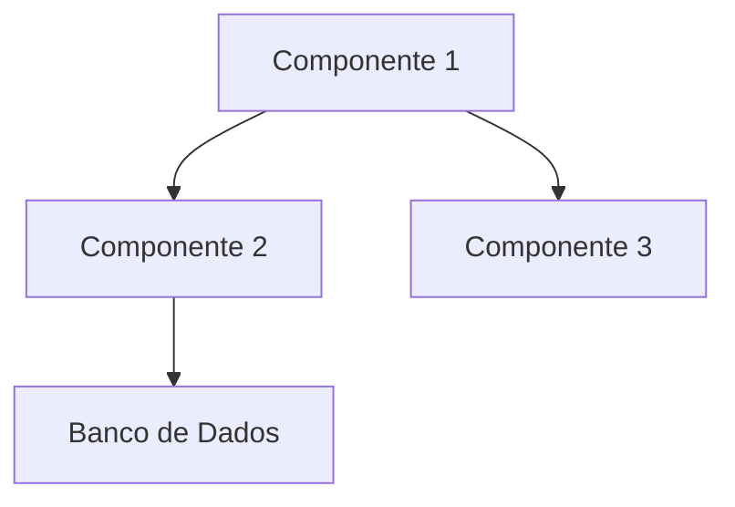

# Arquitetura do Sistema

## Visão Geral
Documentação técnica da arquitetura do sistema, incluindo decisões de design, tecnologias utilizadas e plano de evolução.

## Padrões Arquiteturais
### Microserviços vs Monolito
- Arquitetura atual: [Descrever padrão adotado e justificativa]
- Vantagens da abordagem escolhida
- Desafios enfrentados

## Tecnologias-Chave
| Tecnologia | Versão | Finalidade | Justificativa |
|------------|--------|------------|---------------|
| [Tech1] | [vX.Y] | [Uso] | [Razão] |
| [Tech2] | [vX.Y] | [Uso] | [Razão] |

## Diagramas

## Plano de Evolução (6-12 meses)
1. [Iniciativa 1] - [Prazo]
2. [Iniciativa 2] - [Prazo]
3. [Iniciativa 3] - [Prazo]

## Tomada de Decisão
### ADRs Relacionados
- [ADR-001]: Decisão Arquitetural Principal
- [ADR-002]: Escolha de Stack Tecnológico

## Stakeholders
- Equipe de Engenharia
- Arquitetos de Solução
- Líderes Técnicos
- Product Managers

---
Última atualização: 16/04/2025  
Responsável: [Nome do Arquiteto]