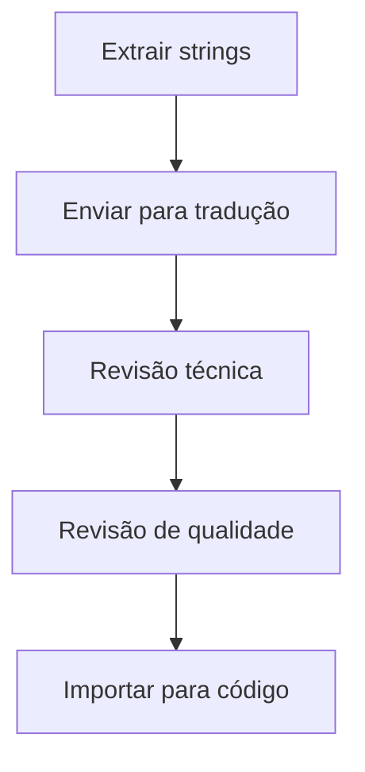

# Guia de Internacionalização (i18n)

## Visão Geral
Documentação dos processos e ferramentas para internacionalização e localização do sistema.

## Idiomas Suportados
| Idioma | Código | Status | % Concluído |
|--------|--------|--------|------------|
| Português (BR) | pt-BR | Completo | 100% |
| Inglês | en-US | [Status] | [X]% |
| Espanhol | es-ES | [Status] | [Y]% |

## Ferramentas
- Plataforma de tradução: [Nome]
- Gerenciamento de strings: [Ferramenta]
- Validação de qualidade: [Processo]

## Fluxo de Tradução

## Roadmap de Expansão
1. [Idioma1] - [Data prevista]
2. [Idioma2] - [Data prevista]
3. [Idioma3] - [Data prevista]

## Melhores Práticas
- Convenções de formatação
- Tratamento de pluralização
- Considerações culturais

## Stakeholders
- Equipe de Localização
- UX Writers
- Product Managers internacionais

---
Última atualização: 16/04/2025  
Responsável: [Nome do Responsável por i18n]