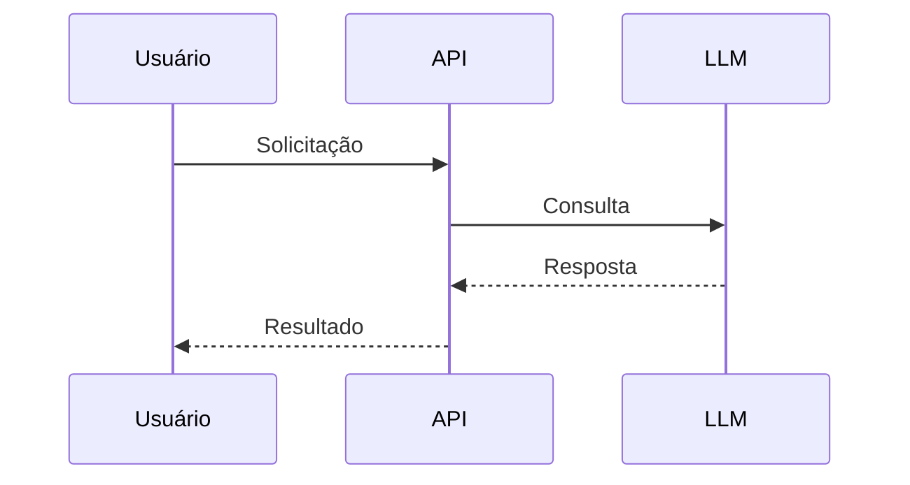

# Serviços de LLM

## Visão Geral
Documentação dos serviços de Large Language Models utilizados no sistema, incluindo fluxos, modelos e requisitos de compliance.

## Modelos em Uso
| Modelo | Provedor | Versão | Casos de Uso Principais |
|--------|----------|--------|-------------------------|
| [Model1] | [Provider] | [vX] | [Descrição] |
| [Model2] | [Provider] | [vY] | [Descrição] |

## Fluxos Principais

## Limitações
### Performance
- Latência máxima aceitável: [X]ms
- TPS (Transações por Segundo): [Y]

### Custo
- Custo médio por requisição: [Z]
- Orçamento mensal: [W]

## Requisitos Regulatórios
### LGPD
- Dados pessoais processados: [Sim/Não]
- Medidas de proteção: [Descrição]

### Outras Regulamentações
- [Regulação1]: [Status]
- [Regulação2]: [Status]

## Stakeholders
- Equipe de IA/ML
- Product Managers
- Legal/Compliance
- Engenheiros de DevOps

---
Última atualização: 16/04/2025  
Responsável: [Nome do Engenheiro de IA]