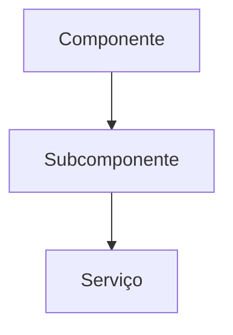

# [Nome do Componente/Feature]

## Visão Geral
[Descrição concisa do propósito e contexto]

## Diagrama de Arquitetura


## Configuração
### Pré-requisitos
- [Lista de dependências]

### Instalação
```bash
[comandos de instalação]
```

## Uso Básico
```typescript
[exemplo de código mínimo]
```

## API Reference
### Métodos Principais
| Método        | Parâmetros           | Retorno  | Descrição          |
|---------------|---------------------|----------|-------------------|
| `method1()`   | param1: type        | type     | Descrição método  |

### Eventos
| Evento        | Descrição           |
|--------------|---------------------|
| `event1`     | Descrição evento   |

## Exemplos Avançados
### Caso de Uso 1
```typescript
[código exemplo completo]
```

### Caso de Uso 2
```typescript
[código exemplo completo]
```

## Fluxos de Trabalho
1. [Passo 1]
2. [Passo 2]
3. [Passo 3]

## Solução de Problemas
| Problema      | Causa Possível      | Solução           |
|--------------|---------------------|-------------------|
| Erro X       | Causa Y            | Fazer Z          |

## Perguntas Frequentes
**Q:** [Pergunta comum]  
**A:** [Resposta completa]

## Histórico de Versões
| Versão | Data       | Mudanças         |
|--------|------------|------------------|
| 1.0.0  | 2025-04-16 | Versão inicial   |

## Links Relacionados
- [Documentação relacionada](#)
- [Referências técnicas](#)