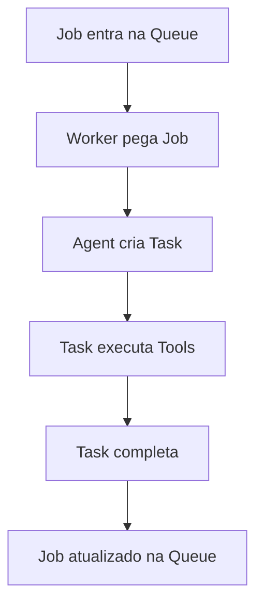

# Terminologia do Sistema de Fila e Tarefas

## Definições Fundamentais

### Job
- **Definição**: Unidade atômica de trabalho na fila global do sistema
- **Características**:
  - Persistente (armazenado em banco de dados)
  - Possui estado completo (pending, delayed, executing, success, failed)
  - Pode ter dependências e retentativas
  - Gerenciado pela Queue (Fila de Jobs)
- **Exemplo de uso**: Processar um repositório GitHub, gerar documentação

### Task
- **Definição**: Unidade de execução dentro de um agente
- **Características**:
  - Volátil (gerenciada em memória)
  - Estado simplificado (pending, running, completed)
  - Não persistida - apenas para controle interno do agente
  - Sem mecanismos de retentativa ou dependências
- **Exemplo de uso**: Executar uma ferramenta específica durante o processamento de um Job

## Fluxo de Processamento

## Responsabilidades

| Componente | Responsabilidade                 | Exemplo                  |
| ---------- | -------------------------------- | ------------------------ |
| Queue      | Gerenciar Jobs persistentes      | Adicionar/recuperar Jobs |
| Worker     | Orquestrar processamento de Jobs | Criar Agents             |
| Agent      | Transformar Job em Tasks         | Criar e monitorar Tasks  |
| Task       | Executar sequência de Tools      | Chamar Tools em ordem    |
| Tool       | Realizar operação específica     | Gerar código, analisar   |

## Boas Práticas

1. **Jobs** devem conter toda informação necessária para reprocessamento
2. **Tasks** devem ser leves e focadas em uma operação específica
3. Estado de **Tasks** não deve ser persistido - usar Jobs para histórico
4. Erros em Tasks devem ser tratados no nível do Job