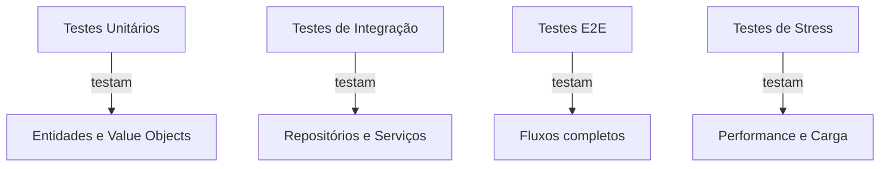

# Workshop de Testes - Project Wiz

## Configuração do Ambiente de Testes

O setup básico para testes no projeto inclui:

```typescript
// tests/setup.ts
import { setupTestDB } from "./setup/drizzle";

if (process.env.VITEST_TEST_TYPE === "integration-db") {
  setupTestDB(); // Configura banco em memória para testes de integração
}
```

E para testes com banco de dados:

```typescript
// tests/setup/drizzle.ts
import { Database } from "better-sqlite3";
import { drizzle } from "drizzle-orm/better-sqlite3";
import { migrate } from "drizzle-orm/better-sqlite3/migrator";

export async function setupTestDB() {
  const sqlite = new Database(":memory:");
  const db = drizzle(sqlite);
  await migrate(db, { migrationsFolder: "./migrations" });
  return db;
}
```

## Visão Geral da Arquitetura de Testes

O Project Wiz utiliza uma abordagem moderna de testes com:

- **Vitest** como runner de testes
- **Drizzle ORM** para testes com banco de dados em memória
- Estrutura organizada por tipo de teste:
  - `unit/`: Testes de unidade
  - `integration/`: Testes de integração
  - `e2e/`: Testes end-to-end
  - `stress/`: Testes de performance



## Exercícios Práticos

### Nível Iniciante - Testes Unitários Básicos

**Exercício 1:** Testar a entidade Job

1. Crie um teste para verificar se uma instância de Job é criada corretamente
2. Teste as transições de estado válidas
3. Verifique as validações de campos obrigatórios

**Espaço para sua solução:**
```typescript
// Seu código aqui
```

### Nível Intermediário - Testes de Integração com DB

**Exercício 2:** Testar QueueRepository com Drizzle

1. Configure o banco em memória
2. Teste os métodos básicos CRUD
3. Implemente testes para casos de erro

**Espaço para sua solução:**
```typescript
// Seu código aqui
```

### Nível Avançado - Testes de Stress e Performance

**Exercício 3:** Teste de carga no sistema de filas

1. Simule 1000 jobs sendo processados
2. Meça o tempo de execução
3. Verifique o consumo de memória

**Espaço para sua solução:**
```typescript
// Seu código aqui
```

## Soluções Comentadas

### Solução Exercício 1 - Testes Unitários

```typescript
// Baseado em tests/unit/core/domain/entities/jobs/job.entity.test.ts
describe("Job Entity", () => {
  describe("Priority Validation", () => {
    it("should accept priority 0 as default value", () => {
      const job = new TestJob("test-id", new JobStatus(JobStatusValues.WAITING));
      expect(job.getPriority()).toBe(0);
    });

    it("should accept valid priority values (0-10)", () => {
      const job = new TestJob("test-id", new JobStatus(JobStatusValues.WAITING), 5);
      expect(job.getPriority()).toBe(5);
    });

    it("should reject negative priority values", () => {
      const result = job.setPriority(-1);
      expect(result.success).toBe(false);
      expect(result.error.message).toBe("Priority cannot be negative");
    });
  });
});
```

### Solução Exercício 2 - Testes de Integração

```typescript
// Baseado em tests/integration/repositories/drizzle/queue.repository.test.ts
describe("DrizzleQueueRepository - Integration Tests", () => {
  let repository: DrizzleQueueRepository;

  beforeAll(async () => {
    const db = await getTestDB();
    repository = new DrizzleQueueRepository(db);
  });

  it("deve lançar erro quando queue for nulo", async () => {
    await expect(repository.save(null as unknown as Queue)).rejects.toThrow(
      "Queue parameter cannot be null or undefined"
    );
  });

  it("deve retornar array vazio quando não houver filas", async () => {
    const result = await repository.findAll();
    expect(result).toEqual([]);
  });
});
```

### Solução Exercício 3 - Testes de Stress

```typescript
// Baseado em tests/stress/queue.stress.test.ts
describe("Queue Stress Tests", () => {
  it("should handle 1000+ jobs simultaneously", async () => {
    const queue = new Queue("stress-queue", "Stress Test Queue");
    
    // Adiciona 1000 jobs
    const jobsCount = 1000;
    for (let i = 0; i < jobsCount; i++) {
      const job = new StressTestJob(`job-${i}`, `Job ${i}`);
      queue.addJob(job);
    }

    // Medição de tempo
    const startTime = performance.now();
    await queueRepository.save(queue);
    const saveTime = performance.now() - startTime;

    console.log(`Saved ${jobsCount} jobs in ${saveTime}ms`);
    expect(dbJobs).toHaveLength(jobsCount);
  });
});
```

## Checklist de Qualidade

- [ ] Cobertura de testes acima de 80%
- [ ] Testes independentes e isolados
- [ ] Nomes descritivos para testes
- [ ] Setup/teardown adequado
- [ ] Casos de erro testados
- [ ] Edge cases considerados

## Comandos Úteis

```bash
# Rodar todos os testes
npm test

# Rodar testes unitários
npm run test:unit

# Rodar testes de integração
npm run test:integration

# Rodar testes com cobertura
npm run test:coverage

# Rodar testes em watch mode
npm run test:watch

# Gerar relatório de cobertura
npm run coverage:report
```

## Referências

- [Padrões Consolidados de Teste](/.roo/rules/Consolidated-Test-Standards.md)
- [Guia de Testes](/docs/testing-guide.md)
- [Vitest Documentation](https://vitest.dev/)
- [Drizzle ORM Testing](https://orm.drizzle.team/docs/tests)

## Espaço para Anotações

### Dúvidas
- 

### Insights
- 

### Próximos Passos
-