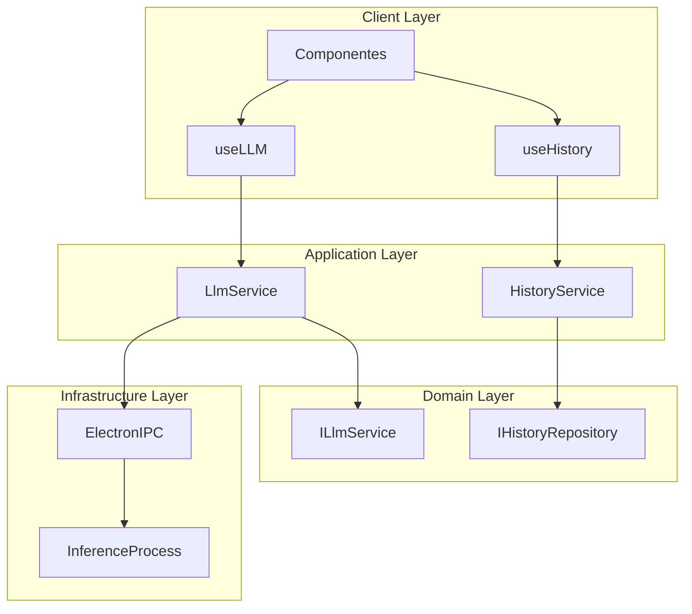

# Documentação de Componentes UI

## Visão Arquitetural (Atualizada)

Os componentes UI implementam a camada de apresentação seguindo os princípios da Clean Architecture ([ADR-0012](../adr/ADR-0012-Clean-Architecture-LLM.md)):



### Princípios de Integração:
1. **Separação Clara:** UI não acessa diretamente infraestrutura
2. **Contratos Definidos:** Comunicação via interfaces (ILlmService)
3. **Gerenciamento de Estado:** Hooks centralizam lógica complexa
4. **Tratamento de Erros:** Timeouts e cancelamento conforme [ADR-0017](../adr/ADR-0017-Gerenciamento-Streams-Requisicoes-LlmService.md)

## Visão Geral

Componentes reutilizáveis que compõem a interface do usuário do Project Wiz, seguindo os princípios de Clean Architecture.

---

## ModelCard

### Contexto Arquitetural (Atualizado)
- **Camada:** Client (UI)
- **Dependências:**
  - Hook `useLLM` (Application Layer)
  - Interface `IModel` (Domain Layer)
- **Contratos:**
  - Implementa `IModelCardProps` (Domain)
  - Consome `useLLM().getModels()` (Application)
- **Padrões:**
  - Strategy Pattern para diferentes estados de modelo
  - Observer Pattern para atualizações

### Descrição

Componente que exibe informações detalhadas sobre um modelo LLM, seguindo os princípios de Clean Architecture:
1. **UI:** Renderização e interação
2. **Hooks:** Comunicação com camada de aplicação
3. **Contratos:** Interfaces bem definidas com domínio

Permite a visualização de metadados, status (baixado, não baixado, ativo) e ativação para uso, seguindo o padrão de projeto Strategy para diferentes estados.

### Contratos e Tipos

```typescript
// Domain Layer Contract
interface IModel {
  id: string;
  name: string;
  status: 'downloaded' | 'not_downloaded' | 'active';
  metadata: {
    size: string;
    description: string;
    lastUsed?: Date;
  };
}

// Component Props
interface ModelCardProps {
  model: IModel;
  onStatusChange: (newStatus: IModel['status']) => Promise<void>;
  onError: (error: Error) => void; // Error handling from ADR-0017
}
```

### Comportamento (Atualizado)

1. **Renderização:**
   - Exibe status do modelo com ícones visuais
   - Mostra metadados formatados

2. **Interações:**
   - Ativação via `onStatusChange` (gerencia loading/error states)
   - Download via `useLLM().downloadModel()`
   - Tratamento de erros conforme [ADR-0017](../adr/ADR-0017-Gerenciamento-Streams-Requisicoes-LlmService.md)

3. **Otimizações:**
   - Memoização de props
   - Lazy loading de recursos pesados

### Exemplo de Uso (Atualizado)

```tsx
function ModelExample() {
  const { models, error } = useLLM();
  const [loadingId, setLoadingId] = useState<string | null>(null);

  const handleStatusChange = async (modelId: string, status: IModel['status']) => {
    setLoadingId(modelId);
    try {
      await useLLM().setModelStatus(modelId, status);
    } catch (err) {
      console.error('Falha na atualização', err);
      // Implementação do ADR-0017
      if (err instanceof TimeoutError) {
        showToast('Timeout - tente novamente');
      }
    } finally {
      setLoadingId(null);
    }
  };

  if (error) return <ErrorView error={error} />;

  return (
    <ModelCard
      model={models[0]}
      onStatusChange={(status) => handleStatusChange(models[0].id, status)}
      onError={(err) => console.error('Erro no ModelCard', err)}
    />
  );
}
```

### Componentes Relacionados

- [ModelList](#modellist) - Lista de ModelCards
- [useLLM](../src/client/hooks/use-llm.ts) - Hook para gerenciamento de modelos

---

## ModelList

### Descrição

Componente que renderiza uma lista de componentes `ModelCard`, permitindo a exibição e gerenciamento de múltiplos modelos LLM. O componente é responsável por manter o estado dos modelos ativos e fornecer uma interface de usuário para interagir com a lista.

### Funcionalidades

- Renderiza ModelCards em layout responsivo (1 coluna mobile, 2-3 colunas desktop)
- Gerencia o estado do modelo ativo
- Atualiza o status e data de uso dos modelos

### Exemplo de Uso

```tsx
function Example() {
  return (
    <div className="p-4">
      <ModelList />
    </div>
  );
}
```

## ModelSettings

### Descrição

Componente principal para configuração e gerenciamento de modelos LLM, com múltiplas abas:

1. **Available Models**: Lista de modelos disponíveis
2. **Model Configuration**: Parâmetros do modelo
3. **Performance**: Monitoramento de recursos

### Funcionalidades Principais

- Seletor de modelo ativo (apenas modelos baixados)
- Controles deslizantes para:
  - Temperatura (0-1)
  - Tokens máximos (256-4096)
  - Limite de memória (4-16GB)
- Alternador para atualizações automáticas
- Visualização de desempenho

### Exemplo de Uso

```tsx
function App() {
  return (
    <div className="p-4">
      <ModelSettings />
    </div>
  );
}
```

### Componentes Relacionados

- [ModelList](#modellist) - Lista de modelos integrada

## Dashboard

### Descrição

Componente principal que exibe métricas e atividades do sistema, incluindo:

- Status do modelo ativo
- Métricas de issues, PRs e documentação
- Atividades recentes

### Seções Principais

1. **Métricas**:
   - Issues ativas
   - Pull Requests abertos
   - Documentação gerada
   - Status do modelo
2. **Atividade Recente**: Lista das últimas ações realizadas

### Exemplo de Uso

```tsx
function App() {
  return (
    <div className="p-4">
      <Dashboard />
    </div>
  );
}
```

### Componentes Relacionados

- [ModelSettings](#modelsettings) - Configurações do modelo
- [ModelList](#modellist) - Lista de modelos disponíveis
- [useLLM](../src/client/hooks/use-llm.ts) - Dados de execução

- [ModelCard](#modelcard) - Componentes individuais de modelo
- [useLLM](../src/client/hooks/use-llm.ts) - Configurações de execução

---

### Componentes Relacionados

- [ModelCard](#modelcard) - Componentes individuais de modelo
- [useLLM](../src/client/hooks/use-llm.ts) - Hook para integração com serviços LLM

---

## ActivityLog

### Descrição

Componente que exibe um registro de atividades do usuário, permitindo filtrar por tipo de atividade e pesquisar por texto. Fornece uma visão cronológica das interações do usuário com o sistema.

### Funcionalidades

- Exibe uma lista de atividades com informações como timestamp, ação, tipo e detalhes.
- Permite filtrar as atividades por texto.
- Permite filtrar as atividades por tipo (pull-request, documentation, issue, etc.).
- Permite exportar o log de atividades.

### Exemplo de Uso

```tsx
<ActivityLog />
```

---

## Documentation

### Descrição

Componente para exibir a documentação do projeto. Permite pesquisar e selecionar arquivos de documentação.

### Funcionalidades

- Exibe uma lista de arquivos de documentação.
- Permite pesquisar arquivos de documentação por nome, caminho e conteúdo.
- Exibe o conteúdo do arquivo de documentação selecionado.

### Exemplo de Uso

```tsx
<Documentation />
```

---

## ModeToggle

### Descrição

Componente que permite ao usuário alternar entre diferentes temas de interface (claro, escuro e sistema). Utiliza um ícone para indicar o tema atual e oferece uma interface simples para a troca.

### Funcionalidades

- Permite selecionar o tema claro.
- Permite selecionar o tema escuro.
- Permite selecionar o tema do sistema.

### Exemplo de Uso

```tsx
<ModeToggle />
```

---

## RepositorySettings

### Descrição

Componente que permite configurar as definições do repositório, como URL, token de acesso e opções de automação. Permite adicionar e remover repositórios, configurar o URL do repositório padrão, o token de acesso do GitHub e opções de automação, como criação automática de pull requests e geração automática de documentação.

### Funcionalidades

- Permite adicionar e remover repositórios.
- Permite configurar o URL do repositório padrão.
- Permite configurar o token de acesso do GitHub.
- Permite configurar opções de automação, como criação automática de pull requests e geração automática de documentação.

### Exemplo de Uso

```tsx
<RepositorySettings />
```

---

## Boas Práticas

1. **Testabilidade:**
   - Mockar `useLLM` em testes
   - Testar estados de loading/error
   - Verificar contratos com Domain

2. **Performance:**
   - Evitar re-renders desnecessários
   - Usar virtualização em listas grandes
   - Implementar lazy loading

3. **Acessibilidade:**
   - ARIA labels para estados
   - Foco gerenciado
   - Suporte a teclado

## Referências

- [ADR-0012](../adr/ADR-0012-Clean-Architecture-LLM.md): Arquitetura
- [ADR-0017](../adr/ADR-0017-Gerenciamento-Streams-Requisicoes-LlmService.md): Tratamento de erros
- [Guia de Estilo](../style-guide.md): Convenções
- [Documentação shadcn-ui](https://ui.shadcn.com/docs): Componentes base

**Histórico de Versões:**
| Versão | Data       | Mudanças                |
|--------|------------|-------------------------|
| 2.0.0  | 2025-04-16 | Alinhamento com ADRs    |
| 1.1.0  | 2025-03-15 | Adição de TypeScript    |
| 1.0.0  | 2025-02-10 | Versão inicial          |
