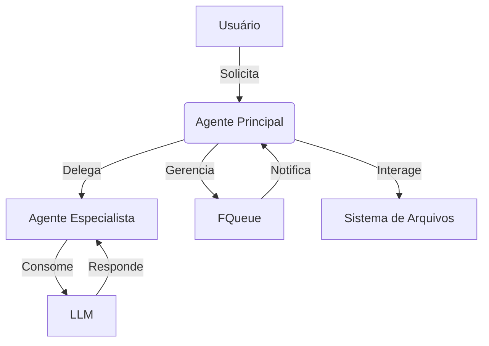

# Casos de Uso do Sistema Project Wiz

## 1. Visão Geral

### Objetivo dos Casos de Uso
Os casos de uso documentam as principais interações entre os componentes do sistema e os atores externos, definindo os fluxos de trabalho essenciais para o funcionamento do Project Wiz. Eles servem como guia para implementação e validação dos requisitos funcionais.

### Relação com a Arquitetura
Os casos de uso operam principalmente na camada de **Use Cases** da Clean Architecture, orquestrando a interação entre:
- **Entidades** (Jobs, Tasks)
- **Controladores/Adaptadores** (Workers, Agentes)
- **Frameworks Externos** (LLMs, Sistemas de Arquivos)

### Participação dos Agentes
Os agentes atuam como executores dos casos de uso, utilizando:
1. **Ferramentas** (Tools) para interagir com o ambiente
2. **Memória** para manter contexto entre execuções
3. **Fila de Jobs** para gerenciar prioridades e dependências

## 2. Diagrama de Casos de Uso

### Atores Principais
- **Usuário**: Inicia processos e recebe resultados
- **Agente Principal**: Coordena fluxos e delega tarefas
- **Agentes Especialistas**: Executam tarefas específicas
- **FQueue**: Gerencia fila e estado das Jobs
- **Sistemas Externos**: LLMs, GitHub, Sistemas de Arquivos

### Funcionalidades Principais
1. Processamento assíncrono de Jobs
2. Comunicação entre agentes
3. Gestão de memória e contexto
4. Interação com ferramentas (Tools)
5. Tratamento de erros e retentativas

## 3. Fluxos Principais

### Processamento de Jobs
1. Job é criado na FQueue com payload e metadados
2. Worker atribui Job ao Agente adequado
3. Agente executa Task correspondente
4. Resultado é persistido e status atualizado

### Comunicação entre Agentes
1. Agente A identifica necessidade de especialização
2. Cria Job para Agente B via FQueue
3. Agente B processa e retorna resultado
4. Agente A consolida informações

### Gestão de Filas
1. Jobs são priorizados baseado em:
   - Dependências (depends_on)
   - Prioridade numérica
   - Tipo de solicitante (usuário tem prioridade)
2. FQueue gerencia estados e retentativas

### Tratamento de Erros
1. Erros são capturados pelo Worker
2. FQueue é notificada e decide ação:
   - Retentativa (com backoff exponencial)
   - Falha permanente
   - Reagendamento

## 4. Exemplos Completos

### Exemplo 1: Geração de Código Assistida
**Contexto**: Usuário solicita implementação de componente React.

**Fluxo**:
1. Usuário envia requisição via UI
2. Agente Principal cria Job do tipo "code-generation"
3. Agente Especialista em Frontend:
   - Analisa requisitos
   - Usa FilesystemTool para ler arquivos relacionados
   - Gera código usando LLM
   - Escreve arquivos com FilesystemTool
4. Job é marcado como sucesso

**Resultado Esperado**:
- Componente React criado conforme especificado
- Código segue padrões do projeto

**Variações**:
- Requisitos incompletos → Agente solicita clarificação
- Erro de sintaxe → Retentativa com correção

### Exemplo 2: Correção de Bug Reportado
**Contexto**: Issue reportada no GitHub precisa de análise.

**Fluxo**:
1. Agente Monitor detecta nova issue
2. Cria Job do tipo "bug-analysis"
3. Agente Especialista:
   - Reproduz bug (TerminalTool)
   - Identifica causa raiz
   - Implementa correção
   - Atualiza issue via ProjectTool
4. Cria PR via GitHub API

**Resultado Esperado**:
- Bug corrigido e documentado
- PR criado com mudanças

**Variações**:
- Bug complexo → Delega para múltiplos agentes
- Ambiente não reproduzível → Solicita mais info

### Exemplo 3: Comunicação entre Agentes
**Contexto**: Agente precisa de validação de especialista.

**Fluxo**:
1. Agente A encontra dúvida técnica
2. Cria Job para Agente B via FQueue
3. Usa MessageTool para contexto adicional
4. Agente B responde via FQueue
5. Agente A continua processamento

**Resultado Esperado**:
- Colaboração eficiente entre agentes
- Contexto mantido entre interações

**Variações**:
- Resposta demorada → Agente A trabalha em outras Jobs
- Resposta insuficiente → Nova interação