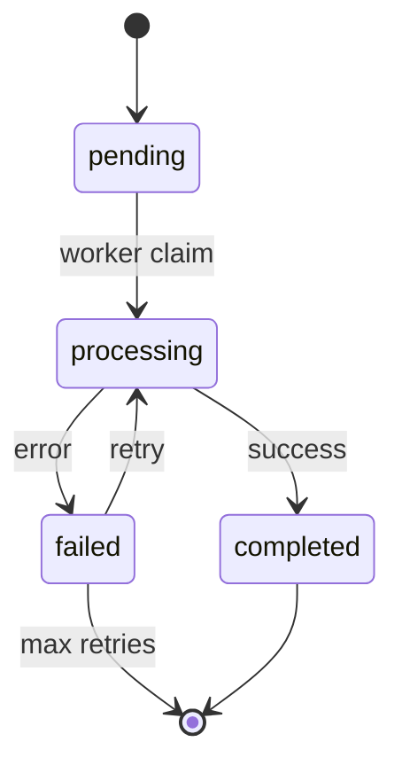

# Processamento de Jobs

## Visão Geral
Use case responsável por orquestrar o processamento de jobs na fila, incluindo:
- Controle de estados
- Política de retentativas
- Tratamento de erros

### Fluxo Principal
1. Worker solicita próximo job disponível
2. Sistema marca job como "em processamento"
3. Worker executa a lógica específica do tipo de job
4. Sistema atualiza status conforme resultado:
   - Sucesso → "concluído"
   - Falha → "falhou" (aplica política de retentativa)
5. Worker notifica conclusão ao sistema

### Diagrama de Estados


### Retentativas Automáticas
- **Padrão**: 3 tentativas totais
- **Backoff**: Exponencial (1s, 5s, 25s)
- **Condições para retentar**:
  - Erros temporários (timeout, rate limit)
  - Códigos HTTP 5xx
  - Exceções não críticas

### Códigos de Erro
- `job_not_found`: Job não existe ou já foi processado
- `invalid_job_type`: Tipo de job não possui handler registrado
- `handler_failed`: Erro durante execução do handler
- `max_retries_exceeded`: Número máximo de retentativas atingido

### Implementação de Referência
```typescript
// process-job.usecase.ts
class ProcessJobUseCase implements Executable<JobId, JobResult> {
  constructor(
    private readonly jobRepository: JobRepository,
    private readonly jobHandlers: Map<JobType, JobHandler>
  ) {}

  async execute(jobId: JobId): Promise<Result<JobResult>> {
    const job = await this.jobRepository.getById(jobId);
    if (!job) return Result.fail(new JobNotFoundError());

    try {
      const handler = this.jobHandlers.get(job.type);
      if (!handler) return Result.fail(new InvalidJobTypeError());
      
      const result = await handler.execute(job.payload);
      await this.jobRepository.markAsCompleted(jobId, result);
      return Result.ok(result);
      
    } catch (error) {
      const shouldRetry = this.shouldRetry(error);
      await this.jobRepository.markAsFailed(jobId, error, shouldRetry);
      return Result.fail(error);
    }
  }

  private shouldRetry(error: unknown): boolean {
    return error instanceof TemporaryError || 
           (error instanceof HttpError && error.status >= 500);
  }
}
```

### Diagrama de Sequência
```mermaid
sequenceDiagram
  participant Worker
  participant UC as ProcessJobUseCase
  participant Repo as JobRepository
  participant Handler as JobHandler
  
  Worker->>UC: execute(jobId)
  UC->>Repo: getById(jobId)
  Repo-->>UC: Job
  UC->>UC: validate(job)
  UC->>Handler: execute(job.payload)
  Handler-->>UC: result
  UC->>Repo: markAsCompleted(jobId, result)
  Repo-->>UC: success
  UC-->>Worker: Result.ok(result)

## Documentação Relacionada
- [Arquitetura do Sistema](../arquitetura.md)
- [Gerenciamento de Workers](../worker-management.md)
- [Monitoramento de Filas](../queue-monitoring.md)
- [Retentativa de Jobs Falhos](../use-cases/retry-failed-job.md)