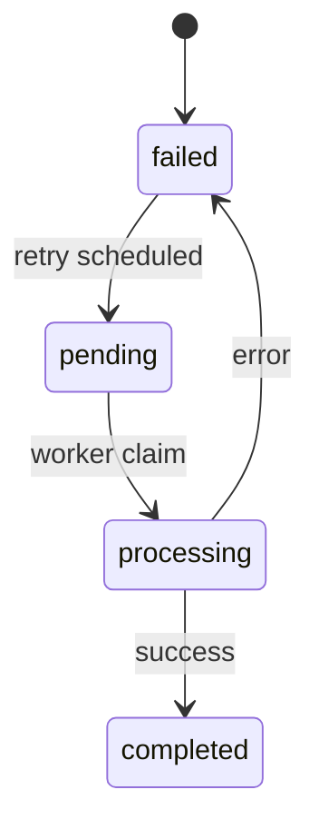

# Retry Failed Job Use Case

## Descrição
Use case responsável por gerenciar a retentativa de jobs que falharam durante o processamento.

### Fluxo Principal
1. Sistema identifica jobs falhados elegíveis para retentativa
2. Verifica se número máximo de tentativas não foi excedido
3. Calcula delay baseado na política de backoff
4. Reagenda job com novo timestamp de execução
5. Atualiza contador de tentativas e motivo da falha

### Regras de Retentativa
- **Automática**:
  - Acionada imediatamente após falha (se elegível)
  - Backoff exponencial: 1s, 5s, 25s
  - Máximo de 3 tentativas totais

- **Manual**:
  - Acionada por comando administrativo
  - Pode sobrescrever limite máximo
  - Requer justificativa

## Implementação
```typescript
// retry-failed-job.usecase.ts
class RetryFailedJobUseCase implements Executable<RetryJobInput, void> {
  constructor(
    private readonly jobRepository: JobRepository,
    private readonly scheduler: JobScheduler
  ) {}

  async execute(input: RetryJobInput): Promise<Result<void>> {
    const job = await this.jobRepository.getFailedJob(input.jobId);
    if (!job) return Result.fail(new JobNotFoundError());
    
    if (!input.forceRetry && job.attempts >= job.maxAttempts) {
      return Result.fail(new MaxRetriesExceededError());
    }

    const delayMs = this.calculateBackoff(job.attempts);
    const retryAt = new Date(Date.now() + delayMs);
    
    await this.jobRepository.prepareForRetry(job.id, {
      retryAt,
      lastError: input.reason,
      attempts: job.attempts + 1
    });
    
    await this.scheduler.schedule(job.id, retryAt);
    return Result.ok();
  }

  private calculateBackoff(attempt: number): number {
    return Math.min(1000 * (5 ** attempt), 30000); // max 30s
  }
}
```

## Diagrama de Estados


### Códigos de Erro
- `job_not_found`: Job não encontrado ou não está em estado falho
- `max_retries_exceeded`: Número máximo de tentativas atingido (sem forceRetry)
- `invalid_retry_state`: Job não está em estado elegível para retentativa

## Exemplo de Payload
```json
{
  "jobId": "123e4567-e89b-12d3-a456-426614174000",
  "reason": "Serviço externo indisponível",
  "forceRetry": false
}