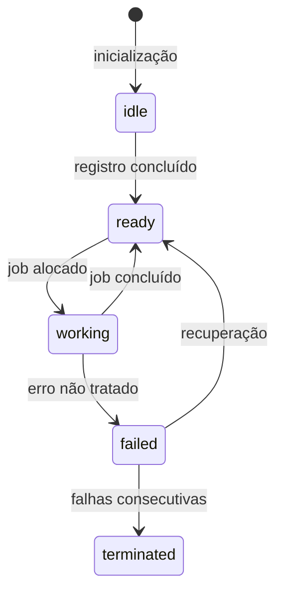

# Gerenciamento de Workers

## Visão Geral do Sistema

### Arquitetura de Workers
- **Worker**: Processo dedicado que consome jobs da fila
- **Worker Pool**: Conjunto de workers ativos
- **Supervisor**: Monitora saúde dos workers e escala automaticamente

## Ciclo de Vida do Worker

### Estados do Worker


## Alocação de Jobs

```typescript
// worker-allocation.strategy.ts
interface WorkerAllocationStrategy {
  allocate(job: Job, workers: Worker[]): Result<Worker>;
}

class RoundRobinAllocation implements WorkerAllocationStrategy {
  private lastIndex = -1;

  allocate(job: Job, workers: Worker[]): Result<Worker> {
    if (workers.length === 0) return Result.fail(new NoWorkersAvailableError());
    
    this.lastIndex = (this.lastIndex + 1) % workers.length;
    const worker = workers[this.lastIndex];
    
    return worker.canAccept(job) 
      ? Result.ok(worker) 
      : Result.fail(new WorkerBusyError());
  }
}
```

## Monitoramento de Saúde

### Métricas Monitoradas
| Métrica                 | Tipo    | Descrição                       |
| ----------------------- | ------- | ------------------------------- |
| `worker.cpu`            | Gauge   | Uso de CPU por worker           |
| `worker.memory`         | Gauge   | Uso de memória por worker       |
| `worker.uptime`         | Counter | Tempo ativo desde inicialização |
| `worker.jobs_processed` | Counter | Total de jobs processados       |

## Política de Escalonamento

### Regras de Auto Scaling
- **Scale Up**:
  - Quando: >80% workers ocupados por 5min
  - Ação: +1 worker (até máximo configurado)

- **Scale Down**:
  - Quando: <30% workers ocupados por 15min
  - Ação: -1 worker (até mínimo configurado)

## Exemplo de Configuração

```json
{
  "worker": {
    "minInstances": 2,
    "maxInstances": 10,
    "healthCheckInterval": "30s",
    "maxConsecutiveFailures": 3
  }
}