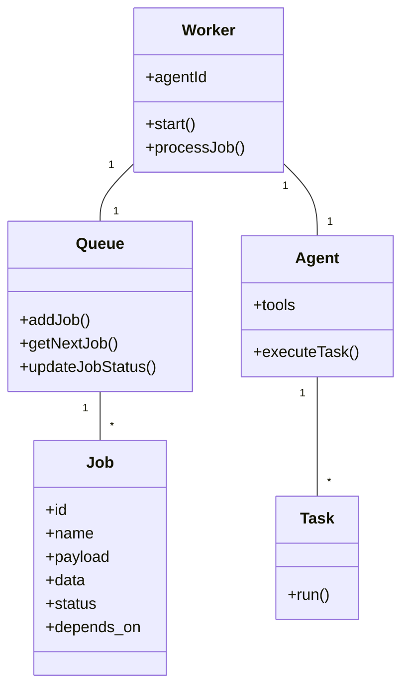

# Mapeamento de Classes e Objetos para Sistema de Workers e Jobs

## 1. Entidades Principais

### 1.1. Job
**Descrição**: Representação persistida de uma unidade de trabalho no sistema.

**Propriedades**:
- `id`: Identificador único (`JobId` - extends `Identity<string>`)
- `name`: Nome da Job (`JobName` - string validada)
- `payload`: Dados de entrada imutáveis (`JobPayload` - tipo específico por task)
- `data`: Dados mutáveis durante execução (`JobData` - tipo específico por task)
- `result`: Resultado final (`JobResult` - tipo específico por task ou `ErrorResult`)
- `max_attempts`: Máximo de tentativas (`PositiveInteger`)
- `attempts`: Tentativas realizadas (`NonNegativeInteger`)
- `max_retry_delay`: Tempo máximo entre retentativas (`Milliseconds`)
- `retry_delay`: Tempo base entre retentativas (`Milliseconds`)
- `delay`: Tempo de espera inicial (`Milliseconds`)
- `priority`: Prioridade (`JobPriority` enum: 0=HIGH, 1=MEDIUM, 2=LOW)
- `status`: Estado atual (`JobStatus` enum: waiting, delayed, success, failed, executing)
- `depends_on`: Lista de IDs de Jobs dependentes (`JobId[]`)

### 1.2. Task
**Descrição**: Lógica de execução em memória para um tipo específico de trabalho.

**Responsabilidades**:
- Implementar a lógica específica de processamento
- Interagir com serviços externos (LLM)
- Utilizar Tools fornecidas pelo Agente

### 1.3. Queue
**Descrição**: Gerencia o ciclo de vida das Jobs.

**Responsabilidades**:
- Persistir estado das Jobs (SQLite)
- Controlar transições de status
- Gerenciar retentativas e dependências
- Atualizar `status`, `attempts`, `delay`, `result`

### 1.4. Worker
**Descrição**: Orquestra a execução das Jobs.

**Propriedades**:
- `agentId`: ID do agente associado (string)
- `queue`: Instância da Queue
- `processor`: Função de processamento do Agente

**Métodos**:
- `start()`: Inicia o worker para escutar a fila
- `processJob(job: Job)`: Executa uma Job específica

### 1.5. Agent
**Descrição**: Contém a lógica específica de execução de Tasks.

**Propriedades**:
- `tools`: Conjunto de Tools disponíveis (MemoryTool, TaskTool, etc.)
- `llmProvider`: Configuração do provedor LLM

**Métodos**:
- `executeTask(job: Job)`: Processa uma Job usando a Task apropriada

## 2. Diagramas de Relacionamento



## 3. Fluxos de Execução

### 3.1. Fluxo Principal de Execução

1. **Adição de Job**:
   - Job é criada e adicionada à Queue
   - Status inicial: `waiting`

2. **Processamento pelo Worker**:
   - Worker pega Job da Queue (status → `executing`)
   - Worker chama `agent.executeTask(job)`

3. **Execução pelo Agente**:
   - Agente instancia Task apropriada
   - Task executa lógica usando Tools
   - Retorna resultado ou erro

4. **Finalização**:
   - Worker notifica Queue com resultado
   - Queue atualiza status (`success` ou `failed`)

### 3.2. Fluxo de Retentativa

1. Job falha mas tem tentativas restantes
2. Queue calcula novo delay
3. Status muda para `delayed`
4. Após delay, status volta para `waiting`
5. Job é reprocessada

## 4. Tools do Agente

| Tool           | Descrição                   | Métodos                                   |
| -------------- | --------------------------- | ----------------------------------------- |
| MemoryTool     | Gerencia memória do agente  | Write, Delete                             |
| TaskTool       | Gerencia atividades na fila | View, Save, Remove                        |
| AnnotationTool | Cria anotações              | View, Save, Remove                        |
| FilesystemTool | Manipula arquivos           | ReadFile, WriteFile, MoveFile, RemoveFile |
| TerminalTool   | Executa comandos shell      | ShellCommand                              |
| ProjectTool    | Gerencia projetos           | Save, Channel, Forum, Issue               |
| MessageTool    | Envia mensagens             | Direct, Channel, Forum                    |

## 4.1 Exemplos Práticos

### Exemplo de Job JSON
```json
{
  "id": "job_12345",
  "name": "process_document",
  "payload": {
    "documentId": "doc_67890",
    "processType": "summarize"
  },
  "max_attempts": 3,
  "priority": 0,
  "depends_on": ["job_12344"]
}
```

### Exemplo de Implementação de Task
```typescript
class ProcessDocumentTask implements Task {
  constructor(
    private readonly documentRepository: DocumentRepository,
    private readonly llmService: LLMService
  ) {}

  async execute(job: Job): Promise<JobResult> {
    const { documentId, processType } = job.payload;
    const document = await this.documentRepository.findById(documentId);
    
    if (processType === 'summarize') {
      const summary = await this.llmService.summarize(document.content);
      return { success: true, summary };
    }
    
    throw new Error(`Unsupported process type: ${processType}`);
  }
}
```

## 5. Referências Cruzadas

- [arquitetura.md](./arquitetura.md):
  - Seção 3: [Detalhes da entidade Job](./arquitetura.md#3-entidade-job)
  - Seção 4: [Componentes e fluxos de interação](./arquitetura.md#4-fluxos-de-interação)
- [AGENT.md](./AGENT.md):
  - [Lista completa de Tools disponíveis](./AGENT.md#tools)
  - [Comportamento do agente entre tasks](./AGENT.md#interactions)
- [WORKERS.md](./WORKERS.md):
  - [Configuração de Workers](./WORKERS.md#configuration)
  - [Políticas de Retentativa](./WORKERS.md#retry-policies)