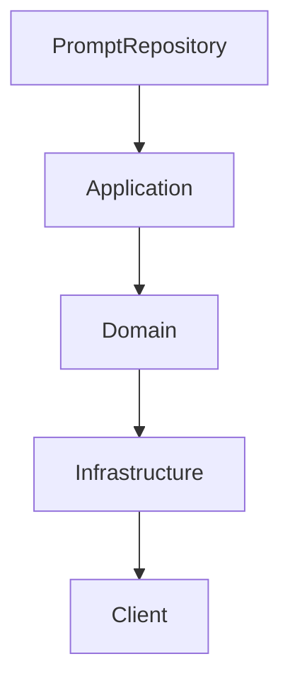

# Plano Atualizado de Refatoração para Clean Architecture

## Contexto

Este plano foi revisado e atualizado com base na auditoria da ISSUE-0121, que avaliou a refatoração do PromptRepository, e no plano original de Clean Architecture. O objetivo é garantir aderência total aos princípios SOLID, Clean Architecture e Clean Code, priorizando a eliminação de dependências indevidas, reforço da inversão de dependências e separação clara de camadas.

---

## Estado Atual

- **PromptRepository** parcialmente refatorado, mas com problemas:
  - Duplicação do tipo `Prompt` na camada de aplicação
  - Métodos auxiliares misturados com o CRUD principal
  - Uso excessivo de `any`
  - Aplicação não depende explicitamente do domínio para conceitos centrais

---

## Objetivos da Refatoração

- Eliminar duplicação de conceitos centrais (ex: `Prompt`)
- Segregar responsabilidades e interfaces
- Reforçar a inversão de dependências (DIP)
- Melhorar a segurança de tipos
- Manter separação clara entre camadas
- Facilitar manutenção, testes e evolução

---

## Prioridades Imediatas

1. **Unificar o conceito `Prompt`**
   - Remover definição duplicada na camada de aplicação
   - Usar o Value Object `Prompt` do domínio em todos os ports, casos de uso e serviços

2. **Segregar métodos auxiliares da infraestrutura**
   - Criar uma interface separada (ex: `PromptImportExportPort`) para métodos como `importPrompts`, `exportPrompts`, `listPromptNames`, `restoreDefaultPrompts`
   - Manter o `PromptRepositoryPort` apenas com métodos CRUD essenciais

3. **Melhorar tipagem**
   - Substituir `any` por tipos explícitos definidos no domínio ou DTOs

4. **Revisar dependências**
   - Garantir que a camada de aplicação dependa do domínio para conceitos centrais
   - Evitar redefinições ou dependências cruzadas incorretas

5. **Atualizar documentação**
   - Refletir essas mudanças nas ADRs, diagramas e documentação técnica

---

## Passos Detalhados

### 1. Refatorar PromptRepository

- Atualizar `PromptRepositoryPort` para usar o `Prompt` do domínio
- Atualizar implementações e casos de uso para usar o `Prompt` do domínio
- Criar interface separada para métodos auxiliares
- Mover métodos auxiliares para uma implementação separada
- Refinar tipagem, eliminando `any`

### 2. Refatorar camada Application

- Garantir que todos os ports usem conceitos do domínio
- Extrair lógica para serviços e use cases específicos
- Corrigir dependências e vazamentos
- Segregar responsabilidades

### 3. Refatorar camada Domain

- Segregar interfaces e contratos
- Definir tipagens estritas para entidades e value objects
- Documentar contratos e regras de negócio

### 4. Refatorar camada Infrastructure

- Separar persistência de regras de negócio
- Criar adaptadores e gateways específicos
- Reduzir acoplamento com Application e Domain
- Segregar responsabilidades em interfaces distintas

### 5. Refatorar camada Client (já planejado)

- Modularizar componentes grandes
- Extrair lógica para hooks
- Separar responsabilidades visuais e de dados
- Consolidar componentes comuns

---

## Sequência Recomendada

1. Corrigir PromptRepository (já iniciado)
2. Refatorar Application para reforçar dependência do domínio
3. Refatorar Domain para segregar interfaces e melhorar tipagem
4. Refatorar Infrastructure para separar responsabilidades
5. Refatorar Client conforme plano já existente

---

## Critérios de Aceitação

- Sem duplicação de conceitos centrais
- Interfaces segregadas por responsabilidade
- Tipagem explícita e segura
- Dependências alinhadas com DIP
- Documentação atualizada refletindo as mudanças
- Passos claros e priorizados para execução incremental

---

## Status

- **Plano atualizado e alinhado com auditoria da ISSUE-0121**
- **Pronto para execução incremental conforme prioridades**