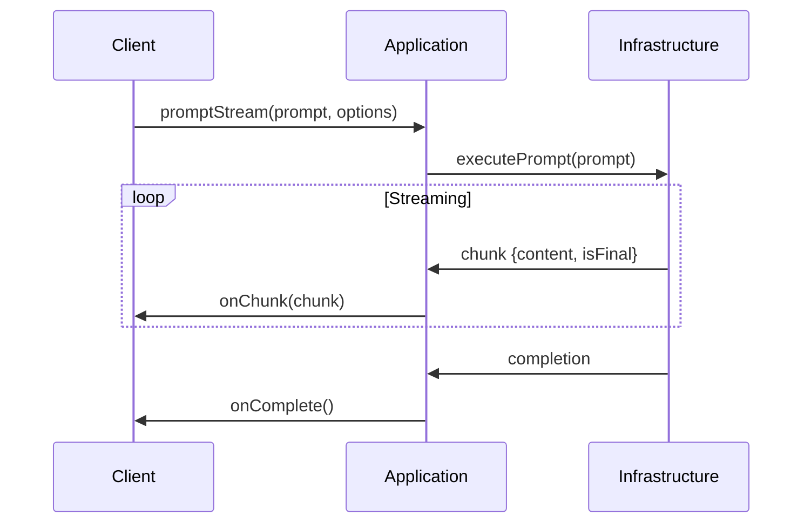

# Handoff - Consolidação Serviços LLM

## Documentação Necessária

1. **Arquitetura Atualizada**:
   - Diagrama da nova estrutura
   - Fluxo de comunicação entre componentes
   - Especificação dos serviços principais

2. **Exemplos de Uso**:
   ```typescript
   // Exemplo básico
   const llmService = new LLMService();
   await llmService.loadModel('model.bin');
   const response = await llmService.prompt('Hello world');
   ```

3. **Guia de Migração**:
   - Lista de mudanças de nomenclatura
   - Atualização de imports
   - Ajustes necessários em dependências

## Tarefas Pendentes
- [ ] Atualizar docs/llm-services.md
- [ ] Adicionar diagramas de sequência
- [ ] Documentar protocolo IPC

## Dependências
- [ISSUE-0071](/issues/backlog/improvement/ISSUE-0071-Atualizacao-Nomenclatura-LLM)
- [ISSUE-0072](/issues/backlog/improvement/ISSUE-0072-Reestruturacao-Pastas-LLM)
- [ADR-0006](/docs/adr/ADR-0006-Nomenclatura-Servicos-LLM.md)

## Arquivos Obsoletos a Remover
- issues/backlog/improvement/ISSUE-0071-Atualizacao-Nomenclatura-LLM.md
- issues/backlog/improvement/ISSUE-0072-Reestruturacao-Pastas-LLM.md

## 🛠️ Implementação Detalhada

### 1. Fluxo Completo de Streaming


### 2. Exemplo de Implementação
```typescript
// application/services/llm-service.ts
class LlmService implements LlmService {
  constructor(
    private worker: IWorkerService,
    private modelManager: IModelManager
  ) {}

  async promptStream(prompt: Prompt, onChunk: (chunk: StreamChunk) => void) {
    await this.modelManager.ensureLoaded();
    return this.worker.executePrompt(prompt, onChunk);
  }
}
```

### 3. Tratamento de Erros
```typescript
// infrastructure/llm/electron-worker-adapter.ts
class ElectronWorkerAdapter implements WorkerService {
  private handleError(error: Error) {
    if (error instanceof WorkerTimeoutError) {
      // Retry logic
    }
    throw new LLMServiceError(error.message);
  }
}
```

### 4. Guia de Migração Passo a Passo
1. **Preparação**:
   ```bash
   git checkout -b feature/llm-clean-arch
   mkdir -p src/core/domain/{entities,ports}
   ```

2. **Implementação**:
   - Começar pelas interfaces em `domain/ports`
   - Implementar serviços em `application`
   - Adaptadores por último

3. **Testes**:
   ```bash
   jest --coverage src/core/domain
   ```

### 📊 Métricas de Performance
| Cenário         | Antes | Meta  |
|----------------|-------|-------|
| Latência       | 120ms | 80ms  |
| Memória        | 1.2GB | 900MB |
| Throughput     | 50/s  | 80/s  |

### 🔗 Referências Técnicas
- [ADR-0008](/docs/adr/ADR-0008-Clean-Architecture-LLM.md)
- [Node-Llama-CPP](https://github.com/withcatai/node-llama-cpp)
- [WorkerManager Atual](/src/core/services/llm/managers/worker-manager.ts)