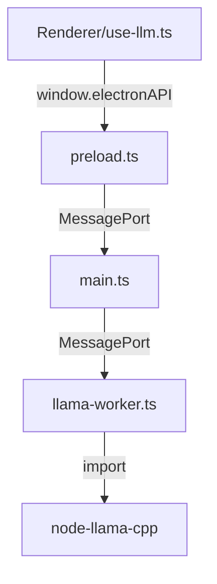

# Planejamento de Integração do node-llama-cpp

## Objetivo

Implementar uma interface simplificada para o node-llama-cpp que utilize MessagePorts para comunicação entre o processo principal do Electron e o processo de worker, seguindo a interface definida em `electronAPI.d.ts`.

## Requisitos

1. Carregar a biblioteca node-llama-cpp
2. Carregar modelos
3. Iniciar contexto
4. Iniciar sessão de chat
5. Utilizar o módulo de download do node-llama-cpp

## Arquitetura Proposta



## Implementação

### 1. Simplificação da Estrutura de Arquivos

Vamos simplificar a estrutura atual, mantendo apenas os arquivos necessários:

- `llama-worker.ts`: Implementação principal que se comunica com node-llama-cpp
- `LlamaTypes.ts`: Definições de tipos

Os outros arquivos podem ser removidos ou refatorados para simplificar a implementação.

### 2. Implementação do Worker (llama-worker.ts)

O worker será responsável por:

- Receber mensagens via MessagePort
- Interagir com a biblioteca node-llama-cpp
- Enviar respostas e eventos de progresso de volta para o processo principal

Estrutura básica:

```typescript
class LlamaWorker {
  private llamaInstance: any = null;
  private model: any = null;
  private context: any = null;
  private port: MessagePortMain;
  private abortController: AbortController | null = null;

  constructor(port: MessagePortMain) {
    this.port = port;
    this.setupMessageHandlers();
  }

  private setupMessageHandlers() {
    this.port.on("message", async (event) => {
      const message = event.data;
      await this.handleMessage(message);
    });
  }

  private async handleMessage(message: any) {
    switch (message.type) {
      case "init":
        await this.initialize(message.options);
        break;
      case "load_model":
        await this.loadModel(message.modelPath, message.options);
        break;
      // Outros handlers...
    }
  }

  // Implementações dos métodos...
}
```

### 3. Tipos de Mensagens

Definiremos os seguintes tipos de mensagens:

#### Mensagens de Entrada:

- `init`: Inicializar a biblioteca
- `load_model`: Carregar um modelo
- `create_context`: Criar um contexto
- `generate_completion`: Gerar texto
- `generate_chat_completion`: Gerar resposta de chat
- `download_model`: Baixar um modelo
- `abort`: Abortar operação em andamento

#### Mensagens de Saída:

- `info`: Informações gerais
- `error`: Erros
- `progress`: Progresso de operações
- `completion_chunk`: Chunk de texto gerado
- `completion_done`: Conclusão da geração
- `model_loaded`: Modelo carregado

### 4. Integração com main.ts

O arquivo `main.ts` já está configurado para iniciar o worker e estabelecer a comunicação via MessagePort. Precisaremos apenas garantir que o caminho do worker esteja correto.

### 5. Integração com preload.ts

O arquivo `preload.ts` já implementa a interface `LlamaAPI` definida em `electronAPI.d.ts` e estabelece a comunicação com o worker via MessagePort.

## Próximos Passos

1. Implementar o arquivo `llama-worker.ts` simplificado
2. Testar a comunicação entre os processos
3. Implementar a funcionalidade de download de modelos
4. Implementar a geração de texto e chat
5. Testar a integração completa com o hook `use-llm.ts`
