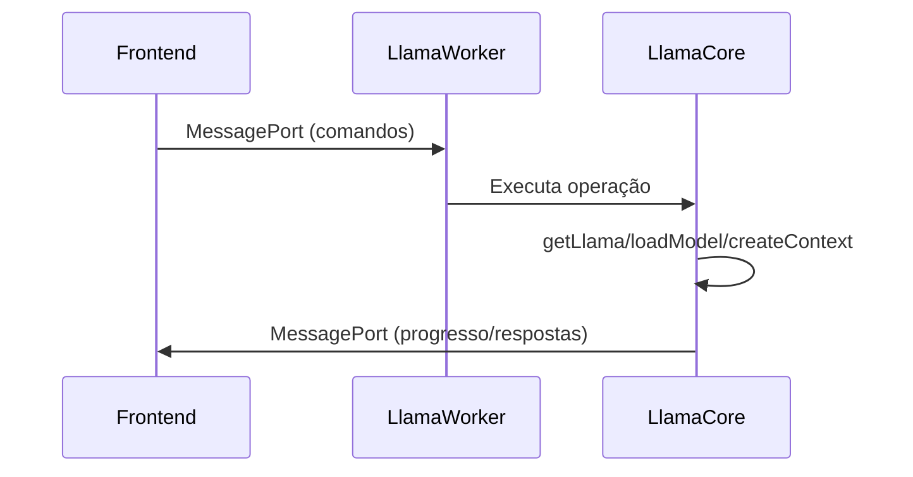

# Plano de Refatoração para Llama Core

## Objetivo

Simplificar a estrutura do diretório `src/core/llama` mantendo apenas as funcionalidades essenciais:

- getLlama
- loadModel
- createContext
- downloadModel
- Controles de aborto
- Stream de progresso

## Nova Estrutura de Arquivos

```
src/core/llama/
├── LlamaCore.ts        # Implementação principal
├── LlamaTypes.ts       # Tipos e interfaces
├── LlamaWorker.ts      # Worker principal
└── LlamaMessageHandler.ts # Manipulador de mensagens
```

## Funcionalidades Principais

### LlamaCore.ts

- Inicialização do LLM (getLlama)
- Carregamento de modelos (loadModel)
- Criação de contexto (createContext)
- Download de modelos (downloadModel)
- Controle de operações (abort)
- Stream de progresso

### LlamaTypes.ts

- Tipos de mensagens
- Interfaces de configuração
- Tipos de progresso e erros

### LlamaWorker.ts

- Inicialização do worker
- Gerenciamento de MessagePort
- Roteamento de mensagens

### LlamaMessageHandler.ts

- Envio de mensagens
- Recebimento de comandos
- Tratamento de erros

## Diagrama de Fluxo



## Próximos Passos

1. Implementar a nova estrutura
2. Migrar as funcionalidades essenciais
3. Remover arquivos obsoletos
4. Testar a nova implementação

## Considerações Finais

## Como usar o LlamaWorker

Para utilizar o LlamaWorker, siga esses passos:

1. Importe e instancie o worker no seu arquivo principal:

```typescript
const worker = new LlamaWorker();
```

2. Envie mensagens ao worker usando MessagePort:

```typescript
port.postMessage({
  type: "init",
  options: {
    debug: true,
    gpu: "auto",
    maxThreads: 4,
  },
});
```

3. Escute as respostas do worker:

```typescript
port.on("message", (event) => {
  const message = event.data;
  switch (message.type) {
    case "info":
      console.log("[INFO]", message.message);
      break;
    case "progress":
      console.log("[PROGRESS]", message.progressType, message.progress);
      break;
    // Outros tipos de mensagem
  }
});
```

A nova estrutura será mais simples e direta, mantendo apenas o essencial para o funcionamento do LLM via MessagePort.
