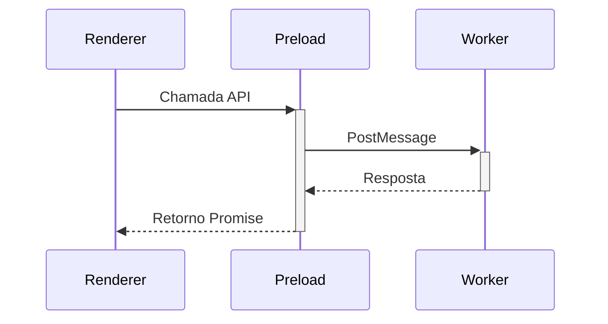

# Plano de Refatoração - preload.ts

## Objetivo

Atualizar a implementação do arquivo `src/core/preload.ts` para seguir a interface definida em `src/core/electronAPI.d.ts`, mantendo conformidade com as diretrizes de código limpo e boas práticas do projeto.

## Mudanças Propostas

### Renomeação de Métodos

| Método Atual        | Novo Método                |
| ------------------- | -------------------------- |
| init                | initializeLlamaEnvironment |
| loadModel           | prepareModelForInference   |
| createContext       | createInferenceContext     |
| generateCompletion  | generateTextCompletion     |
| downloadModel       | downloadModelSafely        |
| abort/abortDownload | cancelOngoingOperation     |

### Implementação de Callbacks

- Adicionar suporte a callbacks conforme definido na interface BaseCallback
- Remover listeners individuais (on\*) e integrar callbacks nas operações principais
- Implementar tipagem correta usando LlamaMessageType

### Estrutura de Mensagens

- Manter a comunicação via MessageChannel
- Atualizar tipos de mensagens para refletir novos nomes de métodos
- Garantir consistência entre mensagens enviadas e recebidas

### Tratamento de Erros

- Implementar tratamento de erros consistente
- Usar tipos de erro customizados
- Garantir que todas as Promises sejam devidamente resolvidas/rejeitadas

## Diagrama de Fluxo

## Considerações de Código Limpo

1. Nomes descritivos e consistentes
2. Métodos com responsabilidade única
3. Tipagem forte sem any
4. Documentação focada no "porquê"
5. Tratamento de erros consistente
6. Testabilidade garantida

## Próximos Passos

1. Implementar as mudanças no modo Code
2. Validar integração com o worker
3. Atualizar testes unitários
4. Revisar documentação relacionada
