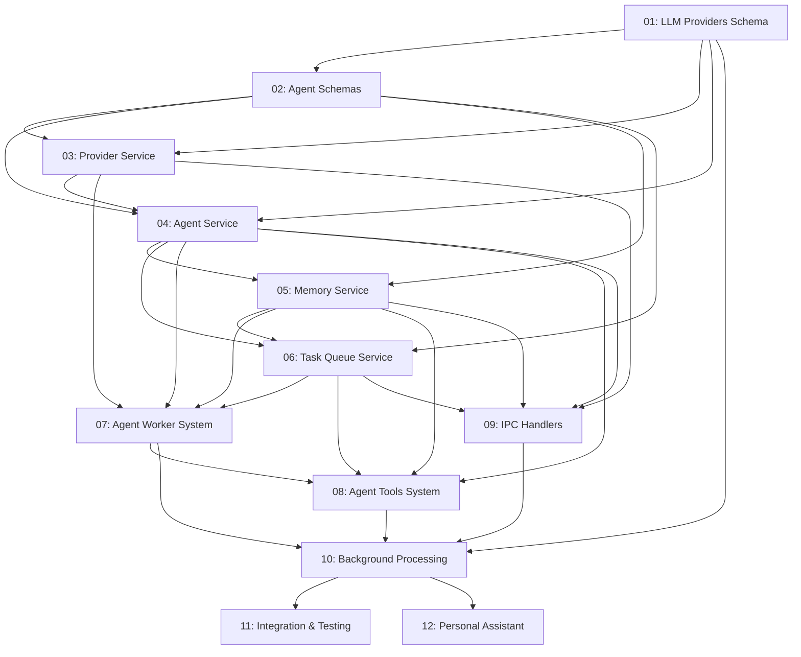

# Sistema de Agentes AI - Task Implementation Guide

> Comprehensive implementation tasks for building the AI Agent system in Project Wiz

## Overview

This directory contains detailed, self-contained task files for implementing the complete AI Agent system as specified in the main PRP. Each task is designed to be implementable by an LLM without requiring additional context or documentation lookups.

## Task Dependencies & Implementation Order

## Core Implementation Tasks

### Phase 1: Database Foundation (Tasks 1-2)
**Duration**: ~5 hours | **Critical Path**: Yes

#### TASK-001: LLM Providers Schema
- **File**: `01-database-llm-providers-schema.md`
- **Goal**: Create database schema for user LLM provider credentials with encryption
- **Dependencies**: None
- **Outputs**: 
  - `src/main/llm/providers.schema.ts`
  - Database migration for `llm_providers` table
- **Key Features**:
  - Encrypted API key storage
  - Multiple provider support (OpenAI, DeepSeek, Anthropic)
  - User ownership and default provider management

#### TASK-002: Agent Database Schemas
- **File**: `02-database-agents-schema.md`
- **Goal**: Create comprehensive schemas for agents, memories, and task queue
- **Dependencies**: TASK-001
- **Outputs**:
  - `src/main/agents/agents.schema.ts`
  - `src/main/agents/memory.schema.ts`
  - `src/main/agents/tasks.schema.ts`
  - Database migrations for all agent tables
- **Key Features**:
  - Agent personality and configuration storage
  - Memory system with type classification
  - Task queue with priority and retry mechanisms

### Phase 2: Service Layer (Tasks 3-6)
**Duration**: ~14 hours | **Critical Path**: Yes

#### TASK-003: LLM Provider Service
- **File**: `03-llm-provider-service.md`
- **Goal**: Service layer for managing LLM credentials with encryption
- **Dependencies**: TASK-001, TASK-002
- **Outputs**: `src/main/llm/provider.service.ts`
- **Key Features**:
  - API key encryption/decryption with AES-256-GCM
  - Provider CRUD operations
  - Default provider management
  - Provider validation and testing

#### TASK-004: Agent Service Layer
- **File**: `04-agent-service-layer.md`
- **Goal**: Comprehensive agent lifecycle management service
- **Dependencies**: TASK-001, TASK-002, TASK-003
- **Outputs**: `src/main/agents/agent.service.ts`
- **Key Features**:
  - Agent creation with user integration (agents as special users)
  - Agent status and configuration management
  - Provider relationship handling
  - Agent-user relationship integrity

#### TASK-005: Memory Management System
- **File**: `05-memory-management-system.md`
- **Goal**: Agent memory storage, retrieval, and search system
- **Dependencies**: TASK-002, TASK-004
- **Outputs**: `src/main/agents/memory.service.ts`
- **Key Features**:
  - Memory type classification (conversation, learning, goal, context)
  - Importance-based prioritization
  - Recency scoring and relevance ranking
  - Memory cleanup and optimization

#### TASK-006: Task Queue System
- **File**: `06-task-queue-system.md`
- **Goal**: Priority-based task processing queue with persistence
- **Dependencies**: TASK-002, TASK-004, TASK-005
- **Outputs**: `src/main/agents/task-queue.service.ts`
- **Key Features**:
  - Priority queue (1-5 levels) with persistent storage
  - Retry mechanism with exponential backoff
  - Scheduled task execution
  - Concurrent processing safety

### Phase 3: AI Integration (Tasks 7-8)
**Duration**: ~9 hours | **Critical Path**: Yes

#### TASK-007: Agent Worker System
- **File**: `07-agent-worker-system.md`
- **Goal**: Background worker system using AI SDK for task processing
- **Dependencies**: TASK-003, TASK-004, TASK-005, TASK-006
- **Outputs**: `src/main/agents/agent-worker.ts`
- **Key Features**:
  - AI SDK integration with generateText (not streamText)
  - Worker thread implementation for 24/7 processing
  - Provider credential integration
  - Context building from memories and conversations

#### TASK-008: Agent Tools System
- **File**: `08-agent-tools-system.md`
- **Goal**: Tool system for agent actions with AI SDK integration
- **Dependencies**: TASK-004, TASK-005, TASK-006, TASK-007
- **Outputs**: `src/main/agents/agent-tools.ts`
- **Key Features**:
  - Zod-validated tool schemas for AI SDK
  - Communication tools (send messages, create conversations)
  - Task and memory management tools
  - Project analysis and file operation tools

### Phase 4: IPC Integration (Task 9)
**Duration**: ~3 hours | **Critical Path**: Yes

#### TASK-009: IPC Handlers
- **File**: `09-ipc-handlers.md`
- **Goal**: IPC handlers for frontend-backend communication
- **Dependencies**: TASK-003, TASK-004, TASK-005, TASK-006
- **Outputs**:
  - `src/main/agents/agent.handlers.ts`
  - `src/main/llm/provider.handlers.ts`
  - Handler registration in `src/main/main.ts`
- **Key Features**:
  - Type-safe IPC communication
  - Consistent error handling with IpcResponse pattern
  - Authentication and permission validation
  - Agent management and interaction endpoints

## Additional Implementation Tasks

### Background Processing Integration (Estimated 6-8 hours)
- **File**: Create `10-background-processing-system.md`
- **Goal**: Integrate worker system with main process for 24/7 operation
- **Key Features**:
  - Worker pool management
  - Graceful startup and shutdown
  - Performance monitoring and health checks
  - System resource management

### System Integration Testing (Estimated 4-6 hours)
- **File**: Create `11-integration-testing.md`
- **Goal**: Comprehensive integration tests for complete system
- **Key Features**:
  - End-to-end workflow testing
  - Multi-agent interaction testing
  - Performance and load testing
  - Error recovery and resilience testing

### Personal Assistant Agent (Estimated 4-5 hours)
- **File**: Create `12-personal-assistant-agent.md`
- **Goal**: Default personal assistant agent for project analysis and hiring
- **Key Features**:
  - Automatic creation on user registration
  - Project analysis capabilities
  - Agent hiring and recommendation system
  - Proactive monitoring and suggestions

## Implementation Strategy

### Critical Path Execution
1. **Foundation First**: Complete Tasks 1-2 to establish database foundation
2. **Service Layer**: Implement Tasks 3-6 to build robust service layer
3. **AI Integration**: Complete Tasks 7-8 for AI processing capabilities
4. **Frontend Integration**: Implement Task 9 for UI communication
5. **System Integration**: Complete background processing and testing

### Quality Assurance
Each task includes comprehensive validation checkpoints:
- **Syntax & Style**: ESLint, TypeScript, Prettier validation
- **Unit Testing**: Vitest test coverage for all service methods
- **Integration Testing**: End-to-end workflow validation
- **Performance Testing**: Load and stress testing for production readiness

### Technology Compliance
All tasks follow established project patterns:
- **Database**: Drizzle ORM with SQLite, type inference patterns
- **Services**: Static class methods with direct data return
- **IPC**: Handler wrapper pattern with IpcResponse format
- **AI SDK**: generateText usage with tool calling capabilities
- **Error Handling**: Descriptive error messages with proper logging

## Success Criteria

### Technical Milestones
- [ ] All database schemas created and migrated successfully
- [ ] Service layer provides complete CRUD operations
- [ ] AI workers process tasks continuously in background
- [ ] Frontend can manage agents and providers through IPC
- [ ] System handles errors gracefully and recovers automatically

### Business Functionality
- [ ] Users can configure LLM providers with encrypted credentials
- [ ] Personal assistant analyzes projects and suggests specialist agents
- [ ] System generates diverse agent candidates for user selection
- [ ] Agents converse naturally and create/manage their own tasks
- [ ] Memory system maintains context across long conversations
- [ ] Background processing operates 24/7 without intervention

### Performance Requirements
- [ ] Task processing latency < 5 seconds for simple tasks
- [ ] Memory retrieval operations < 100ms
- [ ] System handles 10+ concurrent agents without degradation
- [ ] Worker pool scales based on workload automatically
- [ ] Database operations maintain ACID compliance under load

## Troubleshooting Resources

Each task file includes:
- **Common Issues**: Technology-specific problems and solutions
- **Debug Commands**: Specific commands for troubleshooting
- **Performance Tuning**: Optimization guidance
- **Integration Points**: Known interaction patterns and dependencies

## Development Workflow

1. **Read Task File**: Study complete context and requirements
2. **Validate Dependencies**: Ensure prerequisite tasks are complete
3. **Implement Phase by Phase**: Follow implementation steps sequentially
4. **Validate Checkpoints**: Run validation commands at each checkpoint
5. **Integration Test**: Verify task works with existing system
6. **Document Issues**: Update troubleshooting guide as needed

---

## Quick Start

To begin implementation:

1. **Clone and Setup**: Ensure development environment is ready
2. **Start with TASK-001**: Begin with LLM providers schema
3. **Follow Dependencies**: Implement tasks in dependency order
4. **Validate Continuously**: Run quality checks at each step
5. **Integration Test**: Test complete workflows regularly

Each task is designed to be completable in 2-5 hours by an experienced developer or AI assistant, with comprehensive guidance and validation steps included.