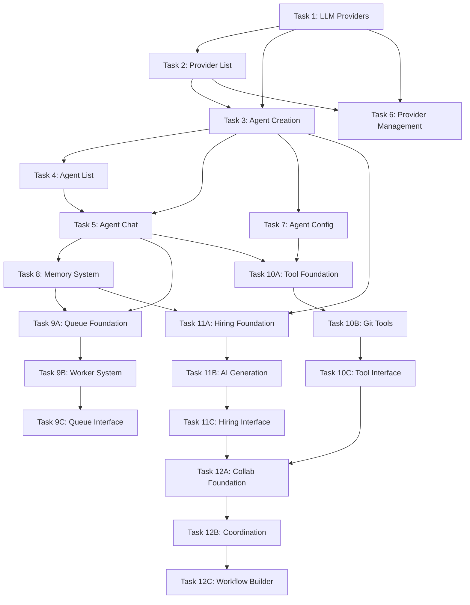

# Sistema de Agentes AI - Implementation Tasks

## Overview

This directory contains the evolutionary micro-feature tasks for implementing the AI Agents system in Project Wiz. Each task delivers complete, working functionality that users can immediately experience, building progressively from simple to sophisticated features.

## Feature Progression Map

### 🚀 MVP Phase (Tasks 1-5) - Core Functionality
*Goal: Users can create, manage, and chat with AI agents*

After completing this phase, users can:
- Configure their own LLM providers (OpenAI, DeepSeek, etc.)
- Create AI agents with distinct personalities and roles
- View and manage their agents in an organized interface
- Have real-time conversations with their agents
- Experience agent personalities through chat interactions

#### Task 01: Create LLM Provider - MVP
**Delivers**: User can securely add their LLM API credentials
- Add OpenAI, DeepSeek, or Anthropic providers
- Encrypted API key storage
- Basic provider configuration form

#### Task 02: List LLM Providers - MVP  
**Delivers**: User can view all their configured providers
- Provider list with masked API keys
- Status and type indicators
- Real-time updates when adding providers

#### Task 03: Create Agent - MVP
**Delivers**: User can create AI agents with personalities
- Agent creation form with personality fields
- Link agents to LLM providers
- Integration with existing user system

#### Task 04: List Agents - MVP
**Delivers**: User can view all their AI agents
- Agent cards showing key information
- Status indicators and provider information
- Navigation to agent interactions

#### Task 05: Agent Chat Interface - MVP
**Delivers**: User can have conversations with agents
- Real-time chat interface
- Agent responses using configured LLM
- Message persistence and history
- Typing indicators and error handling

---

### ⚡ Enhanced Phase (Tasks 6-9) - Production Polish
*Goal: Production-ready features with validation, management, and intelligence*

After completing this phase, users have:
- Professional-grade provider management with testing
- Advanced agent memory and context awareness
- Enhanced configuration and customization options
- Robust error handling and validation

#### Task 06: Provider Management - Enhanced
**Delivers**: Production-ready provider management
- Edit existing providers with masked API key handling
- Test API connectivity before saving
- Safe deletion with dependency checking
- Default provider switching and status management

#### Task 07: Agent Configuration - Enhanced *(Available for implementation)*
**Delivers**: Advanced agent customization
- Model parameter tuning (temperature, max tokens, etc.)
- Advanced personality configuration
- Agent status management and scheduling
- Configuration templates and presets

#### Task 08: Agent Memory System - Enhanced
**Delivers**: Agents remember context across conversations
- Persistent memory storage with importance scoring
- Context-aware responses using conversation history
- Memory management interface for users
- Learning from user preferences and patterns

#### Task 09: Agent Task Queue - Enhanced *(Subdivided into micro-tasks)*
**Delivers**: Agents can work autonomously in background
- **09A**: Task Queue Foundation - Database schema and core service
- **09B**: Background Worker System - Worker threads and autonomous execution
- **09C**: Task Management Interface - Complete UI for task management

---

### 🔬 Advanced Phase (Tasks 10-12) - AI Ecosystem
*Goal: Sophisticated AI collaboration and automation*

After completing this phase, users have:
- Agents that can perform actions beyond chat
- Intelligent agent hiring and team building
- Agent-to-agent collaboration capabilities
- Full autonomous software development workflows

#### Task 10: Agent Tools Integration - Advanced *(Subdivided into micro-tasks)*
**Delivers**: Agents can perform actions and use tools
- **10A**: Tool Foundation & Registry - Core tool system and permissions
- **10B**: Git & Analysis Tools - Project analysis and repository operations
- **10C**: Chat Integration & Interface - Tool usage in conversations and monitoring

#### Task 11: Agent Hiring System - Advanced *(Subdivided into micro-tasks)*
**Delivers**: Intelligent agent recruitment and team building
- **11A**: Project Analysis & Database Foundation - Analysis system and job posting infrastructure
- **11B**: AI Candidate Generation System - Smart candidate generation with LLM integration
- **11C**: Hiring Interface & Workflow - Complete hiring wizard and candidate management

#### Task 12: Agent Collaboration - Advanced *(Subdivided into micro-tasks)*
**Delivers**: Agents work together on complex tasks
- **12A**: Collaboration Foundation & Database - Workflow schema and basic management
- **12B**: Agent Coordination & Execution Engine - Intelligent coordination and knowledge sharing
- **12C**: Workflow Builder & Monitoring Interface - Visual workflow creation and real-time monitoring

---

## Implementation Strategy

### Evolutionary Micro-Features
Each task follows the **complete backend→integration→frontend flow**:

1. **Database Schema**: Create/extend data models with proper relationships
2. **Service Layer**: Implement business logic with error handling
3. **IPC Integration**: Create handlers and API exposure
4. **Frontend Implementation**: Build UI components and state management
5. **Validation & Testing**: Ensure end-to-end functionality

### Micro-Task Subdivision Strategy

**Complex tasks (09, 10, 11, 12) have been subdivided into focused micro-tasks** to improve manageability and reduce cognitive load:

- **Foundation (A tasks)**: Database schema, core types, and basic service layer
- **Processing (B tasks)**: Business logic, integrations, and execution engines  
- **Interface (C tasks)**: Frontend components, user workflows, and monitoring

Each micro-task:
- ✅ Delivers complete, testable functionality
- ✅ Can be implemented independently within its group
- ✅ Follows clear dependency chains (A → B → C)
- ✅ Maintains 1.5-2.5 hour implementation timeframe

### Task Dependencies

## Getting Started

### Prerequisites
- Project Wiz development environment set up
- Database migrations system working
- Frontend development server running
- Basic understanding of the tech stack (Electron, React, TypeScript, SQLite)

### Implementation Order

**Start with MVP Phase (Tasks 1-5)** for immediate user value:
1. Begin with Task 01 (LLM Providers) - foundation for all AI features
2. Continue sequentially through Task 05 for complete chat experience
3. Test each task thoroughly before moving to the next

**Continue with Enhanced Phase (Tasks 6-9)** for production readiness:
- Task 06 and Task 08 provide the most immediate value
- Task 07 can be implemented based on user feedback
- **Task 09**: Implement micro-tasks sequentially (09A → 09B → 09C)

**Advance to Advanced Phase (Tasks 10-12)** for AI ecosystem:
- These tasks create sophisticated agent capabilities
- **Micro-task Implementation**: Follow A → B → C pattern within each task group
- **Task 10**: 10A → 10B → 10C (tools foundation to interface)
- **Task 11**: 11A → 11B → 11C (hiring foundation to interface)  
- **Task 12**: 12A → 12B → 12C (collaboration foundation to interface)

### Quality Standards
Each task must meet these criteria before completion:
- ✅ Complete end-to-end functionality working
- ✅ All TypeScript types correct and complete
- ✅ No linting or compilation errors
- ✅ Manual testing confirms user value delivery
- ✅ Proper error handling and user feedback
- ✅ Code follows established project patterns

## Task Status

| Task | Title | Phase | Status | Estimated Effort |
|------|-------|-------|---------|------------------|
| 01 | Create LLM Provider - MVP | MVP | ✅ **COMPLETED** | 2 hours |
| 02 | List LLM Providers - MVP | MVP | ✅ **COMPLETED** | 1.5 hours |
| 03 | Create Agent - MVP | MVP | ✅ Ready | 3 hours |
| 04 | List Agents - MVP | MVP | ✅ Ready | 2 hours |
| 05 | Agent Chat Interface - MVP | MVP | ✅ Ready | 4 hours |
| 06 | Provider Management - Enhanced | Enhanced | ✅ Ready | 3 hours |
| 07 | Agent Configuration - Enhanced | Enhanced | 📋 Spec Available | 2.5 hours |
| 08 | Agent Memory System - Enhanced | Enhanced | ✅ Ready | 3.5 hours |
| **09A** | **Task Queue Foundation** | **Enhanced** | **✅ Ready** | **1.5 hours** |
| **09B** | **Background Worker System** | **Enhanced** | **✅ Ready** | **1.5 hours** |
| **09C** | **Task Management Interface** | **Enhanced** | **✅ Ready** | **1.5 hours** |
| **10A** | **Tool Foundation & Registry** | **Advanced** | **✅ Ready** | **1.5 hours** |
| **10B** | **Git & Analysis Tools** | **Advanced** | **✅ Ready** | **2 hours** |
| **10C** | **Chat Integration & Interface** | **Advanced** | **✅ Ready** | **2 hours** |
| **11A** | **Project Analysis & Database** | **Advanced** | **✅ Ready** | **1.5 hours** |
| **11B** | **AI Candidate Generation** | **Advanced** | **✅ Ready** | **2 hours** |
| **11C** | **Hiring Interface & Workflow** | **Advanced** | **✅ Ready** | **2 hours** |
| **12A** | **Collaboration Foundation** | **Advanced** | **✅ Ready** | **1.5 hours** |
| **12B** | **Agent Coordination Engine** | **Advanced** | **✅ Ready** | **2.5 hours** |
| **12C** | **Workflow Builder & Monitor** | **Advanced** | **✅ Ready** | **2.5 hours** |

**Total Estimated Effort**: ~41 hours for complete implementation (including subdivided micro-tasks)

## Success Metrics

### MVP Success (Tasks 1-5 Complete)
- [x] User can create and configure LLM providers
- [x] User can view and manage their configured providers
- [ ] User can create AI agents with distinct personalities  
- [ ] User can have natural conversations with agents
- [ ] Agent responses reflect configured personality and model
- [ ] All interactions are persistent and reliable

### Enhanced Success (Tasks 6-9 Complete)  
- [ ] Provider management is production-ready with validation
- [ ] Agents remember context across multiple conversations
- [ ] Advanced configuration options available
- [ ] Background task processing functional

### Advanced Success (Tasks 10-12 Complete)
- [ ] Agents can perform complex actions beyond chat
- [ ] Intelligent agent hiring and team building works
- [ ] Multi-agent collaboration delivers complex results
- [ ] Full autonomous development workflows operational

## Next Steps

1. **Choose Starting Point**: Begin with Task 01 for greenfield or continue from your current implementation state
2. **Set Up Environment**: Ensure all prerequisites are met
3. **Implement Sequentially**: Follow task dependencies and complete each task fully
4. **Test Thoroughly**: Validate each task meets success criteria before proceeding
5. **Gather Feedback**: Test with real users after MVP phase completion

Each task is designed to be implementable by an LLM with complete context and patterns, ensuring consistent quality and adherence to project conventions.

---

*Generated as part of the Sistema de Agentes AI implementation planning.*