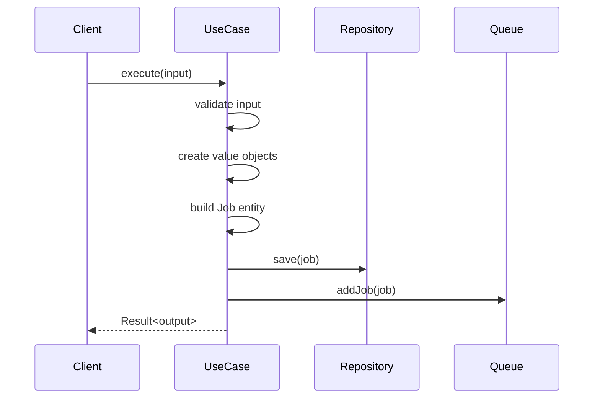

# CreateJobUseCase

## Descrição
Use case responsável por criar e enfileirar jobs no sistema. Garante a validação dos dados de entrada, criação dos objetos de domínio e persistência consistente entre repositório e fila.

### Propósito
- Criar um novo job com status PENDING
- Validar os dados de entrada conforme regras de negócio
- Garantir a persistência consistente no repositório e fila
- Retornar o resultado da operação usando o padrão Result

### Fluxo Principal
1. Validação dos dados de entrada usando Zod
2. Criação dos value objects (JobId, JobStatus, RetryPolicy)
3. Construção da entidade Job usando JobBuilder
4. Persistência no repositório de jobs
5. Adição na fila de processamento
6. Retorno dos dados básicos do job criado

### Exceções Tratadas
- Validação de entrada inválida (retorna erro de validação)
- Falha ao persistir no repositório (rollback automático)
- Falha ao enfileirar o job (rollback automático)
- Erros genéricos (retorna mensagem amigável)

## Exemplo de Uso

```typescript
import { CreateJobUseCase } from "./create-job.usecase";
import { JobRepository } from "../ports/job-repository.interface";
import { JobQueue } from "../ports/job-queue.interface";

// 1. Instanciação
const jobRepository: JobRepository = /* ... */;
const jobQueue: JobQueue = /* ... */;
const useCase = new CreateJobUseCase(jobRepository, jobQueue);

// 2. Execução
const result = await useCase.execute({
  name: "processar-pagamentos",
  payload: { userId: "123", amount: 100 },
  retryPolicy: {
    maxRetries: 3,
    delay: 1000
  }
});

// 3. Tratamento do Result
if (result.isError()) {
  console.error("Falha ao criar job:", result.message);
} else {
  console.log("Job criado com sucesso:", result.value);
}
```

## Diagrama de Sequência



## Requisitos

### Dependências Necessárias
- `JobRepository`: Interface para persistência de jobs
- `JobQueue`: Interface para enfileiramento de jobs
- `JobBuilder`: Construtor da entidade Job
- `JobId`, `JobStatus`, `RetryPolicy`: Value objects de domínio

### Pré-condições
- Repositório e fila devem estar configurados e disponíveis
- Dados de entrada devem estar no formato esperado

### Pós-condições
- Job é persistido no repositório com status PENDING
- Job é adicionado à fila de processamento
- Dados básicos do job são retornados

## Padrões Seguidos
- Clean Architecture (separação de camadas)
- Object Calisthenics (pequenos métodos, value objects)
- Result pattern (para tratamento de erros)
- Builder pattern (para construção de entidades)
- Ports & Adapters (interfaces para infraestrutura)